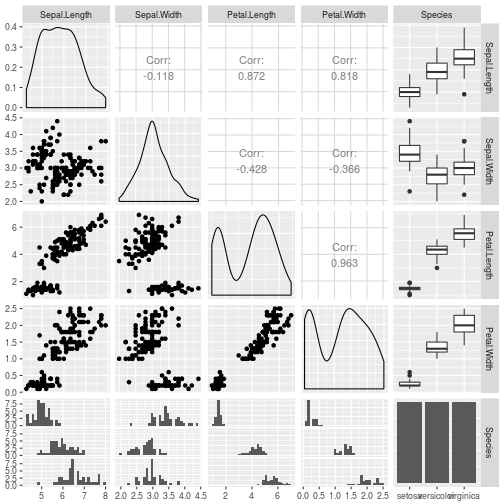

# Blogging with Pelican and R Markdown

Documenting process for blogging with Pelican and R Markdown with a focus on figures.

This blog is powered by Pelican and many of the posts are written using
reStructuredText. Often, these posts take the form of tutorials developed
using Jupyter notebooks or R Markdown documents. My less than super frequent
posting schedule results in me constantly refiguring out exactly how to include
the Jupyter notebook or R Markdown content. Dealing with things like included
images or plots generated from ggplot2 or matplotlib is often troublesome. It
would really make sense if I just carefully documented the workflow for doing
these things and publish it as its own blog post. So, here it is. Hopefully
this will save me (and others) time and frustration in the future.

I will use the famous [Iris dataset](https://en.wikipedia.org/wiki/Iris_flower_data_set) (of course).

## R Markdown blogging

I had done various ad-hoc things to do R related blog posts using R Markdown. 
Then I found an approach described in [Michael Toth's data science blog](http://michaeltoth.me/how-to-write-pelican-blog-posts-using-rmarkdown-knitr-20.html). The basic approach is to use run an R script from the command line using the
`Rscript` program that uses knitr commands to:

* convert the Rmd blog post to a plain Markdown file that Pelican can handle,
* put generated md file into your main Pelican content folder,
* put generated plots and other images into an appropriate folder so that
Pelican can find them and generate your blog post correctly, both locally and
in the published version.,
* then do your Pelican blog post processing as you normally do to publish your
new post.

It's those last two steps that were causing me grief. Images and plots weren't
showing up on the local devserver. I'd hack fix it by publishing to my host and
then manually uploading image files to the "right place" based on the URL's in
the generated HTML. I'm sure it's something dumb I'm doing but time to get it
sorted out, fixed and documented.

Here's the R script that I borrowed (from Toth's post):


```r
#!/usr/bin/Rscript --vanilla

# compiles all .Rmd files in _R directory into .md files in blog directory,
# if the input file is older than the output file.

# run ./knitpages.R to update all knitr files that need to be updated.
# run this script from your base content directory

library(knitr)

KnitPost <- function(input, outfile, figsfolder, cachefolder, base.url="/") {
  opts_knit$set(base.url = base.url)
  fig.path <- paste0(figsfolder, sub(".Rmd$", "", basename(input)), "/")
  cache.path <- file.path(cachefolder, sub(".Rmd$", "", basename(input)), "/")

  opts_chunk$set(fig.path = fig.path)
  opts_chunk$set(cache.path = cache.path)
  opts_chunk$set(fig.cap = "center")
  render_markdown()
  knit(input, outfile, envir = parent.frame())
}

knit_folder <- function(infolder, outfolder, figsfolder, cachefolder, force = F) {
  for (infile in list.files(infolder, pattern = "*.Rmd", full.names = TRUE)) {

    print(infile)
    outfile = paste0(outfolder, "/", sub(".Rmd$", ".md", basename(infile)))
    print(outfile)

    # knit only if the input file is the last one modified
    if (!file.exists(outfile) | file.info(infile)$mtime > file.info(outfile)$mtime) {
        KnitPost(infile, outfile, figsfolder, cachefolder)
    }
  }
}

#knit_folder("_R", "blog", "figures/", "_caches")
knit_folder("_R", "content", "images/", "cache")
```

The only changes I made were in that last line and just made to match my
blogging folder structure. The subfolders inside the `images/` folder were
created by the `knitpages.R` script above.

    .
    ├── cache
    ├── content
    │   ├── extra
    │   ├── images
    │   ├── literalhtml
    │   └── pages
    ├── images
    │   ├── obsim_caret_part1
    │   ├── obsim_caret_part2
    │   ├── obsim_caret_part3
    │   ├── otbirders_1_ebirdapi_python_1
    │   ├── post_metamods_pp_1
    │   └── simmer-getting-started
    ├── output
    ├── __pycache__
    └── _R
        ├── data
        ├── images
        └── images
    
    36 directories

Um, as I write this I realize one source of my problems. The only `images/` folder
I should have should be inside the `content/` folder. Furthermore, it's the
`base.url` parameter in the R script, which is defaulted to '/', that is
causing the script to generate subfolders inside `images/` instead of
`content/images/`. Perhaps Toth's Pelican powered site is structured
slightly differently than mine in terms of where the `images/` folder resides.
So, I changed the R script to default the `base.url` to `./`. That fixed one
whole set of issues of the R generated plots not having correct paths
generated in the markdown and html files. Now, folder structure looks like this.

    ├── cache
    ├── content
    │   ├── extra
    │   ├── images
    │   │   ├── obsim_caret_part1
    │   │   ├── obsim_caret_part2
    │   │   ├── obsim_caret_part3
    │   │   ├── otbirders_1_ebirdapi_python_1
    │   │   ├── post_metamods_pp_1
    │   │   └── simmer-getting-started
    │   ├── literalhtml
    │   └── pages
    ├── output
    ├── __pycache__
    └── _R
        ├── data
        └── images

    
## Irises

Let's take a look at the famous iris dataset.


```r
GGally::ggpairs(iris)
```



What do those irises look like? So, should I use the main blog's
`images/` folder or should I use a subfolder of the folder
containing this Rmd file? Up till now, I've been doing the latter. I should
do both. This ensures the published site will have correct links to images
and will allow me to use knitr inside R Studio while writing the post to check
out how things will look.


```r
knitr::include_graphics('images/iris_setosa.jpg')
```


## Creating the post

Ok, so this is getting a little self-referential. But, after the above
chunk, I went to my blog's main folder and ran

    $ ./knitpages.R
    
Then I went and looked at the `blogging_pelican_rmd.md` file that was generated and placed
into the `content/` folder. The Markdown generated to display the
pairs plot is:

    

and, for the iris image:

    
    
Now generate the site locally:

    $ make devserver

and viewed the post in the local server and, yep, both the generated pairs
plot and the jpg Iris image appear.

Now generate the site to publish remotely:

    $ make publish
    
Yep, both images appear.

## Bottom line

For R Markdown blogging with Pelican, I need to do the following:

* put non-generated images into the `content/images` folder as well as the `_R/images` folder (the latter not necessary but a nicety if knitting from R Studio for testing).
* make sure that knitpages.R uses `"./"` for `base.url`
* make sure that knitpages.R specifies `images/` for output folder for images.
* for external images use the following


```r
knitr::include_graphics('images/iris_setosa.jpg')
```

Here's working version of knitpages.R.


```r
#!/usr/bin/Rscript --vanilla

# compiles all .Rmd files in _R directory into .md files in blog directory,
# if the input file is older than the output file.

# run ./knitpages.R to update all knitr files that need to be updated.
# run this script from your base content directory

library(knitr)

KnitPost <- function(input, outfile, figsfolder, cachefolder, base.url="/") {
  opts_knit$set(base.url = base.url)
  fig.path <- paste0(figsfolder, sub(".Rmd$", "", basename(input)), "/")
  cache.path <- file.path(cachefolder, sub(".Rmd$", "", basename(input)), "/")

  opts_chunk$set(fig.path = fig.path)
  opts_chunk$set(cache.path = cache.path)
  opts_chunk$set(fig.cap = "center")
  render_markdown()
  knit(input, outfile, envir = parent.frame())
}

knit_folder <- function(infolder, outfolder, figsfolder, cachefolder, force = F) {
  for (infile in list.files(infolder, pattern = "*.Rmd", full.names = TRUE)) {

    print(infile)
    outfile = paste0(outfolder, "/", sub(".Rmd$", ".md", basename(infile)))
    print(outfile)

    # knit only if the input file is the last one modified
    if (!file.exists(outfile) | file.info(infile)$mtime > file.info(outfile)$mtime) {
        KnitPost(infile, outfile, figsfolder, cachefolder, "./")
    }
  }
}

#knit_folder("_R", "blog", "figures/", "_caches")
knit_folder("_R", "content", "images/", "cache")
```
    
    
