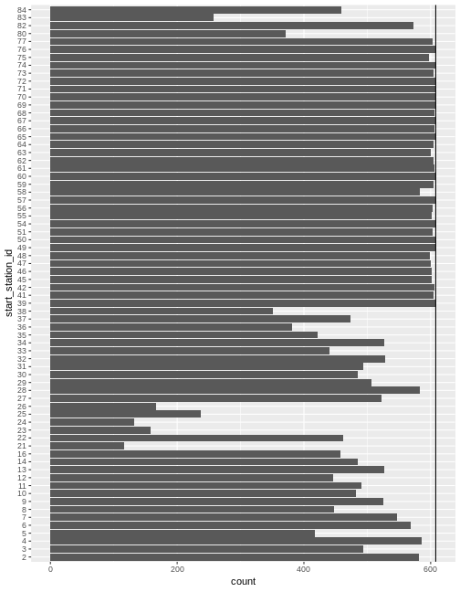
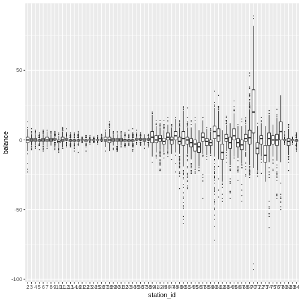
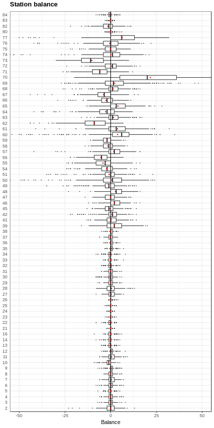
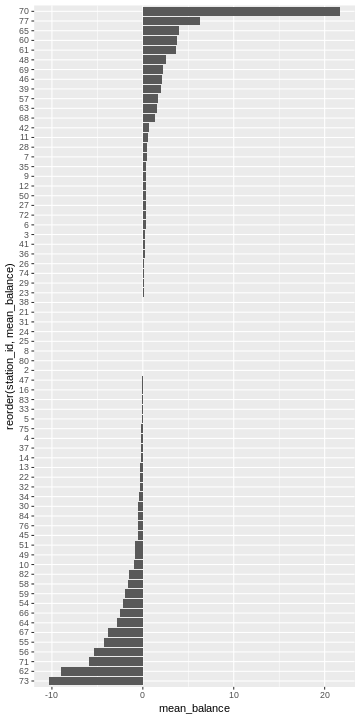
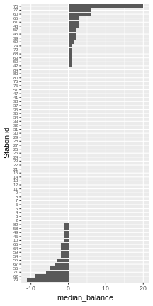
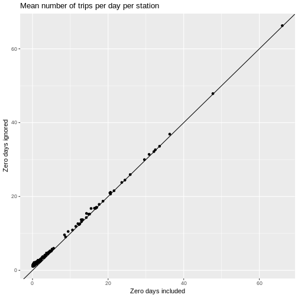
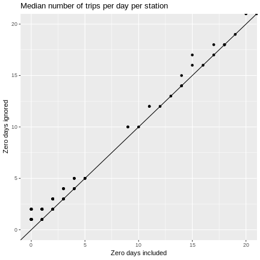
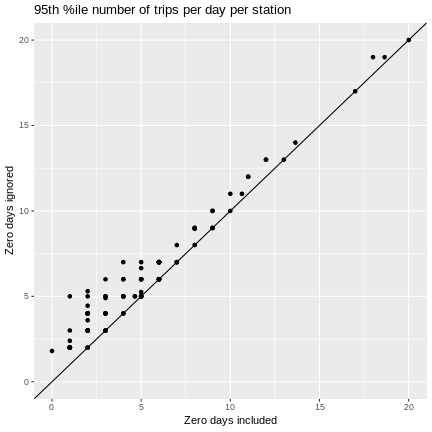
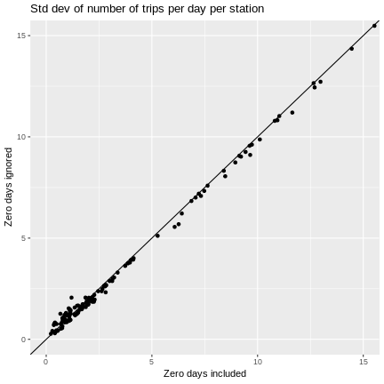
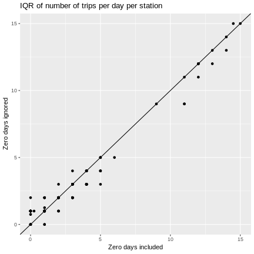

# Use R to explore station balance in bike share systems - and learn a little dplyr programming

Creating a function to analyze events by date which takes "zero days" into account

## Introduction

One of the challenges in operating
[bike share systems](https://www.fordgobike.com/) is dealing with flow balance issues. While many stations
might have pretty similar numbers of bikes being rented from them as are 
dropped off, others might be pretty imbalanced. In other words, some are
net senders and some are net receivers. Net senders are more susceptible to
customers showing up and finding no bike available, while net receivers may
end up with full docks and customers having difficulty dropping off their bikes.

Extremely imbalanced stations also likely will have to resort to manually
rebalancing their bike inventory using trucks (overnight) or riders with trikes (during the day) or teleportation (if
that was a thing). There's a nice blog post, [NYC Citi Bike Visualization - A Hint of Future Transportation](https://nycdatascience.com/blog/student-works/r-visualization/nyc-citi-bike-migration-visulization/),
which uses an R Shiny app to facilitate visualization and exploration of
station flow balance. As the author points out, the rebalancing problem
pops up in a number of *fleet optimization* problems and has 
[attracted the attention of operations research folks](https://www.citylab.com/transportation/2014/08/balancing-bike-share-stations-has-become-a-serious-scientific-endeavor/379188/).

Freund et al have collaborated on several papers that propose a number of
optimization and simulation models for various aspects of bike share
rebalancing problems based. Their work has been piloted in New York City
in their Citi Bike system. Check these out:

- [Data-Driven Rebalancing Methods for Bike-Share Systems](https://alicejpaul.files.wordpress.com/2017/05/bikeshare_rebalance.pdf)
- [Minimizing Multimodular Functions and Allocating Capacity in Bike-Sharing Systems](https://arxiv.org/pdf/1611.09304.pdf)
- [Simulation Optimization for a Large-scale Bike-sharing System](http://www.informs-sim.org/wsc16papers/054.pdf)

In this blog post, we are just going to take a look at using R to compute and
visualize station flow balance metrics. In doing this, we'll develop an R
function for the general problem of counting the number of events by date and by
one or more grouping fields. This function will rely on the dplyr package and
thus we'll have to dig into issues related to *non-standard evaluation* and use
quosures and other advanced dplyr programming features.

## Getting and prepping the bike share data

We are going to use data from San Francisco's cycle share system. It's available
from Kaggle at [https://www.kaggle.com/benhamner/sf-bay-area-bike-share/version/1](https://www.kaggle.com/benhamner/sf-bay-area-bike-share/version/1).

There are several files:

- station.csv - one row per station. Includes lat/lon, city, dock count and install date
- trip.csv - one row per trip with standard fields. Includes a zip code that is user entered (according to answer in Discussion forum)
- weather.csv - one row per date per zip code with min, mean, and max of several weather related variables
- status.csv - bikes available and docks available at the minute level by station 

For this post, we'll just be using trip and station data.

### Station data

Read in the csv file and do a little data type fixing using the readr package.

```r
library(dplyr)
library(ggplot2)
library(lubridate)
library(readr)
library(tidyr)
```

```r
station <- read_csv("data/raw/station.csv",
    col_types = cols(id = col_integer(),
                     dock_count = col_integer(),
                     installation_date = col_date(format = "%m/%d/%Y")))

station$id <- as.factor(station$id)
str(station, give.attr=FALSE)
```

```
## Classes 'spec_tbl_df', 'tbl_df', 'tbl' and 'data.frame':	70 obs. of  7 variables:
##  $ id               : Factor w/ 70 levels "2","3","4","5",..: 1 2 3 4 5 6 7 8 9 10 ...
##  $ name             : chr  "San Jose Diridon Caltrain Station" "San Jose Civic Center" "Santa Clara at Almaden" "Adobe on Almaden" ...
##  $ lat              : num  37.3 37.3 37.3 37.3 37.3 ...
##  $ long             : num  -122 -122 -122 -122 -122 ...
##  $ dock_count       : int  27 15 11 19 15 15 15 15 15 19 ...
##  $ city             : chr  "San Jose" "San Jose" "San Jose" "San Jose" ...
##  $ installation_date: Date, format: "2013-08-06" "2013-08-05" ...
```

Hmmm, should we convert `name` and `city` to factors? The `name` values will be in the `trip` table and
we'll want to use join type operations to get station level information (e.g. the lat/lon). I guess
I never thought carefully about this and was just trusting base R `merge` and dplyr joins to coerce
factors to strings if needed (e.g. the levels in the two tables don't match perfectly). Some
good posts on this are:

- [https://rpubs.com/hadley/45044](https://rpubs.com/hadley/45044)
- [https://stackoverflow.com/questions/23802571/safely-merge-data-frames-by-factor-columns](https://stackoverflow.com/questions/23802571/safely-merge-data-frames-by-factor-columns)
- [https://stackoverflow.com/questions/30468412/dplyr-join-warning-joining-factors-with-different-levels](https://stackoverflow.com/questions/30468412/dplyr-join-warning-joining-factors-with-different-levels)

For dplyr, coercion to strings is done if needed and a warning raised.

### Trip table

This is the primary table we'll use for analysis.


```r
trip <- read_csv("data/raw/trip.csv",
                 col_types = cols(id = col_integer(),
                     start_station_id = col_integer(),
                     end_station_id = col_integer(),
                     bike_id = col_integer(),
                     zip_code = col_integer()))
```

Convert start and end dates to date times.


```r
trip$start_date <- as.POSIXct(trip$start_date, format="%m/%d/%Y %H:%M")
trip$end_date <- as.POSIXct(trip$end_date, format="%m/%d/%Y %H:%M")
```

Let's convert some of the fields to factors.


```r
trip$start_station_id <- as.factor(trip$start_station_id)
trip$end_station_id <- as.factor(trip$end_station_id)
trip$subscription_type <- as.factor(trip$subscription_type)
trip$zip_code <- as.factor(trip$zip_code)
```

For analytical convenience, let's create some new fields in the `trip` data frame.

### Date parts

Use the `start_date` as a basis and add some date part fields.


```r
trip <- trip %>% 
  mutate(trip_date = date(start_date),
         start_year = year(start_date),
         start_month = month(start_date),
         start_hour = hour(start_date),
         start_dow = wday(start_date),
         trip_ym = floor_date(start_date, "month"))
```

We'll likely want to do some day of week analysis.


```r
trip$start_dow <- as.factor(trip$start_dow)
levels(trip$start_dow) <- c("Su", "Mo", "Tu", "We", "Th", "Fr", "Sa")

trip$start_weekday <- trip$start_dow %in% 2:6
trip$start_weekday <- as.factor(trip$start_weekday)
levels(trip$start_weekday) <- c("Weekend", "Weekday")
```

### Trip type

If start and end points are the same, it's a "round trip".


```r
trip <- trip %>% 
  mutate(round_trip = (start_station_id == end_station_id))

trip$round_trip <- as.factor(trip$round_trip)
levels(trip$round_trip) <- c("One way", "Round trip")
```


### Trip geography

Let's pull in the start and end cities (based on zip code in the `station` data frame) and create a few more fields based on the starting location and on ending location.


```r
trip <- trip %>% 
  left_join(station, by = c("start_station_id" = "id")) %>%
  mutate(start_city = city,
         start_lat = lat,
         start_long = long) %>% 
  select(-c(city, name, lat, long, dock_count, installation_date))
```


```r
trip <- trip %>% 
  left_join(station, by = c("end_station_id" = "id")) %>%
  mutate(end_city = city,
         end_lat = lat,
         end_long = long) %>% 
  select(-c(city, name, lat, long, dock_count, installation_date))
```

Here's our prepped `trip` data frame:


```r
str(trip)
```

```
## Classes 'tbl_df', 'tbl' and 'data.frame':	669959 obs. of  25 variables:
##  $ id                : int  4576 4607 4130 4251 4299 4927 4500 4563 4760 4258 ...
##  $ duration          : num  63 70 71 77 83 103 109 111 113 114 ...
##  $ start_date        : POSIXct, format: "2013-08-29 14:13:00" "2013-08-29 14:42:00" ...
##  $ start_station_name: chr  "South Van Ness at Market" "San Jose City Hall" "Mountain View City Hall" "San Jose City Hall" ...
##  $ start_station_id  : Factor w/ 70 levels "2","3","4","5",..: 55 9 21 9 55 48 3 7 55 9 ...
##  $ end_date          : POSIXct, format: "2013-08-29 14:14:00" "2013-08-29 14:43:00" ...
##  $ end_station_name  : chr  "South Van Ness at Market" "San Jose City Hall" "Mountain View City Hall" "San Jose City Hall" ...
##  $ end_station_id    : Factor w/ 70 levels "2","3","4","5",..: 55 9 21 9 56 48 4 7 55 10 ...
##  $ bike_id           : int  520 661 48 26 319 527 679 687 553 107 ...
##  $ subscription_type : Factor w/ 2 levels "Customer","Subscriber": 2 2 2 2 2 2 2 2 2 2 ...
##  $ zip_code          : Factor w/ 7427 levels "0","1","2","3",..: 6254 6564 6880 6516 6231 6237 6539 6539 6231 6516 ...
##  $ trip_date         : Date, format: "2013-08-29" "2013-08-29" ...
##  $ start_year        : num  2013 2013 2013 2013 2013 ...
##  $ start_month       : num  8 8 8 8 8 8 8 8 8 8 ...
##  $ start_hour        : int  14 14 10 11 12 18 13 14 17 11 ...
##  $ start_dow         : Factor w/ 7 levels "Su","Mo","Tu",..: 5 5 5 5 5 5 5 5 5 5 ...
##  $ trip_ym           : POSIXct, format: "2013-08-01" "2013-08-01" ...
##  $ start_weekday     : Factor w/ 2 levels "Weekend","Weekday": 1 1 1 1 1 1 1 1 1 1 ...
##  $ round_trip        : Factor w/ 2 levels "One way","Round trip": 2 2 2 2 1 2 1 2 2 1 ...
##  $ start_city        : chr  "San Francisco" "San Jose" "Mountain View" "San Jose" ...
##  $ start_lat         : num  37.8 37.3 37.4 37.3 37.8 ...
##  $ start_long        : num  -122 -122 -122 -122 -122 ...
##  $ end_city          : chr  "San Francisco" "San Jose" "Mountain View" "San Jose" ...
##  $ end_lat           : num  37.8 37.3 37.4 37.3 37.8 ...
##  $ end_long          : num  -122 -122 -122 -122 -122 ...
```

Save for use in future analysis.


```r
save(station, trip, file = "data/processed/station_trip.Rdata")
```

## Ins and outs by station

Compute number of trips per day out and in by station, subtract the the number of outs from ins and call it `balance`. A positive value of
balance corresponds to a station receiving more bikes during that day than
departed from that station.

Let's do this for the period 2014-01-01 through 2015-08-31. 


```r
startdate <- ymd("2014-01-01")
enddate <- ymd("2015-08-31")

# Create a vector of dates over this range
dates <- seq(startdate, enddate, by='days')
```

There are 608 days in this range.

Since we
eventually want to compute summary statistics for balance by station, care
is required in doing the trip counts. There is no guarantee that every
station has trips into and/or out of on every date in the range of 
interest - i.e. there are "zero days". The final counts of
the following query should be 608 for all stations if 
there were no zero days.


```r
num_out_station_date <- trip %>% 
  filter(between(trip_date, startdate, enddate)) %>% 
  group_by(start_station_id, trip_date) %>% 
  count()

num_out_station_date %>% 
  group_by(start_station_id) %>% 
  count() %>% 
  head(n = 10)
```

```
## # A tibble: 10 x 2
## # Groups:   start_station_id [10]
##    start_station_id    nn
##    <fct>            <int>
##  1 2                  582
##  2 3                  493
##  3 4                  586
##  4 5                  417
##  5 6                  568
##  6 7                  547
##  7 8                  447
##  8 9                  525
##  9 10                 482
## 10 11                 491
```

Clearly there are zero days and ignoring them when computing
quantities such as mean balance would lead to overestimates. Let's plot 
the the number of non-zero days by station.


```r
ggplot(num_out_station_date) + geom_bar(aes(x=start_station_id)) +
  geom_hline(aes(yintercept = length(dates))) +
  coord_flip()
```



In a series of recent posts,

- [http://hselab.org/daily-averages-1.html](http://hselab.org/daily-averages-1.html),
- [http://hselab.org/daily-averages-2.html](http://hselab.org/daily-averages-2.html),

I showed how to deal with the zero days issue using
Python with heavy use of the pandas package. The second post ends with a little
R based version using the NYC Flights data.

The main purpose of this post is to develop a pretty general R function for
doing counts of events by date and one or more grouping fields. For example,
we need number of arrivals and departures of bikes by date and station in
order to compute balance. We might also want to compute things like the
average number of rentals by station and subscription type. It
would be nice to have an R function in which we could pass in the following
input arguments:

- data frame
- start date
- end date
- trip date field
- zero or more additional fields to group by

The function will lean on the dplyr package and we want it to work like
dplyr verbs in that we can pass in unquoted field names.

Let's run through it manually first and then convert to a function. To simplify
things, let's assume that we just have one additional grouping field - `start_station_id`.


```r
# Specify date range
startdate <- ymd("2014-01-01")
enddate <- ymd("2015-08-31")

# Get unique values of date and grouping field
dates <- seq(startdate, enddate, by='days')
# For simplicity, for now, let's just use the `id` field from the station table.
stations <- station$id

# Use expand.grid to create all the combinations (the fully seeded table)
date_station <- expand.grid(stations, dates)
names(date_station) <- c("start_station_id", "trip_date")

# Get sorted by station and date
date_station <- date_station %>% 
  arrange(start_station_id, trip_date)

# Count trips out
num_out_station_date <- trip %>% 
  filter(between(trip_date, startdate, enddate)) %>% 
  group_by(start_station_id, trip_date) %>% 
  count()

# Join the fully seeded table, `date_station`, to `num_out_station_date`. 
num_out_station_date <- date_station %>% 
  left_join(num_out_station_date, by = c("start_station_id", "trip_date"))

# Replace the NAs with 0's.
num_out_station_date$n <- num_out_station_date$n %>% replace_na(0)
```

Let's confirm.


```r
date_counts <- num_out_station_date %>% 
  group_by(start_station_id) %>% 
  count() 

range(date_counts$nn)
```

```
## [1] 608 608
```


This is such a common task, it would be nice to have a function to do it.
Ideally, it would be nice to pass multiple grouping fields along with a date
range. To start, consider one grouping field. 

Do counts of bike trips out of each station. I want to be able to do this:


```r
num_out <- counts_by_date_group(trip, startdate, enddate, trip_date, start_station_id)
```

## Creating the counts_by_date_group function

The trickiness involved in creating this function is that I want to
be able to call it like a dplyr verb (unquoted column names) and to
use dplyr itself in the function. The following dplyr vignette is
essential reading - [https://cran.r-project.org/web/packages/dplyr/vignettes/programming.html](https://cran.r-project.org/web/packages/dplyr/vignettes/programming.html).

A key concept is that of a *quosure* - a construct that stores both an expression as
well as its environment. It's a special type of formula. Using the R Studio 
debugging tools to step through the following function is a great way to
see all the details. The code is heavily commented, including alternative
ways of doing a few things.


```r
counts_by_date_group <- function(df, start, end, date_var, group_var){
  
  # Use enquo to enable dplyr style calling. Both date_var and group_var are
  # converted to quosures.
  date_var <- enquo(date_var)
  group_var <- enquo(group_var)
  
  # Need to use quo_name() to convert group_var quosure to string 
  # to use as new column name
  group_var_name <- quo_name(group_var)
  date_var_name <- quo_name(date_var)
  
  # Create sequence of dates
  dates <- seq(start, end, by='days')
  
  # Now I  want the unique values of the grouping variable
  # The following results in a one column tibble. Yes, even with as.vector().
  # grp <- as.vector(unique(df[, group_var]))
  
  # To get as actual vector, need to do this using dplyr::pull.
  # Need to use !! to unqoute group_var so that it gets evaluated.
  grp <- df %>% distinct(!!group_var) %>% pull()
  # Or this using unlist
  # grp <- unlist(unique(df[, group_var]), use.names = FALSE)
  
  # Use expand.grid() to create the fully seeded data frame
  date_grp <- expand.grid(grp, dates)
  names(date_grp) <- c(group_var_name, date_var_name)
  
  # Get sorted by station and date
  date_grp <- date_grp %>% 
    arrange(!!group_var, !!date_var)
  
  # Count trips out (again notice use !! with date_var quosure)
  counts_group_date <- df %>% 
    filter(between(!!date_var, startdate, enddate)) %>% 
    group_by(!!group_var, !!date_var) %>% 
    count()
  
  # Join the fully seeded data frame to the count data frame 
  counts_group_date <- date_grp %>% 
    left_join(counts_group_date, by = c(group_var_name, date_var_name))
  
  # Replace the NAs with 0's.
  counts_group_date$n <- counts_group_date$n %>% replace_na(0)
  
  # Return the data frame
  counts_group_date
  
}
```

Whew! Let's finish exploring the balance question and then we'll return to
this and generalize our function to handle multiple grouping fields.


```r
num_out <- counts_by_date_group(trip, startdate, enddate, trip_date, start_station_id)

head(num_out)
```

```
##   start_station_id  trip_date  n
## 1                2 2014-01-01  0
## 2                2 2014-01-02  6
## 3                2 2014-01-03 15
## 4                2 2014-01-04  2
## 5                2 2014-01-05 12
## 6                2 2014-01-06 15
```

## Back to the balance analysis

Now do counts of trips into each station.


```r
num_in <- counts_by_date_group(trip, startdate, enddate, trip_date, end_station_id)

head(num_in)
```

```
##   end_station_id  trip_date  n
## 1              2 2014-01-01  2
## 2              2 2014-01-02  9
## 3              2 2014-01-03 12
## 4              2 2014-01-04  4
## 5              2 2014-01-05 12
## 6              2 2014-01-06 15
```

Compute overall flow balance as `num_in - num_out`.


```r
flow_balance_date <- num_in %>% 
  left_join(num_out, by = c("end_station_id" = "start_station_id", "trip_date"))

names(flow_balance_date) <- c("station_id", "trip_date", "num_in", "num_out")

flow_balance_date$station_id <- as.factor(flow_balance_date$station_id)

flow_balance_date <- flow_balance_date %>% mutate(
  balance = num_in - num_out
)

head(flow_balance_date)
```

```
##   station_id  trip_date num_in num_out balance
## 1          2 2014-01-01      2       0       2
## 2          2 2014-01-02      9       6       3
## 3          2 2014-01-03     12      15      -3
## 4          2 2014-01-04      4       2       2
## 5          2 2014-01-05     12      12       0
## 6          2 2014-01-06     15      15       0
```

Let's look at the distribution of balance by station using boxplots.


```r
ggplot(flow_balance_date) + 
  geom_boxplot(aes(x = station_id, y = balance),
               outlier.size = 0.1,
               outlier.shape = 20)
```



Let's try to make it look nicer. Got some ideas from

- [http://shinyapps.stat.ubc.ca/r-graph-catalog/#fig04-11_museum-exhibitions-box-plot](http://shinyapps.stat.ubc.ca/r-graph-catalog/#fig04-11_museum-exhibitions-box-plot)
- [https://www.r-graph-gallery.com/269-ggplot2-boxplot-with-average-value/](https://www.r-graph-gallery.com/269-ggplot2-boxplot-with-average-value/)

If you want to "zoom in" on the plot by changing the y-axis limits,
it's important to change the limits with the coordinate system and not the
axis scale (e.g. inside of `scale_y_continuous`). The former doesn't throw
out the points outside the limits (important for properly computing boxplot
elements) whereas latter does.


```r
p <- ggplot(flow_balance_date, aes(x = station_id, y = balance)) +
  geom_boxplot(outlier.shape = 20, outlier.size = 0.1) + 
  labs(x = "Station id", y = "Balance") + 
  coord_flip(ylim=c(-50, 50)) +
  geom_hline(aes(yintercept = 0)) +
  stat_summary(fun.y=mean, geom="point", shape=20, size=1, color="red", fill="red") +
  ggtitle("Station balance") +
  theme_bw() +
  theme(plot.title = element_text(size = rel(1.2), face = "bold", vjust = 1.5),
        axis.ticks.y = element_blank(),
        axis.title.y = element_blank())

p
```




Summary stats are the quantities that would have
been computed incorrectly had we neglected to take care of the zero days.


```r
flow_balance_stats <- flow_balance_date %>% 
  group_by(station_id) %>% 
  summarize(
    mean_balance = mean(balance),
    sd_balance = sd(balance),
    cv_balance = sd_balance / mean_balance,
    p01_balance = quantile(balance, 0.01),
    p05_balance = quantile(balance, 0.05),
    q1_balance = quantile(balance, 0.25),
    median_balance = median(balance),
    q3_balance = quantile(balance, 0.75),
    p95_balance = quantile(balance, 0.95),
    p99_balance = quantile(balance, 0.99)
  ) %>% 
  arrange(mean_balance)

head(flow_balance_stats)
```

```
## # A tibble: 6 x 11
##   station_id mean_balance sd_balance cv_balance p01_balance p05_balance
##   <fct>             <dbl>      <dbl>      <dbl>       <dbl>       <dbl>
## 1 73               -10.4        7.60     -0.734       -27           -22
## 2 62                -9.00       7.41     -0.823       -31.9         -20
## 3 71                -5.89       5.89     -1.000       -20.9         -15
## 4 56                -5.36       5.14     -0.960       -19           -14
## 5 55                -4.23       6.24     -1.48        -20           -15
## 6 67                -3.86       6.27     -1.62        -20           -14
## # ... with 5 more variables: q1_balance <dbl>, median_balance <dbl>,
## #   q3_balance <dbl>, p95_balance <dbl>, p99_balance <dbl>
```

Plot mean balance by station.


```r
ggplot(flow_balance_stats) +
  geom_bar(aes(x=reorder(station_id, mean_balance), y=mean_balance), 
           stat = "identity") +
  coord_flip()
```



What about median instead of mean?


```r
ggplot(flow_balance_stats) +
  geom_bar(aes(x=reorder(station_id, median_balance), y=median_balance), 
           stat = "identity") + xlab("Station id") +
  theme(axis.text.y = element_text(size=6)) +
  coord_flip()
```



Obviously this is just a first look at balance. Lots more to do. But, let's get
back to the function we wrote to do the counts by date and station. For this 
application, a single grouping field is fine. However, what if we want to do
stats by station and subscription type?

## Generalizing the counts_by_date_group function

There are two generalization I wanted:

- multiple grouping fields
- specify the time bin size (e.g hourly)

For now, I'm just going to do the multiple grouping fields and save the 
finer time bins for another day.

I wrote a little helper function to return a vector of unique values
from a specified data frame and column.


```r
unique_vals_vector <- function(df, col){
  
  unlist(unique(df[, col]), use.names = FALSE)
  
}
```

Since multiple grouping variables can be passed in, we need to do a few things
differently in our function. For example, the `quos()` function is used
to create a list of quosures from the `...` arguments and the `!!!` operator is used to 
splice this list of quosures into function calls (such as `group_by()`). 


```r
counts_by_date_groups <- function(df, start, end, date_var,  ...){
  
  # Use enquo to enable dplyr style calling
  date_var <- enquo(date_var)
  # Get list of quosures of the grouping variables
  group_vars <- quos(...)
  num_group_vars <- length(group_vars)

  # Need to use quo_name() to convert group_var quosure to string 
  # to use as new column name
  group_var_names <- lapply(group_vars, quo_name)
  date_var_name <- quo_name(date_var)
  all_names <- c(group_var_names, date_var_name)
  
  # Create vector of dates over specified range
  dates <- seq(start, end, by='days')

  # There may be some clever lapply approach to this, but I'm just going to
  # use a loop to construct a list of vectors containing the unique values
  # for each of the grouping fields (not including the date)
  group_vals_unique <- list()
  for (gvn in group_var_names){
    unique_vals <- unique_vals_vector(df, gvn)
    group_vals_unique <- c(group_vals_unique, list(unique_vals))
  }
  group_vals_unique <- c(group_vals_unique, list(dates))
  
  # Use expand.grid() to create the fully seeded data frame
  date_grps <- expand.grid(group_vals_unique)
  names(date_grps) <- all_names

  # Count events. Note the use of !!! to "splice" the group_vars list into the 
  # group_by() call
  counts_groups_date <- df %>%
    filter(between(!!date_var, startdate, enddate)) %>%
    group_by(!!!group_vars, !!date_var) %>%
    count()
  
  # Join the fully seeded data frame to the count data frame 
  counts_groups_date <- date_grps %>%
    left_join(counts_groups_date)

  # Get sorted by group vars and date
  counts_groups_date <- counts_groups_date %>%
    arrange(!!!group_vars, !!date_var)
  
  # Replace the NAs with 0's.
  counts_groups_date$n <- counts_groups_date$n %>% replace_na(0)
 
  counts_groups_date
  
}
```

Now we can count the number of trips by date, start station and subscription type.


```r
num_trips_start_sub <- counts_by_date_groups(trip, startdate, enddate, 
                                   trip_date, start_station_id, subscription_type)
```

```
## Joining, by = c("start_station_id", "subscription_type", "trip_date")
```


```r
stats_trips_start_sub <- num_trips_start_sub %>% 
  group_by(start_station_id, subscription_type) %>% 
  summarize(
    mean_numtrips = mean(n),
    sd_numtrips = sd(n),
    cv_numtrips = sd_numtrips / mean_numtrips,
    p01_numtrips = quantile(n, 0.01),
    p05_numtrips = quantile(n, 0.05),
    q1_numtrips = quantile(n, 0.25),
    median_numtrips = median(n),
    q3_numtrips = quantile(n, 0.75),
    p95_numtrips = quantile(n, 0.95),
    p99_numtrips = quantile(n, 0.99),
    iqr_numtrips = q3_numtrips - q1_numtrips
  ) 

head(stats_trips_start_sub)
```

```
## # A tibble: 6 x 13
## # Groups:   start_station_id [3]
##   start_station_id subscription_ty… mean_numtrips sd_numtrips cv_numtrips
##   <fct>            <fct>                    <dbl>       <dbl>       <dbl>
## 1 2                Customer                 0.660        1.14       1.73 
## 2 2                Subscriber              12.9          8.47       0.657
## 3 3                Customer                 1.14         1.86       1.63 
## 4 3                Subscriber               1.07         1.13       1.06 
## 5 4                Customer                 0.464        1.12       2.40 
## 6 4                Subscriber               4.99         2.79       0.559
## # ... with 8 more variables: p01_numtrips <dbl>, p05_numtrips <dbl>,
## #   q1_numtrips <dbl>, median_numtrips <dbl>, q3_numtrips <dbl>,
## #   p95_numtrips <dbl>, p99_numtrips <dbl>, iqr_numtrips <dbl>
```

What if we had ignored the possibility of zero days? 


```r
# Count trips
num_trips_start_sub_ignorezdays <- trip %>% 
  filter(between(trip_date, startdate, enddate)) %>% 
  group_by(start_station_id, subscription_type, trip_date) %>% 
  count()

# Summarize
stats_trips_start_sub_ignorezdays <- num_trips_start_sub_ignorezdays %>% 
  group_by(start_station_id, subscription_type) %>% 
  summarize(
    mean_numtrips = mean(n),
    sd_numtrips = sd(n),
    cv_numtrips = sd_numtrips / mean_numtrips,
    p01_numtrips = quantile(n, 0.01),
    p05_numtrips = quantile(n, 0.05),
    q1_numtrips = quantile(n, 0.25),
    median_numtrips = median(n),
    q3_numtrips = quantile(n, 0.75),
    p95_numtrips = quantile(n, 0.95),
    p99_numtrips = quantile(n, 0.99),
    iqr_numtrips = q3_numtrips - q1_numtrips
  ) 

head(stats_trips_start_sub_ignorezdays)
```

```
## # A tibble: 6 x 13
## # Groups:   start_station_id [3]
##   start_station_id subscription_ty… mean_numtrips sd_numtrips cv_numtrips
##   <fct>            <fct>                    <dbl>       <dbl>       <dbl>
## 1 2                Customer                  1.71       1.26        0.740
## 2 2                Subscriber               13.7        8.06        0.586
## 3 3                Customer                  2.41       2.06        0.856
## 4 3                Subscriber                1.75       0.955       0.545
## 5 4                Customer                  2.10       1.48        0.705
## 6 4                Subscriber                5.23       2.62        0.500
## # ... with 8 more variables: p01_numtrips <dbl>, p05_numtrips <dbl>,
## #   q1_numtrips <dbl>, median_numtrips <dbl>, q3_numtrips <dbl>,
## #   p95_numtrips <dbl>, p99_numtrips <dbl>, iqr_numtrips <dbl>
```

Join the two summary stats data frames and then we can scatter individual
statistics against each other (one having been computed with proper treatment
of zero days and the other not).


```r
stats_joined <- stats_trips_start_sub %>% 
  inner_join(stats_trips_start_sub_ignorezdays, 
             by = c("start_station_id", "subscription_type"))

g <- ggplot(stats_joined) +
  xlab("Zero days included") +
  ylab("Zero days ignored")
```


```r
g + ggtitle("Mean number of trips per day per station") +
  geom_point(aes(x = mean_numtrips.x, y = mean_numtrips.y)) +
  geom_abline()
```




For higher volume stations, of course, zero days are pretty rare. Let's
zoom in on the lower volume stations.


```r
g + ggtitle("Mean number of trips per day per station") +
  geom_point(aes(x = mean_numtrips.x, y = mean_numtrips.y)) +
  geom_abline() +
  coord_cartesian(xlim=c(0,20), ylim=c(0, 20))
```


Is the median less susceptible to zero day induced bias? Seems like it should be since less affected by outliers. But, integer nature of the data may lead
to bias. While we are at it, let's try an upper quantile and a measure
of variability.


```r
g + ggtitle("Median number of trips per day per station") +
  geom_point(aes(x = median_numtrips.x, y = median_numtrips.y)) +
  geom_abline() +
  coord_cartesian(xlim=c(0,20), ylim=c(0, 20))
```




```r
g + ggtitle("95th %ile number of trips per day per station") +
  geom_point(aes(x = p95_numtrips.x, y = p95_numtrips.y)) +
  geom_abline() +
  coord_cartesian(xlim=c(0,20), ylim=c(0, 20)) 
```




```r
g + ggtitle("Std dev of number of trips per day per station") +
  geom_point(aes(x = sd_numtrips.x, y = sd_numtrips.y)) +
  geom_abline() +
  coord_cartesian(xlim=c(0,15), ylim=c(0, 15))
```




```r
g + ggtitle("IQR of number of trips per day per station") +
  geom_point(aes(x = iqr_numtrips.x, y = iqr_numtrips.y)) +
  geom_abline() +
  coord_cartesian(xlim=c(0,15), ylim=c(0, 15))
```



As we might have guessed, ignoring zero days can cause means and quantiles 
to be overestimated and measures of variability to be underestimated.

Seems like a good place to stop for now. Next steps:

- make sure this works for zero grouping fields
- extend as needed to do day of week and time of day based analysis for zero or more grouping fields
- tidy up the code, create documentation, create package and release

You can find this post along with a pile of other related, but unorganized, code in the following GitHub repo - [https://github.com/misken/sfcs](https://github.com/misken/sfcs).
