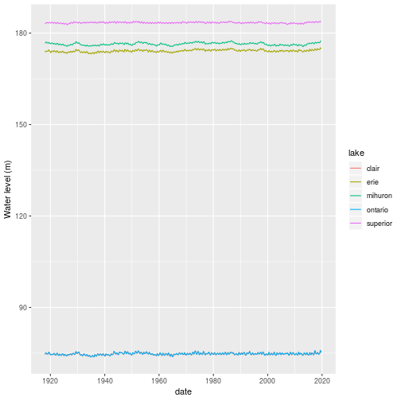
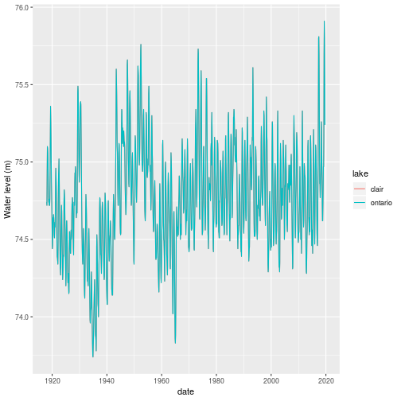
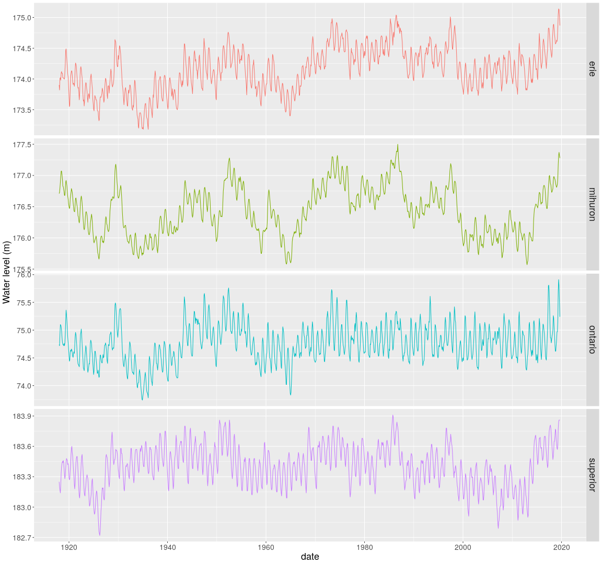
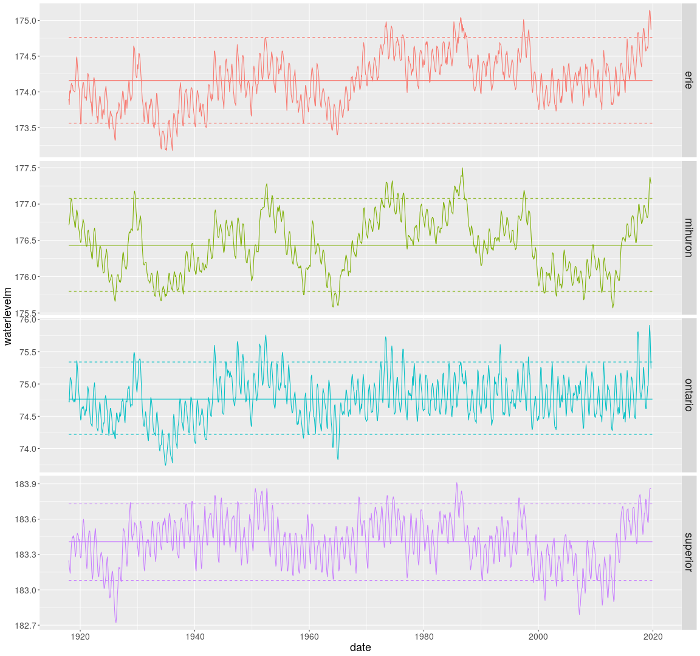

# Using R to download and plot Great Lakes historical water level data

This year we have seen record or near record high water levels in all of the Great Lakes. While plots of historical water levels are available on the web, I thought it would be interesting create my own plots using R. In this post I will summarize the steps for using R to:

* download raw historical water level data for the Great Lakes,
* process the raw data to get it into shape for time series plots,
* create time series plots of monthly water levels using `ggplot`.

## Web resources related to Great Lakes water levels

There are a number of good resources for learning about Great Lakes water level monitoring. A few that I've found useful as I've started to explore this topic include the following.

### NOAA - Great Lakes Environmental Research Laboratory

* Main - [https://www.glerl.noaa.gov/](https://www.glerl.noaa.gov/)
* Water levels - [https://www.glerl.noaa.gov/data/wlevels/levels.html#overview](https://www.glerl.noaa.gov/data/wlevels/levels.html#overview)
* Monitoring: [https://www.glerl.noaa.gov/data/wlevels/levels.html#monitoringNetwork](https://www.glerl.noaa.gov/data/wlevels/levels.html#monitoringNetwork)
* Observations - [https://www.glerl.noaa.gov/data/wlevels/levels.html#observations](https://www.glerl.noaa.gov/data/wlevels/levels.html#observations)
* Forecasts - [https://www.glerl.noaa.gov/data/wlevels/levels.html#modelsAndForecasts](https://www.glerl.noaa.gov/data/wlevels/levels.html#modelsAndForecasts)
* Dashboard - [https://www.glerl.noaa.gov/data/dashboard/GLD_HTML5.html](https://www.glerl.noaa.gov/data/dashboard/GLD_HTML5.html)
* Data download - [https://www.glerl.noaa.gov/data/dashboard/data/](https://www.glerl.noaa.gov/data/dashboard/data/)


### Other resources

US Army Corp of Engineers - Great Lakes Information

* [https://www.lre.usace.army.mil/Missions/Great-Lakes-Information/](https://www.lre.usace.army.mil/Missions/Great-Lakes-Information/)

Great Lakes Coordination Committee (US and CA)

* [http://www.greatlakescc.org/wp36/](http://www.greatlakescc.org/wp36/)

Fisheries and Oceans CA - observational data and forecasts

* [https://waterlevels.gc.ca/eng](https://waterlevels.gc.ca/eng)

Great Lakes Seasonal Hydrological Forecasting Products (Experimental)

* [https://www.glerl.noaa.gov/ahps/curfcst.html](https://www.glerl.noaa.gov/ahps/curfcst.html)
* [https://www.lre.usace.army.mil/Missions/Great-Lakes-Information/Great-Lakes-Water-Levels/Water-Level-Forecast/Long-Term-Forecast/](https://www.lre.usace.army.mil/Missions/Great-Lakes-Information/Great-Lakes-Water-Levels/Water-Level-Forecast/Long-Term-Forecast/)

News

* [https://www.washingtonpost.com/weather/2019/06/06/great-lakes-are-overflowing-with-record-amounts-water/](https://www.washingtonpost.com/weather/2019/06/06/great-lakes-are-overflowing-with-record-amounts-water/)
* [http://theconversation.com/climate-change-is-driving-rapid-shifts-between-high-and-low-water-levels-on-the-great-lakes-118095](http://theconversation.com/climate-change-is-driving-rapid-shifts-between-high-and-low-water-levels-on-the-great-lakes-118095)


## Getting monthly water level data

We will need a few libraries.


```r
library(readr)
library(lubridate)
library(stringr)
library(tidyr)
library(dplyr)
library(ggplot2)
```

You can download csv files from NOAA containing monthly water levels for all of the Great Lakes at the following location:


```r
data_loc <- "https://www.glerl.noaa.gov/data/dashboard/data/levels/1918_PRES/"
```

Here is what a little bit of the Lake Superior file, `superior1918.csv`, looks like.

    Lake Superior:, Monthly Lake-Wide Average Water Levels (1918 - Present)
    Source:, NOAA/NOS; CHS
    year,jan,feb,mar,apr,may,jun,jul,aug,sep,oct,nov,dec
    1918,183.25,183.2,183.17,183.14,183.22,183.34,183.4,183.43,183.45,183.44,183.46,183.44
    1919,183.38,183.32,183.28,183.31,183.38,183.45,183.48,183.47,183.46,183.42,183.43,183.39
    1920,183.29,183.27,183.28,183.36,183.43,183.52,183.58,183.6,183.54,183.5,183.43,183.36

A few things to note:

* The top two lines are metadata,
* Data goes back to 1918,
* Data is in *wide format* in that each month is in its own column.

I used the `readr` package to read in the csv file for each lake. Notice that there is a single data file for Lakes Michigan and Huron as they are actually just one big lake that we divide at the Straits of Mackinac - see https://www.glerl.noaa.gov/res/straits/.


```r
miHuron1918 <- read_csv(str_c(data_loc, "miHuron1918.csv"), skip = 2)
ontario1918 <- read_csv(str_c(data_loc, "ontario1918.csv"), skip = 2)
erie1918 <- read_csv(str_c(data_loc, "erie1918.csv"), skip = 2)
superior1918 <- read_csv(str_c(data_loc, "superior1918.csv"), skip = 2)
clair1918 <- read_csv(str_c(data_loc, "ontario1918.csv"), skip = 2)
```

Looking at the structure of one of these tables confirms that it is in
wide format with the months as columns.


```r
head(miHuron1918)
```

```
## # A tibble: 6 x 13
##    year   jan   feb   mar   apr   may   jun   jul   aug   sep   oct   nov
##   <dbl> <dbl> <dbl> <dbl> <dbl> <dbl> <dbl> <dbl> <dbl> <dbl> <dbl> <dbl>
## 1  1918  177.  177.  177.  177.  177.  177.  177.  177.  177.  177.  177.
## 2  1919  177.  177.  177.  177.  177.  177.  177.  177.  177.  177.  177.
## 3  1920  176.  176.  176.  177.  177.  177.  177.  177.  177.  177.  177.
## 4  1921  176.  176.  176.  177.  177.  177.  177.  177.  176.  176.  176.
## 5  1922  176.  176.  176.  176.  177.  177.  177.  177.  177.  176.  176.
## 6  1923  176.  176.  176.  176.  176.  176.  176.  176.  176.  176.  176.
## # ... with 1 more variable: dec <dbl>
```

```r
str(miHuron1918)
```

```
## Classes 'spec_tbl_df', 'tbl_df', 'tbl' and 'data.frame':	102 obs. of  13 variables:
##  $ year: num  1918 1919 1920 1921 1922 ...
##  $ jan : num  177 177 176 176 176 ...
##  $ feb : num  177 177 176 176 176 ...
##  $ mar : num  177 177 176 176 176 ...
##  $ apr : num  177 177 177 177 176 ...
##  $ may : num  177 177 177 177 177 ...
##  $ jun : num  177 177 177 177 177 ...
##  $ jul : num  177 177 177 177 177 ...
##  $ aug : num  177 177 177 177 177 ...
##  $ sep : num  177 177 177 176 177 ...
##  $ oct : num  177 177 177 176 176 ...
##  $ nov : num  177 177 177 176 176 ...
##  $ dec : num  177 177 176 176 176 ...
##  - attr(*, "spec")=
##   .. cols(
##   ..   year = col_double(),
##   ..   jan = col_double(),
##   ..   feb = col_double(),
##   ..   mar = col_double(),
##   ..   apr = col_double(),
##   ..   may = col_double(),
##   ..   jun = col_double(),
##   ..   jul = col_double(),
##   ..   aug = col_double(),
##   ..   sep = col_double(),
##   ..   oct = col_double(),
##   ..   nov = col_double(),
##   ..   dec = col_double()
##   .. )
```

In order to facilitate plotting with `ggplot2`, we are going to need to reshape this data into *long format*. Each row will be a single monthly reading and there will be a month column. This could be done with the `melt()` function from the `reshape2` package or `gather()` from the `tidyr` package. Let's use the `tidyr::gather` function. 


```r
miHuron1918_long <- gather(miHuron1918, "month", "mihuron", 2:13)
ontario1918_long <- gather(ontario1918, "month", "ontario", 2:13)
erie1918_long <- gather(erie1918, "month", "erie", 2:13)
superior1918_long <- gather(superior1918, "month", "superior", 2:13)
clair1918_long <- gather(clair1918, "month", "clair", 2:13)
```

Take a peek at the Lake Huron data in long format.


```r
head(miHuron1918_long)
```

```
## # A tibble: 6 x 3
##    year month mihuron
##   <dbl> <chr>   <dbl>
## 1  1918 jan      177.
## 2  1919 jan      177.
## 3  1920 jan      176.
## 4  1921 jan      176.
## 5  1922 jan      176.
## 6  1923 jan      176.
```

The months are three character strings. Let's create a date column that we can
use for joining the individual tables as well as proper sorting.


```r
miHuron1918_long$date <- as.POSIXct(str_c(miHuron1918_long$month, " 1, ",
                                                miHuron1918_long$year),
                                          format="%b %d, %Y")

ontario1918_long$date <- as.POSIXct(str_c(ontario1918_long$month, " 1, ",
                                                ontario1918_long$year),
                                          format="%b %d, %Y")

erie1918_long$date <- as.POSIXct(str_c(erie1918_long$month, " 1, ",
                                                erie1918_long$year),
                                          format="%b %d, %Y")

superior1918_long$date <- as.POSIXct(str_c(superior1918_long$month, " 1, ",
                                                superior1918_long$year),
                                          format="%b %d, %Y")

clair1918_long$date <- as.POSIXct(str_c(clair1918_long$month, " 1, ",
                                                clair1918_long$year),
                                          format="%b %d, %Y")
```

Check out our work.


```r
head(miHuron1918_long)
```

```
## # A tibble: 6 x 4
##    year month mihuron date               
##   <dbl> <chr>   <dbl> <dttm>             
## 1  1918 jan      177. 1918-01-01 00:00:00
## 2  1919 jan      177. 1919-01-01 00:00:00
## 3  1920 jan      176. 1920-01-01 00:00:00
## 4  1921 jan      176. 1921-01-01 00:00:00
## 5  1922 jan      176. 1922-01-01 00:00:00
## 6  1923 jan      176. 1923-01-01 00:00:00
```

Drop the year and month columns as they are no longer needed and move the
date to the left most column.


```r
miHuron1918_long <- miHuron1918_long[, c(4,3)]
ontario1918_long <- ontario1918_long[, c(4,3)]
erie1918_long <- erie1918_long[, c(4,3)]
superior1918_long <- superior1918_long[, c(4,3)]
clair1918_long <- clair1918_long[, c(4,3)]
```

Now we can join the long format tables together using the new date field.


```r
lakes_long <- merge(miHuron1918_long, ontario1918_long, by = "date")
lakes_long <- merge(lakes_long, erie1918_long, by = "date")
lakes_long <- merge(lakes_long, superior1918_long, by = "date")
lakes_long <- merge(lakes_long, clair1918_long, by = "date")
```

Take a peek.


```r
head(lakes_long)
```

```
##         date mihuron ontario   erie superior clair
## 1 1918-01-01  176.71   74.74 173.90   183.25 74.74
## 2 1918-02-01  176.73   74.72 173.82   183.20 74.72
## 3 1918-03-01  176.80   74.92 174.01   183.17 74.92
## 4 1918-04-01  176.89   75.10 174.02   183.14 75.10
## 5 1918-05-01  176.99   75.09 173.98   183.22 75.09
## 6 1918-06-01  177.07   75.06 174.10   183.34 75.06
```

Now let's get our dataframe into "tidy" format by creating a `lake` field and gathering (melt) the lake fields.


```r
lake_level <-  gather(lakes_long, 2:6, key = "lake", value = "waterlevelm")
lake_level <- lake_level %>% 
  arrange(lake, date)
head(lake_level)
```

```
##         date  lake waterlevelm
## 1 1918-01-01 clair       74.74
## 2 1918-02-01 clair       74.72
## 3 1918-03-01 clair       74.92
## 4 1918-04-01 clair       75.10
## 5 1918-05-01 clair       75.09
## 6 1918-06-01 clair       75.06
```

Clean up the workspace by getting rid of unneeded dataframes.


```r
rm(miHuron1918, ontario1918, erie1918, superior1918, clair1918)
rm(miHuron1918_long, ontario1918_long, 
   erie1918_long, superior1918_long, clair1918_long)
rm(lakes_long)
```

If we plot all the lake level time series on one plot, we can see the differences in levels between lakes but the intra-lake variation is hidden by the scale.


```r
ggplot(lake_level) + geom_line(aes(x=date, y = waterlevelm, colour = lake)) +
  ylab("Water level (m)")
```



Where did Lake St. Clair go? Probably hidden under Lake Ontario.


```r
lake_level %>% 
  filter(lake == 'clair' | lake == 'ontario') %>% 
ggplot() + geom_line(aes(x=date, y = waterlevelm, colour = lake)) +
  ylab("Water level (m)")
```



Hmm, are the measurements identical for Lake St. Clair and Lake Ontario?


```r
all(lake_level[lake_level$lake == 'ontario' & !is.na(lake_level$waterlevelm), 3] == lake_level[lake_level$lake == 'clair' & !is.na(lake_level$waterlevelm), 3])
```

```
## [1] TRUE
```

Ok, let's drop Lake St. Clair.


```r
lake_level <- lake_level %>% 
  filter(lake != 'clair')
```

Let's find the latest month for which we have data and save a version of this dataframe and tag it by the month.

Here's how we can do this with base R.


```r
last_month <- max(lake_level[!is.na(lake_level$waterlevelm),"date"])
last_month
```

```
## [1] "2019-09-01 EDT"
```

And, here's a `dplyr` approach. Note the use of `pull()` to convert the the resulting 1x1 dataframe into a value.


```r
last_month_d <- lake_level %>% 
  filter(!is.na(waterlevelm)) %>% 
  select(date) %>% 
  summarize(whichmonth = max(date)) %>% 
  pull()

last_month_d
```

```
## [1] "2019-09-01 EDT"
```

Save as an rds file.


```r
rdsname <- paste0("data/lake_level_", year(last_month), strftime(last_month,"%m"), ".rds")

saveRDS(lake_level, rdsname)
```

## Plotting monthly water level data

For this first plot we will facet by lake and just plot the monthly water level values.


```r
ts_all <- ggplot(lake_level) + 
  geom_line(aes(x=date, y = waterlevelm, colour = lake)) + 
  ylab("Water level (m)") +
  facet_grid(lake~., scales = "free") +
  theme(strip.text.y = element_text(size = 18),
        axis.text.x = element_text(size = 14),
        axis.text.y = element_text(size = 14),
        axis.title.x = element_text(size=18),
        axis.title.y = element_text(size=18),
        legend.position = "none")

ts_all
```



Let's compute a bunch of overall historical statistics and include a
few as reference lines on the plots. I will use `dplyr` for the stats.


```r
lake_level_stats <- lake_level %>%
  group_by(lake) %>%
  summarize(
    mean_level = mean(waterlevelm, na.rm = TRUE),
    min_level = min(waterlevelm, na.rm = TRUE),
    max_level = max(waterlevelm, na.rm = TRUE),
    p05_level = quantile(waterlevelm, 0.05, na.rm = TRUE),
    p95_level = quantile(waterlevelm, 0.95, na.rm = TRUE),
    sd_level = sd(waterlevelm, na.rm = TRUE),
    cv_level = sd_level / mean_level
  )

lake_level_stats
```

```
## # A tibble: 4 x 8
##   lake  mean_level min_level max_level p05_level p95_level sd_level
##   <chr>      <dbl>     <dbl>     <dbl>     <dbl>     <dbl>    <dbl>
## 1 erie       174.      173.      175.      174.      175.     0.362
## 2 mihu…      176.      176.      178.      176.      177.     0.401
## 3 onta…       74.8      73.7      75.9      74.2      75.3    0.346
## 4 supe…      183.      183.      184.      183.      184.     0.202
## # ... with 1 more variable: cv_level <dbl>
```

Let's try to combine time series with lines from the stats dataframe just created. Start with
just one lake and then we can try with faceted plot by lake.
There are a few approaches to doing this. One way is to add `geom_hline` objects to the plot. Here's how we could do that for Lake Huron.


```r
lake_level_huron <- lake_level %>%
  filter(lake == 'mihuron')

lake_level_stats_huron <- lake_level_stats %>%
  filter(lake == 'mihuron')
```


```r
ggplot(lake_level_huron, aes(x = date, y = waterlevelm)) +
  geom_line() + geom_hline(yintercept = lake_level_stats_huron$mean_level)
```


Another approach is to add columns to original dataframe with repeated values or create dataframe by date with repeated valuesand then try to overlay on the original plot. I'm just going to create a merged dataframe containing the monthly data as well as the historical statistics.


```r
lake_level_ts_stats <- merge(x = lake_level, y = lake_level_stats) %>%
  arrange(lake, date)

head(lake_level_ts_stats[lake_level_ts_stats$lake == 'mihuron', 1:8])
```

```
##         lake       date waterlevelm mean_level min_level max_level
## 1225 mihuron 1918-01-01      176.71   176.4323    175.57     177.5
## 1226 mihuron 1918-02-01      176.73   176.4323    175.57     177.5
## 1227 mihuron 1918-03-01      176.80   176.4323    175.57     177.5
## 1228 mihuron 1918-04-01      176.89   176.4323    175.57     177.5
## 1229 mihuron 1918-05-01      176.99   176.4323    175.57     177.5
## 1230 mihuron 1918-06-01      177.07   176.4323    175.57     177.5
##      p05_level p95_level
## 1225     175.8    177.08
## 1226     175.8    177.08
## 1227     175.8    177.08
## 1228     175.8    177.08
## 1229     175.8    177.08
## 1230     175.8    177.08
```

Now it's easy to add overall mean and percentile bands to our plot


```r
ggplot(lake_level_ts_stats, aes(x = date, y = waterlevelm, colour = lake)) +
  facet_grid(lake ~ ., scales = "free") +
  geom_line() + 
  geom_line(aes(y = mean_level)) + 
  geom_line(linetype = "dashed", aes(y = p05_level)) + 
  geom_line(linetype = "dashed", aes(y = p95_level)) +
  theme(strip.text.y = element_text(size = 18),
        axis.text.x = element_text(size = 14),
        axis.text.y = element_text(size = 14),
        axis.title.x = element_text(size=18),
        axis.title.y = element_text(size=18),
        legend.position = "none")
```



```r
ggsave("lake_levels.png")
```

```
## Saving 16 x 15 in image
```

This seems like a good place to stop for this post. I hope to dig into this data a bit using R's time series analysis capabilities and do some follow up posts. In the next post we'll pull out the important bits of the work above and create an R function we can call to easily rerun the analysis each month when new data becomes available.
