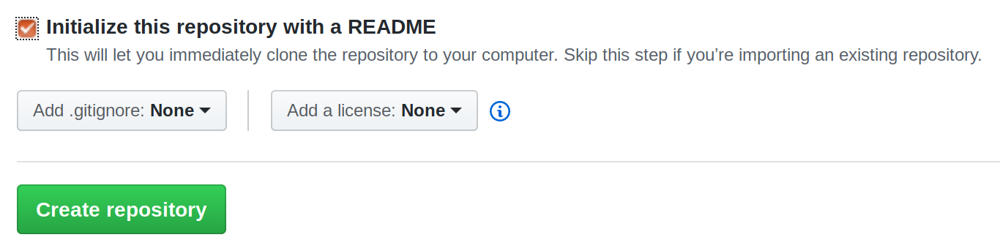
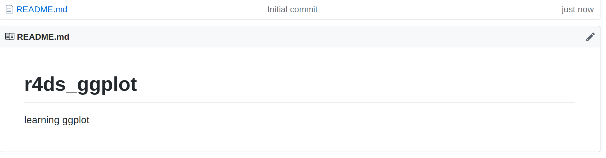
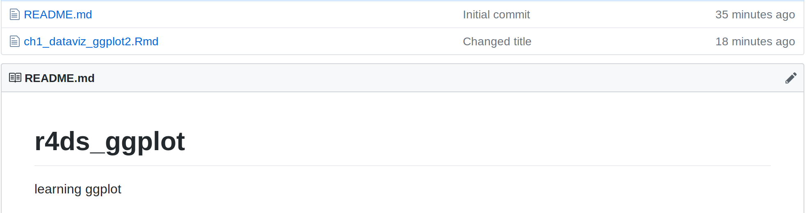

.. post:: Feb 13, 2019
   :tags: git, GitHub
   :author: misken
   :exclude:
   
   Recover from a common git error.

A common git / GitHub error by those new to git
===============================================

In one of the `data analytics courses I teach <http://www.sba.oakland.edu/faculty/isken/courses/mis5470_w19/>`_ I have a little
`intro to git and GitHub <http://www.sba.oakland.edu/faculty/isken/courses/mis5470_w19/git_intro.html>`_. We learn to do basic git operations in
bash shell and from within R Studio. I use the `really good git tutorial
from Software Carpentry <https://swcarpentry.github.io/git-novice/>`_ in addition to some examples specific to my
class.

Git has a pretty steep learning curve for folks with little to no experience with version control and there's one mistake that's pretty easy to make, but not super easy to fix without digging into more advanced git topics. I'm
using this blog post to document this common error and its fix so that I (and my students) can avoid it
in the future.

The error scenario
------------------

Let's assume we have a directory called ``r4ds_ggplot`` which contains a single Rmd file. 

We open a bash shell and navigate to the ``r4ds_ggplot`` directory.

.. code-block:: bash

    $ git init
    $ git add *.Rmd
    $ git commit -m 'Initial commit'
    
Great. We've initialized a new git repo on our local machine, staged
our Rmd file and then done our first commit. We'll then make a few
edits and go through the stage and commit cycle a few times doing
``git status`` and ``git log`` to see what's happening. Now we are
ready to create a remote repo in GitHub and learn how to push our
local repo to this new remote.

Student then login in their newly created GitHub account and we
go through the process of creating a new repo called `r4ds_ggplot`.

Click the Add New Repository link
Fill in the repo name
Add a description like "learning ggplot"

... and here's where trouble might ensue. Sometimes, new users will
inadvertantly check the little box telling GitHub to "initialize this repository with a README".

Oops. The message says not to do this if we are planning on importing an existing repository (which we are).
Again, easy mistake to make anyway. So, now, you've got a remote repo in GitHub which contains a
README.md file. It looks like this.

Now, back in the bash shell, we add this new remote to our local repo.

.. code-block:: bash

    $ git remote add origin https://github.com/<username>/r4ds_ggplot.git

With the remote added, we are ready to push our local repo up to GitHub,
not realizing that there's work up there in the GitHub repo that
we don't have in our local repo. 

.. code-block:: bash

    $ git push -u origin master
    
    To https://github.com/misken/r4ds_ggplot.git
    ! [rejected]        master -> master (fetch first)
    error: failed to push some refs to 'https://github.com/misken/r4ds_ggplot.git'
    hint: Updates were rejected because the remote contains work that you do
    hint: not have locally. This is usually caused by another repository pushing
    hint: to the same ref. You may want to first integrate the remote changes
    hint: (e.g., 'git pull ...') before pushing again.
    hint: See the 'Note about fast-forwards' in 'git push --help' for details.
    
Often a little searching and reading will result in trying to do what the
error messages suggests we do, a ``git pull``. A little `more research <https://help.github.com/articles/fetching-a-remote/>`_ will
reveal that a ``git pull`` will do a ``git fetch`` and then attempt a ``git merge``. 

.. code-block:: bash

    $ git pull origin master
    
    warning: no common commits
    remote: Enumerating objects: 3, done.
    remote: Counting objects: 100% (3/3), done.
    remote: Total 3 (delta 0), reused 0 (delta 0), pack-reused 0
    Unpacking objects: 100% (3/3), done.
    From https://github.com/misken/r4ds_ggplot
     * branch            master     -> FETCH_HEAD
     * [new branch]      master     -> origin/master
    fatal: refusing to merge unrelated histories

What?! Looks like the merge part of the pull process is the sticking point. 

The fix
-------

Let's put that final message about unrelated histories into a little Google search and we land on this StackOverflow post - `https://stackoverflow.com/questions/37937984/git-refusing-to-merge-unrelated-histories-on-rebase <https://stackoverflow.com/questions/37937984/git-refusing-to-merge-unrelated-histories-on-rebase>`_. Reading the whole post reveals the issue:

	"git merge" used to allow merging two branches that have no common base by default, which led to a brand new history of an existing project created and then get pulled by an unsuspecting maintainer, which allowed an unnecessary parallel history merged into the existing project. The command has been taught not to allow this by default, with an escape hatch --allow-unrelated-histories option to be used in a rare event that merges histories of two projects that started their lives independently.
	
That's the case here. Our local repo and our GitHub repo "started their lives independently" (inadvertantly). Now we want to allow them to be merged but we need to tell git to allow this by including the ``--allow-unrelated-histories`` option.

.. code-block:: bash

    $ git pull origin master --allow-unrelated-histories
    
Now, git drops us into our default commit editor (e.g. nano) and we can enter a commit message. And then, ta da...

.. code-block:: bash

    From https://github.com/misken/r4ds_ggplot
     * branch            master     -> FETCH_HEAD
    Merge made by the 'recursive' strategy.
    README.md | 2 ++
    1 file changed, 2 insertions(+)
    create mode 100644 README.md
    
Now we can push our local repo to GitHub.

.. code-block:: bash

	$ git push -u origin master
	
	Username for 'https://github.com': misken
	Password for 'https://misken@github.com': 
	Counting objects: 8, done.
	Delta compression using up to 8 threads.
	Compressing objects: 100% (8/8), done.
	Writing objects: 100% (8/8), 6.45 KiB | 1.61 MiB/s, done.
	Total 8 (delta 1), reused 0 (delta 0)
	remote: Resolving deltas: 100% (1/1), done.
	To https://github.com/misken/r4ds_ggplot.git
	   d565a8a..d77afd3  master -> master
	Branch 'master' set up to track remote branch 'master' from 'origin'.

Head over to GitHub repo and refresh the page. Done.

Now the local and remote repos are in sync and we can carry on. Of course,
git is still hard for those new to version control (like me) and I'm sure
we'll make more mistakes. That's how you learn.
