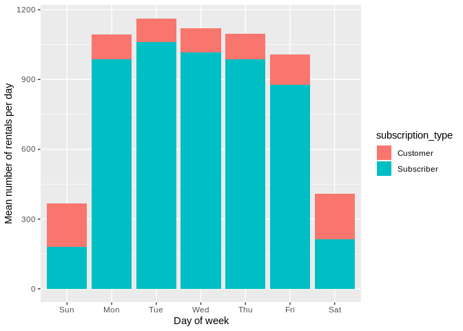
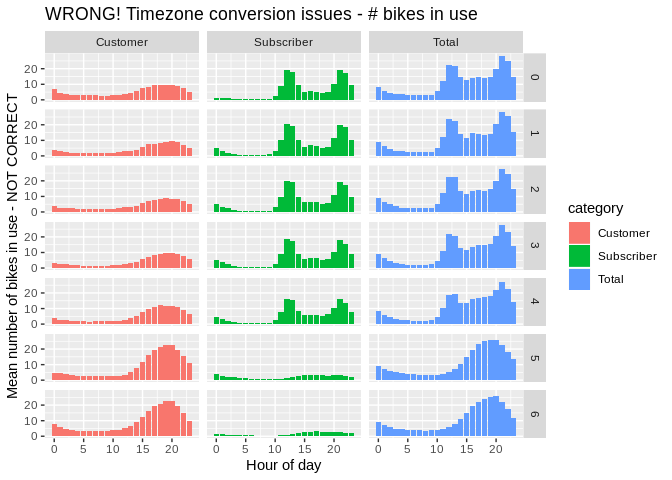
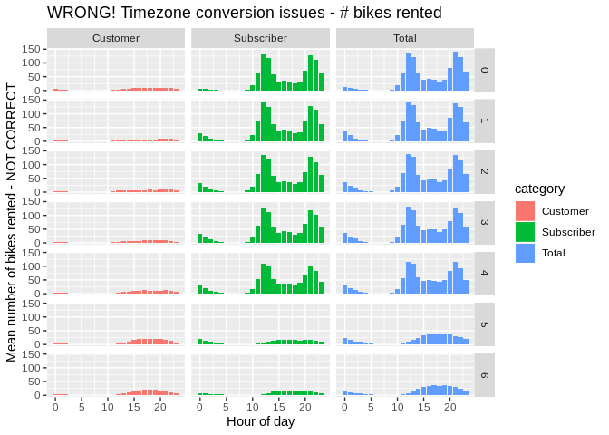
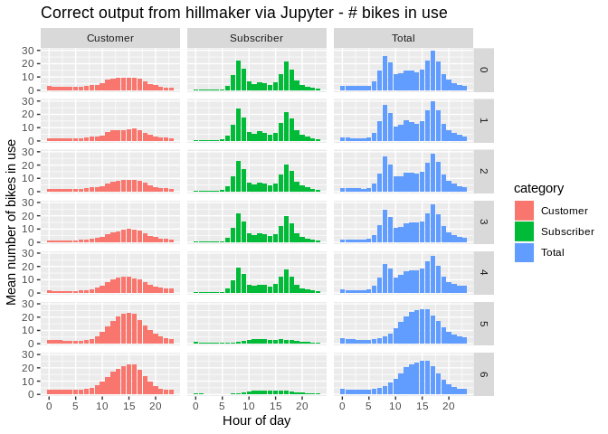
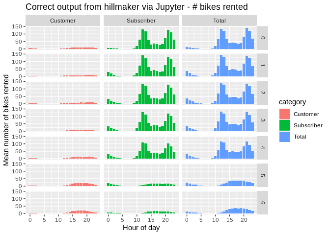
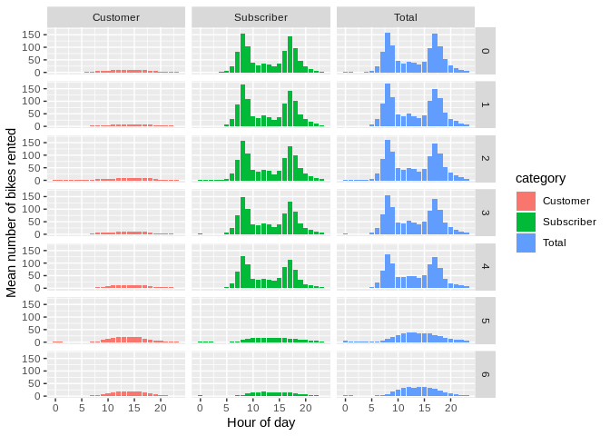
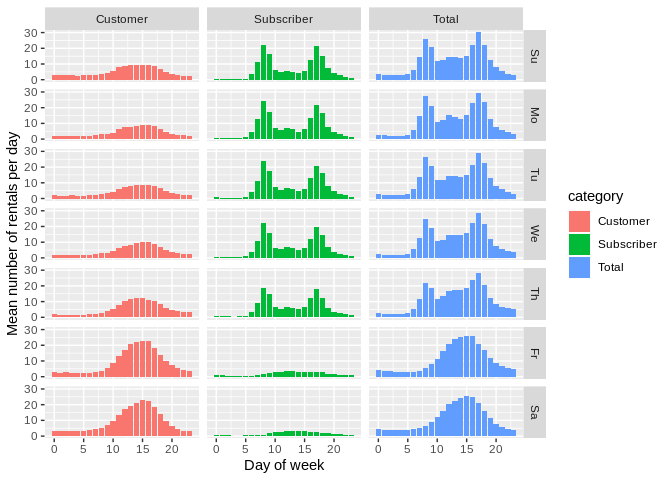

# Using hillmaker from R with reticulate to analyze time of day patterns in bike share data

Python based hillmaker is called from R using reticulate.

In a previous post, [Analyzing Pronto Cycle Share data with hillmaker](https://misken.github.io/blog/basic_usage_cycleshare/), we showed how the Python [hillmaker](https://github.com/misken/hillmaker) module can be used to create statistical summaries by time of day and day of week for bike share system usage. As an everyday user of both Python and R, I've been wanting to test out the [reticulate](https://github.com/rstudio/reticulate) R package that makes it possible to use Python from within R. Let's see if we can use hillmaker from R.

``` r
library(dplyr)
library(ggplot2)
library(lubridate)
library(readr)
library(tidyr)
```

A bit about reticulate
----------------------

It looks like reticulate makes it possible to interact with Python in a number of ways, including:

-   loading Python modules or sourcing Python programs from within R Markdown documents,
-   specifying specific Python virtual environments to use (including conda based),
-   intelligently translating between R and Python objects such as data frames,
-   using Python interactively within an R session.

Installing and loading reticulate is done the usual way.

``` r
#install.packages("reticulate")
library(reticulate)
```

The reticulate package can bind to any of the python installations or virtual environments or conda environments on your system. See <https://rstudio.github.io/reticulate/articles/versions.html> for the details.

On my system I use the Anaconda Python distribution and have a conda virtual environment called `hselab` in which hillmaker and all its dependencies are already installed. To tell reticulate to use this conda environment, we use the `use_condaenv()` function.

``` r
use_condaenv("hselab")
```

However, as discussed in the doc page above, reticulate functions like `use_condaenv()` or `use_python()` are just "hints" and don't actually force binding to a particular Python executable. The binding takes place the first time you do an import. It also seems to happen if you call the reticulate `py_config()` function, which displays all of the discovered paths to Python executables. So, when I tried this simple hello world Python code chunk, I got an error saying reticulate couldn't find Python.

``` python
who = 'world'
print("Hello {}!".format(who))
```

``` r
py_config() # This makes it discover and bind
pd <- import("pandas") # So would this
```

Just for fun.

``` python
who = 'world'
print("Hello {}!".format(who))
```

    ## Hello world!

The data analysis problem
-------------------------

To test out reticulate with hillmaker, let's assume we are interested in obtaining statistics on the total number of bikes in use by time of day and day of week for 2014 in the San Francisco bike share system. We'll use the anonymized [trip data available from Kaggle](https://www.kaggle.com/benhamner/sf-bay-area-bike-share). In a [previous post exploring station balance in this system](https://misken.github.io/blog/eda_post_balance_func_sfcs/) I described some data prep done to facilitate analysis. I'm going to reuse that prepped data for this analysis.

``` r
load("data/processed/sfcs_prepped.Rdata")
```

Here's the structure of the trip table.

``` r
str(trip)
```

    ## Classes 'tbl_df', 'tbl' and 'data.frame':    669959 obs. of  25 variables:
    ##  $ id                : int  4576 4607 4130 4251 4299 4927 4500 4563 4760 4258 ...
    ##  $ duration          : num  63 70 71 77 83 103 109 111 113 114 ...
    ##  $ start_date        : POSIXct, format: "2013-08-29 14:13:00" "2013-08-29 14:42:00" ...
    ##  $ start_station_name: chr  "South Van Ness at Market" "San Jose City Hall" "Mountain View City Hall" "San Jose City Hall" ...
    ##  $ start_station_id  : Factor w/ 70 levels "2","3","4","5",..: 55 9 21 9 55 48 3 7 55 9 ...
    ##  $ end_date          : POSIXct, format: "2013-08-29 14:14:00" "2013-08-29 14:43:00" ...
    ##  $ end_station_name  : chr  "South Van Ness at Market" "San Jose City Hall" "Mountain View City Hall" "San Jose City Hall" ...
    ##  $ end_station_id    : Factor w/ 70 levels "2","3","4","5",..: 55 9 21 9 56 48 4 7 55 10 ...
    ##  $ bike_id           : int  520 661 48 26 319 527 679 687 553 107 ...
    ##  $ subscription_type : Factor w/ 2 levels "Customer","Subscriber": 2 2 2 2 2 2 2 2 2 2 ...
    ##  $ zip_code          : Factor w/ 7427 levels "0","1","2","3",..: 6254 6564 6880 6516 6231 6237 6539 6539 6231 6516 ...
    ##  $ trip_date         : Date, format: "2013-08-29" "2013-08-29" ...
    ##  $ start_year        : num  2013 2013 2013 2013 2013 ...
    ##  $ start_month       : num  8 8 8 8 8 8 8 8 8 8 ...
    ##  $ start_hour        : int  14 14 10 11 12 18 13 14 17 11 ...
    ##  $ start_dow         : Factor w/ 7 levels "Su","Mo","Tu",..: 5 5 5 5 5 5 5 5 5 5 ...
    ##  $ trip_ym           : POSIXct, format: "2013-08-01" "2013-08-01" ...
    ##  $ start_weekday     : Factor w/ 2 levels "Weekend","Weekday": 1 1 1 1 1 1 1 1 1 1 ...
    ##  $ round_trip        : Factor w/ 2 levels "One way","Round trip": 2 2 2 2 1 2 1 2 2 1 ...
    ##  $ start_city        : chr  "San Francisco" "San Jose" "Mountain View" "San Jose" ...
    ##  $ start_lat         : num  37.8 37.3 37.4 37.3 37.8 ...
    ##  $ start_long        : num  -122 -122 -122 -122 -122 ...
    ##  $ end_city          : chr  "San Francisco" "San Jose" "Mountain View" "San Jose" ...
    ##  $ end_lat           : num  37.8 37.3 37.4 37.3 37.8 ...
    ##  $ end_long          : num  -122 -122 -122 -122 -122 ...

Trends in cycle share use
-------------------------

Before diving into detailed time of day and day of week analysis, let's look at overall number of riders by year, month and subscription type.

``` r
trip %>% 
  group_by(trip_ym, subscription_type) %>% 
  count() %>% 
  ggplot() + 
  geom_line(aes(x = trip_ym, y = n, 
                colour = subscription_type, group = subscription_type)) +
  xlab('Month') +
  ylab('Num riders')
```


In the [station balance post](http://hselab.org/use-r-to-explore-station-balance-in-bike-share-systems-and-learn-a-little-dplyr-programming.html) I developed a function to do counts of events by one or more grouping fields and that appropriately accounts for "zero days" so that summary statistics are unbiased. Since then I added a `dow` parameter to the function that allows the day of week to be treated as an ordered factor with either long or abbreviated day names as the levels. Make plot labelling easier. You can find this R script along with a pile of other related, but unorganized, code in the following GitHub repo - <https://github.com/misken/sfcs>.

``` r
source("bikeshare_util.R")
```

``` r
startdate <- ymd("2014-01-01")
enddate <- ymd("2014-12-31")

# Count number of trips by date by subscription type
tot_trips_bydate_sub <- counts_by_date_groups(trip, startdate, enddate, 
                      trip_date, subscription_type, dow = 2)
```

    ## Joining, by = c("subscription_type", "trip_date")

``` r
head(tot_trips_bydate_sub)
```

    ##   subscription_type  trip_date   n dow daytype
    ## 1          Customer 2014-01-01 235 Wed weekday
    ## 2          Customer 2014-01-02 129 Thu weekday
    ## 3          Customer 2014-01-03 128 Fri weekday
    ## 4          Customer 2014-01-04 130 Sat weekend
    ## 5          Customer 2014-01-05 105 Sun weekend
    ## 6          Customer 2014-01-06  75 Mon weekday

Now compute summary stats and plot.

``` r
stats_trips_bydate_sub <- tot_trips_bydate_sub %>% 
  group_by(subscription_type, dow) %>% 
  summarize(
    num_weeks = n(),
    num_trips_mean = mean(n),
    num_trips_sd = sd(n),
    num_trips_min = min(n),
    num_trips_max = max(n),
    num_trips_p05 = quantile(n, 0.05),
    num_trips_p25 = quantile(n, 0.25),
    num_trips_p50 = quantile(n, 0.5),
    num_trips_p75 = quantile(n, 0.75),
    num_trips_p95 = quantile(n, 0.95)

  )

ggplot(stats_trips_bydate_sub) + 
  geom_bar(aes(x = dow, y = num_trips_mean, fill = subscription_type), 
           stat = "identity") +
  xlab("Day of week") + ylab("Mean number of rentals per day")
```



On to time of day analysis.

Time of day and day of week analysis with hillmaker
---------------------------------------------------

The hillmaker module describes itself this way on its [GitHub page](https://github.com/misken/hillmaker).

> hillmaker is a Python package that computes time of day and day of week specific occupancy statistics from transaction data containing arrival and departure timestamps. Typical use is for capacity planning problems in places like hospital emergency departments, surgical recovery rooms or any system in which entities arrive, occupy capacity for some amount of time, and then depart. It gets its name from the hill-like nature of plots based on temporal occupancy statistics.

You can see a Jupyter notebook based "Getting Started" example at [the hillmaker-examples repo](https://github.com/misken/hillmaker-examples/blob/master/notebooks/basic_usage_shortstay_unit.ipynb). I'm not going to repeat any of that here.

I use Python quite a bit and had no interest in creating an R based version of hillmaker. But, I want to be able to use hillmaker directly from R scripts and/or R Markdown documents so that, for example, I could seamlessly create output plots using ggplot2. Enter [reticulate](https://github.com/rstudio/reticulate).

Start out by importing hillmaker. Note that `import` here is a reticulate function and that this is an R code chunk. Nevertheless, the following essentially is like doing the following in Python. After doing this, we can access functions in the hillmaker module with `hm$` followed by the function name.

    import hillmaker as hm

``` r
hm <- import("hillmaker")
```

Let's create a bunch of R variables corresponding to the input arguments we'll pass in to the `make_hills()` function.

``` r
scenario <- 'subtype_2014'
in_fld_name <- 'start_date'
out_fld_name <- 'end_date'
cat_fld_name <- 'subscription_type'

start <- "2014-01-01"
end <- "2014-12-31"
bin_size_minutes <- 60

# Optional inputs
# Default behavior is to export results data frames to csv files. This
#  is the location for those files.
output <- './output' 
```

Now we can call `make_hills()` using the `hm` variable created above. Note that with reticulate, we access Python functions by using the '$' followed by the function name. Notice that we are passing an R data frame, `trip` to a Python function expecting a `pandas` data frame. Thank you, reticulate. Hillmaker returns, in Python, a dictionary of pandas DataFrame objects. According to the [doc section on type conversions](https://rstudio.github.io/reticulate/articles/calling_python.html#type-conversions) reticulate should convert this to a list of R data frames. Perfect.

``` r
subtype_2014_results <- hm$make_hills(scenario, trip, in_fld_name, 
              out_fld_name, start, end, cat_fld_name, 
              export_path = output, 
              return_dataframes = TRUE)
```

Before diving down the rabbit hole of exploring the data structure returned by hillmaker, let's see that indeed the standard hillmaker output files were created and that we can immediately plot the results.

``` bash
ls ./output/*.csv
```

    ## ./output/arr_stats_summary_cat_sfcs_jupyter_1.csv
    ## ./output/arr_stats_summary_cat_subtype_2014.csv
    ## ./output/arr_stats_summary_cat_utc.csv
    ## ./output/arr_stats_summary_sfcs_jupyter_1.csv
    ## ./output/arr_stats_summary_subtype_2014.csv
    ## ./output/arr_stats_summary_utc.csv
    ## ./output/bydatetime_sfcs_jupyter_1.csv
    ## ./output/bydatetime_subtype_2014.csv
    ## ./output/bydatetime_utc.csv
    ## ./output/dep_stats_summary_cat_sfcs_jupyter_1.csv
    ## ./output/dep_stats_summary_cat_subtype_2014.csv
    ## ./output/dep_stats_summary_cat_utc.csv
    ## ./output/dep_stats_summary_sfcs_jupyter_1.csv
    ## ./output/dep_stats_summary_subtype_2014.csv
    ## ./output/dep_stats_summary_utc.csv
    ## ./output/occ_stats_summary_cat_sfcs_jupyter_1.csv
    ## ./output/occ_stats_summary_cat_subtype_2014.csv
    ## ./output/occ_stats_summary_cat_utc.csv
    ## ./output/occ_stats_summary_sfcs_jupyter_1.csv
    ## ./output/occ_stats_summary_subtype_2014.csv
    ## ./output/occ_stats_summary_utc.csv

``` r
occ_subtype_2014 <- read_csv('./output/occ_stats_summary_subtype_2014.csv')
arr_subtype_2014 <- read_csv('./output/arr_stats_summary_subtype_2014.csv')
```

Unfortunately, it it looks like everything is off by about 5 hours. Suspicious since local time is UTC-5.

``` r
ggplot(occ_subtype_2014) + 
  geom_bar(aes(x = bin_of_day, y = mean, fill = category), 
           stat = "identity") + facet_grid(day_of_week ~ category) +
  xlab("Hour of day") + ylab("Mean number of bikes in use - NOT CORRECT") +
  ggtitle("WRONG! Timezone conversion issues - # bikes in use")
```



``` r
ggplot(arr_subtype_2014) + 
  geom_bar(aes(x = bin_of_day, y = mean, fill = category), 
           stat = "identity") + facet_grid(day_of_week ~ category) +
  xlab("Hour of day") + ylab("Mean number of bikes rented - NOT CORRECT") +
  ggtitle("WRONG! Timezone conversion issues - # bikes rented")
```



To confirm the error, I ran hillmaker from a Jupyter Lab notebook on the same raw trip data and plotted the output.

``` r
occ_subtype_2014_jupyter <- read_csv('./output/occ_stats_summary_sfcs_jupyter_1.csv')
arr_subtype_2014_jupyter <- read_csv('./output/arr_stats_summary_sfcs_jupyter_1.csv')
```

``` r
ggplot(occ_subtype_2014_jupyter) + 
  geom_bar(aes(x = bin_of_day, y = mean, fill = category), 
           stat = "identity") + facet_grid(day_of_week ~ category) +
  xlab("Hour of day") + ylab("Mean number of bikes in use") +
  ggtitle("Correct output from hillmaker via Jupyter - # bikes in use")
```



``` r
ggplot(arr_subtype_2014) + 
  geom_bar(aes(x = bin_of_day, y = mean, fill = category), 
           stat = "identity") + facet_grid(day_of_week ~ category) +
  xlab("Hour of day") + ylab("Mean number of bikes rented") +
  ggtitle("Correct output from hillmaker via Jupyter - # bikes rented")
```



These look good. So, something is happening during the R to Python translation when hillmaker is called from R. Let's explore a handful of records.

``` r
trip_5 <- head(trip, n = 5) %>% 
  select(1:3)

trip_5
```

    ## # A tibble: 5 x 3
    ##      id duration start_date         
    ##   <int>    <dbl> <dttm>             
    ## 1  4576       63 2013-08-29 14:13:00
    ## 2  4607       70 2013-08-29 14:42:00
    ## 3  4130       71 2013-08-29 10:16:00
    ## 4  4251       77 2013-08-29 11:29:00
    ## 5  4299       83 2013-08-29 12:02:00

If we print out `start_date`, R uses local time for displaying the timezone.

``` r
trip_5$start_date
```

    ## [1] "2013-08-29 14:13:00 EDT" "2013-08-29 14:42:00 EDT"
    ## [3] "2013-08-29 10:16:00 EDT" "2013-08-29 11:29:00 EDT"
    ## [5] "2013-08-29 12:02:00 EDT"

But, this is just a display artifact and `start_date` actually has no timezone set.

``` r
sapply(trip_5$start_date, FUN = tz)
```

    ## [1] "" "" "" "" ""

Now, let's use the pandas `DataFrame` function to create a pandas data frame from `trip_5`. The reticulate package handles the conversion.

``` r
trip_5_pd <- pd$DataFrame(trip_5)
str(trip_5_pd)
```

    ## 'data.frame':    5 obs. of  3 variables:
    ##  $ id        : int  4576 4607 4130 4251 4299
    ##  $ duration  : num  63 70 71 77 83
    ##  $ start_date: POSIXct, format: "2013-08-29 18:13:00" "2013-08-29 18:42:00" ...
    ##  - attr(*, "pandas.index")=RangeIndex(start=0, stop=5, step=1)

Notice that `start_date` is fours hours later - the difference between EDT and UTC. A little research led to the following relevant and useful reticulate issues:

<https://github.com/rstudio/reticulate/issues/325>

<https://github.com/rstudio/reticulate/issues/160>

Turns out that when an R POSIXct value having no timezone set is converted to its pandas equivalent, pandas sets the timeone to UTC. To see this, here's an example based on Issue 160 (link above):

``` r
# Local time is assumed by R for display purposes
print("R data frame")
```

    ## [1] "R data frame"

``` r
ex <- data.frame(y = Sys.time())
ex
```

    ##                     y
    ## 1 2019-02-23 11:19:50

``` r
ex$y
```

    ## [1] "2019-02-23 11:19:50 EST"

``` r
# No timezone is set
tz(ex$y)
```

    ## [1] ""

``` r
# Use reticulate to convert to Python object - notice conversion to UTC
print("R to Python")
```

    ## [1] "R to Python"

``` r
ex_py <- r_to_py(ex)
ex_py
```

    ##                               y
    ## 0 2019-02-23 16:19:50.980685824

``` r
ex_py$y
```

    ## 0   2019-02-23 16:19:50.980685824
    ## Name: y, dtype: datetime64[ns]

``` r
tz(ex_py$y)
```

    ## [1] "UTC"

``` r
# Use reticulate to bring it back to R
print("Python back to R")
```

    ## [1] "Python back to R"

``` r
ex_back_to_r <- py_to_r(ex_py)
ex_back_to_r
```

    ##                     y
    ## 1 2019-02-23 16:19:50

``` r
ex_back_to_r$y
```

    ## [1] "2019-02-23 16:19:50 UTC"

``` r
tz(ex_back_to_r)
```

    ## [1] "UTC"

> This poses a problem for hillmaker since all timestamps are getting shifted by the number of hours between local time (of the analyst) and UTC.

Since what we really want is for the timestamps to not get shifted, seems we can just set their timezone to UTC. For example:

``` r
ex_utc <- data.frame(y = Sys.time())
ex_utc$y
```

    ## [1] "2019-02-23 11:19:51 EST"

``` r
print("Set timezone to UTC")
```

    ## [1] "Set timezone to UTC"

``` r
tz(ex_utc$y) <- "UTC"
ex_utc$y
```

    ## [1] "2019-02-23 11:19:51 UTC"

``` r
print("Convert UTC value to Python")
```

    ## [1] "Convert UTC value to Python"

``` r
ex_utc_py <- r_to_py(ex_utc)
ex_utc_py$y
```

    ## 0   2019-02-23 11:19:51.012009984
    ## Name: y, dtype: datetime64[ns]

``` r
print("Bring UTC value back from Python")
```

    ## [1] "Bring UTC value back from Python"

``` r
ex_utc_back_to_r <- py_to_r(ex_utc_py)
ex_utc_back_to_r$y
```

    ## [1] "2019-02-23 11:19:51 UTC"

So, we can set the timezone for the `start_date` and `end_date` columns to UTC, pass them to hillmaker, and then remove the timezone information.

``` r
tz(trip$start_date) <- "UTC"
tz(trip$end_date) <- "UTC"
```

``` r
utc_results <- hm$make_hills("utc", trip, in_fld_name, 
              out_fld_name, start, end, cat_fld_name, 
              export_path = output, 
              return_dataframes = TRUE)
```

``` r
occ_utc <- read_csv('./output/occ_stats_summary_utc.csv')
arr_utc <- read_csv('./output/arr_stats_summary_utc.csv')
```

``` r
ggplot(occ_utc) + 
  geom_bar(aes(x = bin_of_day, y = mean, fill = category), 
           stat = "identity") + facet_grid(day_of_week ~ category) +
  xlab("Hour of day") + ylab("Mean number of bikes in use")
```


``` r
ggplot(arr_utc) + 
  geom_bar(aes(x = bin_of_day, y = mean, fill = category), 
           stat = "identity") + facet_grid(day_of_week ~ category) +
  xlab("Hour of day") + ylab("Mean number of bikes rented")
```



Looks good. Let's get rid of those UTC timezone assignments.

``` r
tz(trip$start_date)
```

    ## [1] "UTC"

Remove the timezone info.

``` r
tz(trip$start_date) <- ""
tz(trip$end_date) <- ""

tz(trip$start_date)
```

    ## [1] ""

Bottom line, need to be really careful when calling datetime related functions in Python from R using reticulate. Now that we got that sorted out, let's return to exploring the hillmaker data structures returned from Python.

What does the returned data structure look like?
------------------------------------------------

The hillmaker function returns a Python dictionary of pandas DataFrame objects. Reticulate converts these to a list of, hmm, let's see.

``` r
class(utc_results)
```

    ## [1] "list"

Let's get the names of the data frames returned by hillmaker.

``` r
names(utc_results)
```

    ## [1] "bydatetime" "occupancy"  "arrivals"   "departures" "tot_occ"   
    ## [6] "tot_arr"    "tot_dep"

``` r
class(utc_results$occupancy)
```

    ## [1] "pandas.core.frame.DataFrame"       
    ## [2] "pandas.core.generic.NDFrame"       
    ## [3] "pandas.core.base.PandasObject"     
    ## [4] "pandas.core.base.StringMixin"      
    ## [5] "pandas.core.accessor.DirNamesMixin"
    ## [6] "pandas.core.base.SelectionMixin"   
    ## [7] "python.builtin.object"

The `occupancy` data frame is the one that contains stats about the number of bikes in use by time of day and day of week. Refer back to the hillmaker pages in GitHub (links above) for details on all of the output data frames.

The problem with the following is that the multiindex in the pandas dataframe appears to get translated to data frame attributes.

``` r
occ_df <- py_to_r(utc_results$occupancy)
```

``` r
names(occ_df)
```

    ##  [1] "count" "cv"    "kurt"  "max"   "mean"  "min"   "p50"   "p55"  
    ##  [9] "p60"   "p65"   "p70"   "p75"   "p80"   "p85"   "p90"   "p95"  
    ## [17] "p975"  "p99"   "sem"   "skew"  "stdev" "var"

Notice no columns relating to the underlying pandas MultiIndex. So, seems we could either:

1.  dig out the components of the MultiIndex from the attributes list and convert them to R vectors that could be assigned to new columns in the data frame, or

2.  use pandas from R to reset the index on `occ_df` which will create new columns corresponding to the levels of the MultiIndex.

According this [this reticulate doc page](https://rstudio.github.io/reticulate/articles/r_markdown.html), the R Studio 1.2 Preview Version will directly support Python chunks in R Notebooks. I'm still using v1.1.456. I didn't actually notice this and wasted a bunch of time trying to use the new reticulate features with no luck. So, for this post, we'll use a more brute force approach.

Let's try the first approach - convert the pandas MultiIndex ourselves from the R data frame attributes. What do the attributes look like?

``` r
attributes(occ_df)
```

    ## $names
    ##  [1] "count" "cv"    "kurt"  "max"   "mean"  "min"   "p50"   "p55"  
    ##  [9] "p60"   "p65"   "p70"   "p75"   "p80"   "p85"   "p90"   "p95"  
    ## [17] "p975"  "p99"   "sem"   "skew"  "stdev" "var"  
    ## 
    ## $class
    ## [1] "data.frame"
    ## 
    ## $row.names
    ##   [1]   1   2   3   4   5   6   7   8   9  10  11  12  13  14  15  16  17
    ##  [18]  18  19  20  21  22  23  24  25  26  27  28  29  30  31  32  33  34
    ##  [35]  35  36  37  38  39  40  41  42  43  44  45  46  47  48  49  50  51
    ##  [52]  52  53  54  55  56  57  58  59  60  61  62  63  64  65  66  67  68
    ##  [69]  69  70  71  72  73  74  75  76  77  78  79  80  81  82  83  84  85
    ##  [86]  86  87  88  89  90  91  92  93  94  95  96  97  98  99 100 101 102
    ## [103] 103 104 105 106 107 108 109 110 111 112 113 114 115 116 117 118 119
    ## [120] 120 121 122 123 124 125 126 127 128 129 130 131 132 133 134 135 136
    ## [137] 137 138 139 140 141 142 143 144 145 146 147 148 149 150 151 152 153
    ## [154] 154 155 156 157 158 159 160 161 162 163 164 165 166 167 168 169 170
    ## [171] 171 172 173 174 175 176 177 178 179 180 181 182 183 184 185 186 187
    ## [188] 188 189 190 191 192 193 194 195 196 197 198 199 200 201 202 203 204
    ## [205] 205 206 207 208 209 210 211 212 213 214 215 216 217 218 219 220 221
    ## [222] 222 223 224 225 226 227 228 229 230 231 232 233 234 235 236 237 238
    ## [239] 239 240 241 242 243 244 245 246 247 248 249 250 251 252 253 254 255
    ## [256] 256 257 258 259 260 261 262 263 264 265 266 267 268 269 270 271 272
    ## [273] 273 274 275 276 277 278 279 280 281 282 283 284 285 286 287 288 289
    ## [290] 290 291 292 293 294 295 296 297 298 299 300 301 302 303 304 305 306
    ## [307] 307 308 309 310 311 312 313 314 315 316 317 318 319 320 321 322 323
    ## [324] 324 325 326 327 328 329 330 331 332 333 334 335 336 337 338 339 340
    ## [341] 341 342 343 344 345 346 347 348 349 350 351 352 353 354 355 356 357
    ## [358] 358 359 360 361 362 363 364 365 366 367 368 369 370 371 372 373 374
    ## [375] 375 376 377 378 379 380 381 382 383 384 385 386 387 388 389 390 391
    ## [392] 392 393 394 395 396 397 398 399 400 401 402 403 404 405 406 407 408
    ## [409] 409 410 411 412 413 414 415 416 417 418 419 420 421 422 423 424 425
    ## [426] 426 427 428 429 430 431 432 433 434 435 436 437 438 439 440 441 442
    ## [443] 443 444 445 446 447 448 449 450 451 452 453 454 455 456 457 458 459
    ## [460] 460 461 462 463 464 465 466 467 468 469 470 471 472 473 474 475 476
    ## [477] 477 478 479 480 481 482 483 484 485 486 487 488 489 490 491 492 493
    ## [494] 494 495 496 497 498 499 500 501 502 503 504
    ## 
    ## $pandas.index
    ## MultiIndex(levels=[['Customer', 'Subscriber', 'Total'], [0, 1, 2, 3, 4, 5, 6], [0, 1, 2, 3, 4, 5, 6, 7, 8, 9, 10, 11, 12, 13, 14, 15, 16, 17, 18, 19, 20, 21, 22, 23]],
    ##            labels=[[0, 0, 0, 0, 0, 0, 0, 0, 0, 0, 0, 0, 0, 0, 0, 0, 0, 0, 0, 0, 0, 0, 0, 0, 0, 0, 0, 0, 0, 0, 0, 0, 0, 0, 0, 0, 0, 0, 0, 0, 0, 0, 0, 0, 0, 0, 0, 0, 0, 0, 0, 0, 0, 0, 0, 0, 0, 0, 0, 0, 0, 0, 0, 0, 0, 0, 0, 0, 0, 0, 0, 0, 0, 0, 0, 0, 0, 0, 0, 0, 0, 0, 0, 0, 0, 0, 0, 0, 0, 0, 0, 0, 0, 0, 0, 0, 0, 0, 0, 0, 0, 0, 0, 0, 0, 0, 0, 0, 0, 0, 0, 0, 0, 0, 0, 0, 0, 0, 0, 0, 0, 0, 0, 0, 0, 0, 0, 0, 0, 0, 0, 0, 0, 0, 0, 0, 0, 0, 0, 0, 0, 0, 0, 0, 0, 0, 0, 0, 0, 0, 0, 0, 0, 0, 0, 0, 0, 0, 0, 0, 0, 0, 0, 0, 0, 0, 0, 0, 1, 1, 1, 1, 1, 1, 1, 1, 1, 1, 1, 1, 1, 1, 1, 1, 1, 1, 1, 1, 1, 1, 1, 1, 1, 1, 1, 1, 1, 1, 1, 1, 1, 1, 1, 1, 1, 1, 1, 1, 1, 1, 1, 1, 1, 1, 1, 1, 1, 1, 1, 1, 1, 1, 1, 1, 1, 1, 1, 1, 1, 1, 1, 1, 1, 1, 1, 1, 1, 1, 1, 1, 1, 1, 1, 1, 1, 1, 1, 1, 1, 1, 1, 1, 1, 1, 1, 1, 1, 1, 1, 1, 1, 1, 1, 1, 1, 1, 1, 1, 1, 1, 1, 1, 1, 1, 1, 1, 1, 1, 1, 1, 1, 1, 1, 1, 1, 1, 1, 1, 1, 1, 1, 1, 1, 1, 1, 1, 1, 1, 1, 1, 1, 1, 1, 1, 1, 1, 1, 1, 1, 1, 1, 1, 1, 1, 1, 1, 1, 1, 1, 1, 1, 1, 1, 1, 1, 1, 1, 1, 1, 1, 1, 1, 1, 1, 1, 1, 2, 2, 2, 2, 2, 2, 2, 2, 2, 2, 2, 2, 2, 2, 2, 2, 2, 2, 2, 2, 2, 2, 2, 2, 2, 2, 2, 2, 2, 2, 2, 2, 2, 2, 2, 2, 2, 2, 2, 2, 2, 2, 2, 2, 2, 2, 2, 2, 2, 2, 2, 2, 2, 2, 2, 2, 2, 2, 2, 2, 2, 2, 2, 2, 2, 2, 2, 2, 2, 2, 2, 2, 2, 2, 2, 2, 2, 2, 2, 2, 2, 2, 2, 2, 2, 2, 2, 2, 2, 2, 2, 2, 2, 2, 2, 2, 2, 2, 2, 2, 2, 2, 2, 2, 2, 2, 2, 2, 2, 2, 2, 2, 2, 2, 2, 2, 2, 2, 2, 2, 2, 2, 2, 2, 2, 2, 2, 2, 2, 2, 2, 2, 2, 2, 2, 2, 2, 2, 2, 2, 2, 2, 2, 2, 2, 2, 2, 2, 2, 2, 2, 2, 2, 2, 2, 2, 2, 2, 2, 2, 2, 2, 2, 2, 2, 2, 2, 2], [0, 0, 0, 0, 0, 0, 0, 0, 0, 0, 0, 0, 0, 0, 0, 0, 0, 0, 0, 0, 0, 0, 0, 0, 1, 1, 1, 1, 1, 1, 1, 1, 1, 1, 1, 1, 1, 1, 1, 1, 1, 1, 1, 1, 1, 1, 1, 1, 2, 2, 2, 2, 2, 2, 2, 2, 2, 2, 2, 2, 2, 2, 2, 2, 2, 2, 2, 2, 2, 2, 2, 2, 3, 3, 3, 3, 3, 3, 3, 3, 3, 3, 3, 3, 3, 3, 3, 3, 3, 3, 3, 3, 3, 3, 3, 3, 4, 4, 4, 4, 4, 4, 4, 4, 4, 4, 4, 4, 4, 4, 4, 4, 4, 4, 4, 4, 4, 4, 4, 4, 5, 5, 5, 5, 5, 5, 5, 5, 5, 5, 5, 5, 5, 5, 5, 5, 5, 5, 5, 5, 5, 5, 5, 5, 6, 6, 6, 6, 6, 6, 6, 6, 6, 6, 6, 6, 6, 6, 6, 6, 6, 6, 6, 6, 6, 6, 6, 6, 0, 0, 0, 0, 0, 0, 0, 0, 0, 0, 0, 0, 0, 0, 0, 0, 0, 0, 0, 0, 0, 0, 0, 0, 1, 1, 1, 1, 1, 1, 1, 1, 1, 1, 1, 1, 1, 1, 1, 1, 1, 1, 1, 1, 1, 1, 1, 1, 2, 2, 2, 2, 2, 2, 2, 2, 2, 2, 2, 2, 2, 2, 2, 2, 2, 2, 2, 2, 2, 2, 2, 2, 3, 3, 3, 3, 3, 3, 3, 3, 3, 3, 3, 3, 3, 3, 3, 3, 3, 3, 3, 3, 3, 3, 3, 3, 4, 4, 4, 4, 4, 4, 4, 4, 4, 4, 4, 4, 4, 4, 4, 4, 4, 4, 4, 4, 4, 4, 4, 4, 5, 5, 5, 5, 5, 5, 5, 5, 5, 5, 5, 5, 5, 5, 5, 5, 5, 5, 5, 5, 5, 5, 5, 5, 6, 6, 6, 6, 6, 6, 6, 6, 6, 6, 6, 6, 6, 6, 6, 6, 6, 6, 6, 6, 6, 6, 6, 6, 0, 0, 0, 0, 0, 0, 0, 0, 0, 0, 0, 0, 0, 0, 0, 0, 0, 0, 0, 0, 0, 0, 0, 0, 1, 1, 1, 1, 1, 1, 1, 1, 1, 1, 1, 1, 1, 1, 1, 1, 1, 1, 1, 1, 1, 1, 1, 1, 2, 2, 2, 2, 2, 2, 2, 2, 2, 2, 2, 2, 2, 2, 2, 2, 2, 2, 2, 2, 2, 2, 2, 2, 3, 3, 3, 3, 3, 3, 3, 3, 3, 3, 3, 3, 3, 3, 3, 3, 3, 3, 3, 3, 3, 3, 3, 3, 4, 4, 4, 4, 4, 4, 4, 4, 4, 4, 4, 4, 4, 4, 4, 4, 4, 4, 4, 4, 4, 4, 4, 4, 5, 5, 5, 5, 5, 5, 5, 5, 5, 5, 5, 5, 5, 5, 5, 5, 5, 5, 5, 5, 5, 5, 5, 5, 6, 6, 6, 6, 6, 6, 6, 6, 6, 6, 6, 6, 6, 6, 6, 6, 6, 6, 6, 6, 6, 6, 6, 6], [0, 1, 2, 3, 4, 5, 6, 7, 8, 9, 10, 11, 12, 13, 14, 15, 16, 17, 18, 19, 20, 21, 22, 23, 0, 1, 2, 3, 4, 5, 6, 7, 8, 9, 10, 11, 12, 13, 14, 15, 16, 17, 18, 19, 20, 21, 22, 23, 0, 1, 2, 3, 4, 5, 6, 7, 8, 9, 10, 11, 12, 13, 14, 15, 16, 17, 18, 19, 20, 21, 22, 23, 0, 1, 2, 3, 4, 5, 6, 7, 8, 9, 10, 11, 12, 13, 14, 15, 16, 17, 18, 19, 20, 21, 22, 23, 0, 1, 2, 3, 4, 5, 6, 7, 8, 9, 10, 11, 12, 13, 14, 15, 16, 17, 18, 19, 20, 21, 22, 23, 0, 1, 2, 3, 4, 5, 6, 7, 8, 9, 10, 11, 12, 13, 14, 15, 16, 17, 18, 19, 20, 21, 22, 23, 0, 1, 2, 3, 4, 5, 6, 7, 8, 9, 10, 11, 12, 13, 14, 15, 16, 17, 18, 19, 20, 21, 22, 23, 0, 1, 2, 3, 4, 5, 6, 7, 8, 9, 10, 11, 12, 13, 14, 15, 16, 17, 18, 19, 20, 21, 22, 23, 0, 1, 2, 3, 4, 5, 6, 7, 8, 9, 10, 11, 12, 13, 14, 15, 16, 17, 18, 19, 20, 21, 22, 23, 0, 1, 2, 3, 4, 5, 6, 7, 8, 9, 10, 11, 12, 13, 14, 15, 16, 17, 18, 19, 20, 21, 22, 23, 0, 1, 2, 3, 4, 5, 6, 7, 8, 9, 10, 11, 12, 13, 14, 15, 16, 17, 18, 19, 20, 21, 22, 23, 0, 1, 2, 3, 4, 5, 6, 7, 8, 9, 10, 11, 12, 13, 14, 15, 16, 17, 18, 19, 20, 21, 22, 23, 0, 1, 2, 3, 4, 5, 6, 7, 8, 9, 10, 11, 12, 13, 14, 15, 16, 17, 18, 19, 20, 21, 22, 23, 0, 1, 2, 3, 4, 5, 6, 7, 8, 9, 10, 11, 12, 13, 14, 15, 16, 17, 18, 19, 20, 21, 22, 23, 0, 1, 2, 3, 4, 5, 6, 7, 8, 9, 10, 11, 12, 13, 14, 15, 16, 17, 18, 19, 20, 21, 22, 23, 0, 1, 2, 3, 4, 5, 6, 7, 8, 9, 10, 11, 12, 13, 14, 15, 16, 17, 18, 19, 20, 21, 22, 23, 0, 1, 2, 3, 4, 5, 6, 7, 8, 9, 10, 11, 12, 13, 14, 15, 16, 17, 18, 19, 20, 21, 22, 23, 0, 1, 2, 3, 4, 5, 6, 7, 8, 9, 10, 11, 12, 13, 14, 15, 16, 17, 18, 19, 20, 21, 22, 23, 0, 1, 2, 3, 4, 5, 6, 7, 8, 9, 10, 11, 12, 13, 14, 15, 16, 17, 18, 19, 20, 21, 22, 23, 0, 1, 2, 3, 4, 5, 6, 7, 8, 9, 10, 11, 12, 13, 14, 15, 16, 17, 18, 19, 20, 21, 22, 23, 0, 1, 2, 3, 4, 5, 6, 7, 8, 9, 10, 11, 12, 13, 14, 15, 16, 17, 18, 19, 20, 21, 22, 23]],
    ##            names=['category', 'day_of_week', 'bin_of_day'])

Clearly we need to look at the `pandas.index` object.

``` r
head(attributes(occ_df)$pandas.index, n=10)
```

    ## MultiIndex(levels=[['Customer', 'Subscriber', 'Total'], [0, 1, 2, 3, 4, 5, 6], [0, 1, 2, 3, 4, 5, 6, 7, 8, 9, 10, 11, 12, 13, 14, 15, 16, 17, 18, 19, 20, 21, 22, 23]],
    ##            labels=[[0, 0], [0, 0], [1, 2]],
    ##            names=['category', 'day_of_week', 'bin_of_day'])

``` r
tail(attributes(occ_df)$pandas.index, n=10)
```

    ## MultiIndex(levels=[['Customer', 'Subscriber', 'Total'], [0, 1, 2, 3, 4, 5, 6], [0, 1, 2, 3, 4, 5, 6, 7, 8, 9, 10, 11, 12, 13, 14, 15, 16, 17, 18, 19, 20, 21, 22, 23]],
    ##            labels=[[0, 0], [0, 0], [1, 2]],
    ##            names=['category', 'day_of_week', 'bin_of_day'])

What exactly is it? Looks like it's still a pandas MultiIndex.

``` r
class(attributes(occ_df)$pandas.index)
```

    ## [1] "pandas.core.indexes.multi.MultiIndex"
    ## [2] "pandas.core.indexes.base.Index"      
    ## [3] "pandas.core.base.IndexOpsMixin"      
    ## [4] "pandas.core.base.PandasObject"       
    ## [5] "pandas.core.base.StringMixin"        
    ## [6] "pandas.core.accessor.DirNamesMixin"  
    ## [7] "python.builtin.object"

Yep.

Let's create a list of the levels. It's a list of lists. First level is the category field, second is the day of week, and third is the hour of day.

``` r
levels_list <- attributes(occ_df)$pandas.index$levels
levels_list
```

    ## [['Customer', 'Subscriber', 'Total'], [0, 1, 2, 3, 4, 5, 6], [0, 1, 2, 3, 4, 5, 6, 7, 8, 9, 10, 11, 12, 13, 14, 15, 16, 17, 18, 19, 20, 21, 22, 23]]

``` r
levels_list[[0]]
```

    ## Index(['Customer', 'Subscriber', 'Total'], dtype='object', name='category')

What about the labels? It's also a list of lists (of size 3).

``` r
labels_list <- attributes(occ_df)$pandas.index$labels
length(labels_list)
```

    ## [1] 3

``` r
labels_list
```

    ## [[0, 0, 0, 0, 0, 0, 0, 0, 0, 0, 0, 0, 0, 0, 0, 0, 0, 0, 0, 0, 0, 0, 0, 0, 0, 0, 0, 0, 0, 0, 0, 0, 0, 0, 0, 0, 0, 0, 0, 0, 0, 0, 0, 0, 0, 0, 0, 0, 0, 0, 0, 0, 0, 0, 0, 0, 0, 0, 0, 0, 0, 0, 0, 0, 0, 0, 0, 0, 0, 0, 0, 0, 0, 0, 0, 0, 0, 0, 0, 0, 0, 0, 0, 0, 0, 0, 0, 0, 0, 0, 0, 0, 0, 0, 0, 0, 0, 0, 0, 0, ...], [0, 0, 0, 0, 0, 0, 0, 0, 0, 0, 0, 0, 0, 0, 0, 0, 0, 0, 0, 0, 0, 0, 0, 0, 1, 1, 1, 1, 1, 1, 1, 1, 1, 1, 1, 1, 1, 1, 1, 1, 1, 1, 1, 1, 1, 1, 1, 1, 2, 2, 2, 2, 2, 2, 2, 2, 2, 2, 2, 2, 2, 2, 2, 2, 2, 2, 2, 2, 2, 2, 2, 2, 3, 3, 3, 3, 3, 3, 3, 3, 3, 3, 3, 3, 3, 3, 3, 3, 3, 3, 3, 3, 3, 3, 3, 3, 4, 4, 4, 4, ...], [0, 1, 2, 3, 4, 5, 6, 7, 8, 9, 10, 11, 12, 13, 14, 15, 16, 17, 18, 19, 20, 21, 22, 23, 0, 1, 2, 3, 4, 5, 6, 7, 8, 9, 10, 11, 12, 13, 14, 15, 16, 17, 18, 19, 20, 21, 22, 23, 0, 1, 2, 3, 4, 5, 6, 7, 8, 9, 10, 11, 12, 13, 14, 15, 16, 17, 18, 19, 20, 21, 22, 23, 0, 1, 2, 3, 4, 5, 6, 7, 8, 9, 10, 11, 12, 13, 14, 15, 16, 17, 18, 19, 20, 21, 22, 23, 0, 1, 2, 3, ...]]

Since this is a Python object, I'm guessing the index start at 0.

``` r
labels_list[[0]]
```

    ## FrozenNDArray([0, 0, 0, 0, 0, 0, 0, 0, 0, 0, 0, 0, 0, 0, 0, 0, 0, 0, 0, 0, 0, 0, 0, 0, 0, 0, 0, 0, 0, 0, 0, 0, 0, 0, 0, 0, 0, 0, 0, 0, 0, 0, 0, 0, 0, 0, 0, 0, 0, 0, 0, 0, 0, 0, 0, 0, 0, 0, 0, 0, 0, 0, 0, 0, 0, 0, 0, 0, 0, 0, 0, 0, 0, 0, 0, 0, 0, 0, 0, 0, 0, 0, 0, 0, 0, 0, 0, 0, 0, 0, 0, 0, 0, 0, 0, 0, 0, 0, 0, 0, ...], dtype='int8')

Yep. Now we can try to create a new field in `occ_df` for the category. But, we can't simply assign `labels_list[[0]]` to the new field as it's a Python object and doesn't seem to get autoconverted.

``` r
occ_df$category <- labels_list[[0]]
occ_df$category[1:10]
```

    ## FrozenNDArray([0, 0, 0, 0, 0, 0, 0, 0, 0, 0], dtype='int8')

``` r
mean(occ_df$category)
```

    ## Warning in mean.default(occ_df$category): argument is not numeric or
    ## logical: returning NA

    ## [1] NA

Let's try to convert it to an appropriate R object using `py_to_r` function from reticulate.

``` r
occ_df$category <- py_to_r(labels_list[[0]])
occ_df$category[1:10]
```

    ##  [1] 0 0 0 0 0 0 0 0 0 0

``` r
mean(occ_df$category)
```

    ## [1] 1

Bingo. Let's do the other index levels and then convert to factors to facilitate plot labelling. Of course, we run into problems ...

``` r
occ_df$dow <- py_to_r(labels_list[[1]])
occ_df$dow <- as.factor(occ_df$dow)
levels(occ_df$dow) <- c("Su", "Mo", "Tu", "We", "Th", "Fr", "Sa")

occ_df$category <- as.factor(occ_df$category)

# Unfortunately, this doesn't work. py_to_r won't convert pandas Index to R vector
# levels(occ_df$category) <- py_to_r(levels_list[[0]])
# Let's hack the levels out manually
level_vals <- vector()
nlevels <- length(table(occ_df$category))

for (lv in 0:(nlevels - 1)){
    # Need py_to_r to convert from Python string to R chr
    new_val <- py_to_r(levels_list[[0]][lv])
    level_vals[lv + 1] <- new_val
}

levels(occ_df$category) <- level_vals

# Time of day
occ_df$timeofday <- py_to_r(labels_list[[2]])

# Finally, let's reorder the columns
numcols <- ncol(occ_df)
occ_df <- occ_df[,c((numcols-2):numcols, 1:(numcols-3))]
```

Now we can plot it.

``` r
ggplot(occ_df) + 
  geom_bar(aes(x = timeofday, y = mean, fill = category), 
           stat = "identity") + facet_grid(dow ~ category) +
  xlab("Day of week") + ylab("Mean number of rentals per day")
```



I'm sure that future versions of R Studio and reticulate will continue to make it easier to use Python directly from R and R Studio.
