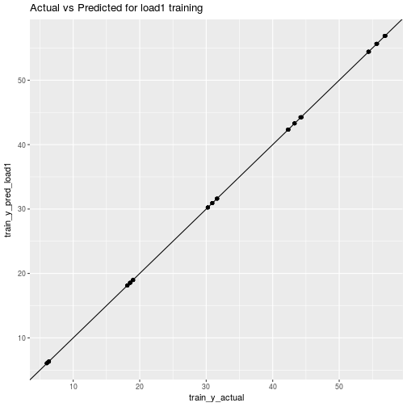
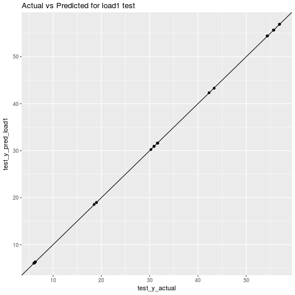
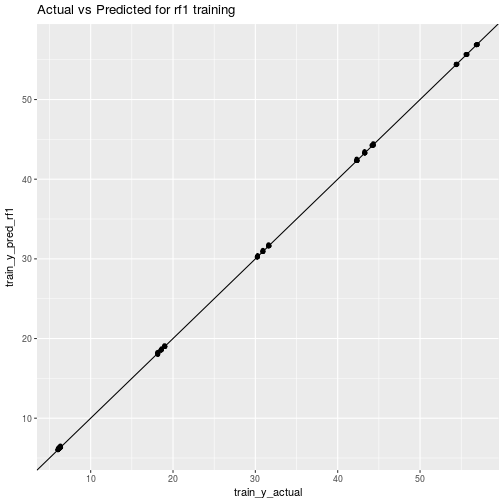
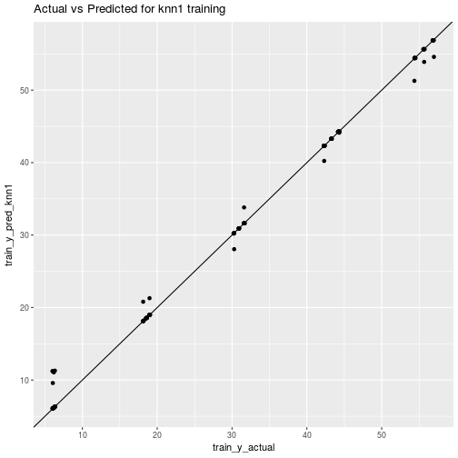
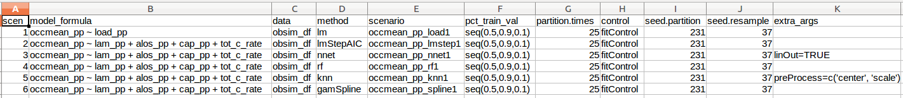

# Comparing predictive models for obstetrical unit occupancy using caret - Part 1

Simulation metamodeling involves building predictive models based on outputs of designed simulation experiments. In this series of posts we'll share our experience with using the R package ``caret`` for building and comparing several predictive modeling based metamodels including linear models, neural networks, random forests, k-nearest neighbor, and cubic splines. 

## Simulating hospital inpatient obstetrical units for capacity planning

A typical configuration of hospital units which provide care for women about to give birth
might include an observation unit, a labor, delivery and recovery unit (LDR) and a
postpartum (PP) unit. Matching the capacity of these units to demand placed on them
is important for maintaining smooth patient flow. For example, there should be
sufficient capacity in a PP unit so that there is a relatively small probability that a post-delivery patient is *blocked* in the LDR due to lack of a bed in PP. Of course, complicating the capacity planning process is the fact that there are numerous sources
of uncertainty in obstetrical patient care processes. These include the number and timing
of patient arrivals, whether or not the patient requires a C-section and the length of stay in each of the three units.


I'm working on a research project involving capacity planning models for these systems. One phase involves building what are known as *simulation metamodels*. The main components are:

* built a discrete event simulation model of a simplified queueing network model of typical obstetrical patient flow system.
* designed and ran a set of simulation experiments involving a range patient volumes, percentages of patients requiring c-section, and unit sizes (numbers of beds). There
were 150 scenarios simulated.
* post-processed the output using both R and Python to compute several performance
measures related to unit occupancy and patient delays. 
* now working on building and comparing a number of different statistical/machine learning
techniques for predicting occupancy and delay related peformance measures using the
experimental inputs (volume, % c-section, unit sizes). This is where `caret` comes in.

In the simulation world, this last step is known as *simulation metamodeling*. It has a long history. See any good discrete event simulation text such as [Simulation modeling and analysis by Law and Kelton](https://www.amazon.com/Simulation-McGraw-Hill-Industrial-Engineering-Management/dp/0073401323) for an overview. There's also a [nice overview done by R. Barton and available as a free pdf from the Proceedings of the 2015 Winter Simulation Conference](http://www.informs-sim.org/wsc15papers/185.pdf). Typically, techniques s any predictive modeling technique capable of producing real valued output such as neural networks, regression trees, k-nearest neighbor or any number of advanced regression techniques. 
As this was my first significant project using `caret`, I thought it would be helpful to
write up some of the challenges faced and share some of the techniques I used to make
it easier to compare different models. In this first post we will use `caret` to train a few
models, make predictions, summarize their performance and motivate the need for a way
to automate this workflow to make it easier to compare a number of modeling techniques and
associated meta-settings such as the relative size of the training and test datasets.

## Read in the data.

As mentioned above, there are 150 scenarios (rows) and a number of input and output columns. For this series of posts, I've created an example file containing a limited number of the output related columns.

Let's read in the data. 


```r
obsim_df <- read.csv(file="data/obsim_example.csv")
names(obsim_df)[1] <- "scenario"
# Shorten a few column names
names(obsim_df)[13] <- "occmean_ldr"
names(obsim_df)[14] <- "occp95_ldr"
names(obsim_df)[15] <- "occmean_pp"
names(obsim_df)[16] <- "occp95_pp"
```

Here are the input variables and the first few rows:


```r
knitr::kable(head(obsim_df[,2:12]),digits=2)
```


| lam_ldr| alos_ldr| cap_ldr| load_ldr| rho_ldr| lam_pp| alos_pp| cap_pp| load_pp| rho_pp| tot_c_rate|
|-------:|--------:|-------:|--------:|-------:|------:|-------:|------:|-------:|------:|----------:|
|    2.74|      0.5|       4|     1.37|    0.34|   2.74|     2.2|     12|    6.03|   0.50|        0.2|
|    2.74|      0.5|       4|     1.37|    0.34|   2.74|     2.2|     10|    6.03|   0.60|        0.2|
|    2.74|      0.5|       4|     1.37|    0.34|   2.74|     2.2|      9|    6.03|   0.67|        0.2|
|    2.74|      0.5|       3|     1.37|    0.46|   2.74|     2.2|     12|    6.03|   0.50|        0.2|
|    2.74|      0.5|       3|     1.37|    0.46|   2.74|     2.2|     10|    6.03|   0.60|        0.2|
|    2.74|      0.5|       3|     1.37|    0.46|   2.74|     2.2|      9|    6.03|   0.67|        0.2|

... and the output variables


```r
knitr::kable(head(obsim_df[,13:16]), digits=3)
```


| occmean_ldr| occp95_ldr| occmean_pp| occp95_pp|
|-----------:|----------:|----------:|---------:|
|       1.371|      3.680|      6.051|    10.183|
|       1.426|      3.987|      6.017|    10.000|
|       1.518|      4.000|      6.020|     9.000|
|       1.319|      3.000|      6.021|    10.231|
|       1.362|      3.000|      6.031|    10.000|
|       1.431|      3.000|      6.033|     9.000|


```r
str(obsim_df)
```

```
## 'data.frame':	150 obs. of  16 variables:
##  $ scenario   : int  1 2 3 4 5 6 7 8 9 10 ...
##  $ lam_ldr    : num  2.74 2.74 2.74 2.74 2.74 ...
##  $ alos_ldr   : num  0.5 0.5 0.5 0.5 0.5 0.5 0.5 0.5 0.5 0.5 ...
##  $ cap_ldr    : int  4 4 4 3 3 3 2 2 2 8 ...
##  $ load_ldr   : num  1.37 1.37 1.37 1.37 1.37 ...
##  $ rho_ldr    : num  0.342 0.342 0.342 0.457 0.457 ...
##  $ lam_pp     : num  2.74 2.74 2.74 2.74 2.74 ...
##  $ alos_pp    : num  2.2 2.2 2.2 2.2 2.2 2.2 2.2 2.2 2.2 2.2 ...
##  $ cap_pp     : int  12 10 9 12 10 9 12 10 9 29 ...
##  $ load_pp    : num  6.03 6.03 6.03 6.03 6.03 ...
##  $ rho_pp     : num  0.502 0.603 0.67 0.502 0.603 ...
##  $ tot_c_rate : num  0.2 0.2 0.2 0.2 0.2 0.2 0.2 0.2 0.2 0.2 ...
##  $ occmean_ldr: num  1.37 1.43 1.52 1.32 1.36 ...
##  $ occp95_ldr : num  3.68 3.99 4 3 3 ...
##  $ occmean_pp : num  6.05 6.02 6.02 6.02 6.03 ...
##  $ occp95_pp  : num  10.2 10 9 10.2 10 ...
```

### Input Variables

| **Name** | **Math** | **Description** |
| --------------- | ---- | ------------------------------------------ |
| `lam_ldr` | $\lambda_L$                | Arrival rate of patients to LDR unit
| `alos_ldr` | $B_L$               | Average length of stay in LDR
| `cap_ldr`  | $c_L$               | Number of beds in LDR
| `load_ldr` | $\lambda_L B_L$     | Arrival rate times average length of stay; a measure of workload submitted to the LDR
| `rho_ldr`  | $\rho_L=\lambda_L B_L/c_L$ | Traffic intensity; a measure of congestion of LDR
| `lam_pp` | $\lambda_P$                | Arrival rate of patients to postpartum (PP) unit
| `alos_pp` | $B_P$               | Average length of stay in PP
| `cap_pp`  | $c_P$               | Number of beds in PP
| `load_pp` | $\lambda_P B_P$     | Arrival rate times average length of stay; a measure of workload submitted to the PP
| `rho_pp`  | $\rho_P=\lambda_P B_P/c_P$ | Traffic intensity; a measure of congestion of PP
| `tot_c_rate` | $\gamma$             | Percentage of patients requiring c-section

### Response Variables

| **Name** | **Description** |
| ------------- | --------------------------------- |
| `occmean_ldr`       | Mean occupancy (number of patients) in LDR unit
| `occp95_ldr`        | 95th percentile of occupancy (number of patients) in LDR unit
| `occmean_pp`        | Mean occupancy (number of patients) in PP unit
| `occp95_pp`         | 95th percentile of occupancy (number of patients) in PP unit

There are other important response variables such as the probability that a patient gets
blocked in the LDR due to the PP unit being full and the amount of time (mean, percentiles) that
such blocked patients wait for a PP bed to become available. We'll explore those variables in
subsequent posts. For now, we'll just focus on the mean and 95th percentile of occupancy 
in the LDR and PP units.


## Metamodel 1 - Mean occupancy of PP

This is the simplest case since the PP unit behaves like an $M/G/c$ queueing system for
which mean occupancy is simply the load placed on the unit, $\lambda_P B_P$. While the
details of the simulation model are outside the scope of this first post, we will note that
the length of stay in the PP unit is the mixture of two different distributions - one for patients requiring a c-section and one for those not requiring one. More on queueing
models and simulation details in later posts.

It would seem
that pretty much any technique such as a linear model, neural net, or random forest
should be able to produce reasonable predictions. We'll use this simple case to illustrate the
basics of using the [caret](https://topepo.github.io/caret/index.html) package to compare a few different models.

This isn't meant to be a comprehensive tutorial on the basics of `caret`. There are plenty of those
available and the [documentation](http://topepo.github.io/caret/index.html) is a good place to start. Instead, we'll use this simple
example to motivate our desire to come up with a simple scheme for automating a bunch of
`caret` runs for different models and values of experimental hyperparameters.

## Load libraries


```r
library(ggplot2)
library(Metrics) # Just to use its rmse() function
library(caret)
library(randomForest)
```

## The analysis plan - getting started with caret

As this was my first time using `caret`, started with a simple cycle of:

* partition data into training and test sets
* train a few different model types using k-crossfold validation
* make predictions on the test dataset using the "best" model from each model type tested
* summarize predictive accuracy using RMSE and plots of actual vs predicted

Along the way I learned a things about `caret` and will share them in the hopes that 
others might find this information useful.

### Random number seeds

The process of data partitioning as well as the k-crossfold validation done during training 
require random sampling of data. To make the analysis reproducible and to control for random
variation, I decided to use separate random number seeds for the partitioning process and the
training process. These seeds were then used by the `set.seed()` function.


```r
train_test_seed <- 233
resample_seed <- 67
```

### Partition data into training and test datasets

For now, let's use a proportion $p=125/150$ for the training set and $1-p$ for the test set. The
`createDataPartition` function makes this quite easy. We can specify $p$ and `caret` will
automatically create a partition that attempts to balance the cases within percentiles
subgroups of the response variable. For classification problems, sampled cases are balanced across class values. See the [function documentation](https://www.rdocumentation.org/packages/caret/versions/6.0-76/topics/createDataPartition) for more details.


```r
pct_train <- 125/150
set.seed(train_test_seed)
trainrecs <- createDataPartition(obsim_df$occmean_pp, p = pct_train, 
                                         list = FALSE, times = 1)
```

A few things to note:

* the first argument is the response variable of interest,
* `list = FALSE` will result in the results being returned in a matrix instead of a list,
* `times = 1` means we'll get back a matrix with one column representing one partitioning of the data. Specifying a value greater than one does the obvious things - we get multiple partitions of our data and each is returned as a column in the matrix.

Let's look at `trainrecs`.


```r
trainrecs[1:20]
```

```
##  [1]  1  2  3  4  6  7  9 10 11 12 13 14 15 16 17 18 20 21 22 23
```

Different random number seed, different results (most likely).


```r
set.seed(train_test_seed + 1) # Use a different seed
trainrecs2 <- createDataPartition(obsim_df$occmean_pp, p = pct_train, 
                                         list = FALSE, times = 1)
trainrecs2[1:20]
```

```
##  [1]  1  2  3  5  7  8  9 10 11 13 14 15 16 17 18 19 20 21 22 23
```

While doing this, you might ask yourself, what value of $p$ should be used? Good question and
no easy answer. Similarly, you might wonder how much variation there will be in our
prediction errors if we created multiple partition samples (i.e. `times` > 1). Another good question. Happily, `createDataPartition` will make such an exploration pretty easy. But, for now,
let's use $p=125/150$ and `times=1`.

Use `trainrecs` to partition the dataset.


```r
obsim_train_df <- obsim_df[trainrecs, ]
obsim_test_df <- obsim_df[-trainrecs, ]
```

### Set parameters for training process

The `caret` package provides a full featured `trainControl` function for controlling
a myriad of parameters related to the model training process. It returns a control object that will get passed along to the function that actually does the training. In our case, we want
to do repeated k-crossfold validation. We will use $k=5$ and repeat the entire 
resampling and training process 10 times. 


```r
fitControl <- trainControl(## 5-fold CV
                           method = "repeatedcv",
                           number = 5,
                           ## repeated ten times
                           repeats = 10)
```

Check out the structure of `fitControl`. Many dials and switches. See the [documentation](https://www.rdocumentation.org/packages/caret/versions/6.0-76/topics/trainControl).


```r
str(fitControl)
```

```
## List of 26
##  $ method           : chr "repeatedcv"
##  $ number           : num 5
##  $ repeats          : num 10
##  $ search           : chr "grid"
##  $ p                : num 0.75
##  $ initialWindow    : NULL
##  $ horizon          : num 1
##  $ fixedWindow      : logi TRUE
##  $ verboseIter      : logi FALSE
##  $ returnData       : logi TRUE
##  $ returnResamp     : chr "final"
##  $ savePredictions  : logi FALSE
##  $ classProbs       : logi FALSE
##  $ summaryFunction  :function (data, lev = NULL, model = NULL)  
##  $ selectionFunction: chr "best"
##  $ preProcOptions   :List of 3
##   ..$ thresh : num 0.95
##   ..$ ICAcomp: num 3
##   ..$ k      : num 5
##  $ sampling         : NULL
##  $ index            : NULL
##  $ indexOut         : NULL
##  $ indexFinal       : NULL
##  $ timingSamps      : num 0
##  $ predictionBounds : logi [1:2] FALSE FALSE
##  $ seeds            : logi NA
##  $ adaptive         :List of 4
##   ..$ min     : num 5
##   ..$ alpha   : num 0.05
##   ..$ method  : chr "gls"
##   ..$ complete: logi TRUE
##  $ trim             : logi FALSE
##  $ allowParallel    : logi TRUE
```

## Train a simple model

Since basic queueing theory tells us that the estimated (from the simulation model output) mean occupancy of PP should be closely approximated by the load placed on the unit, let's fit a simple linear regression model. In this case, there's no real "training" or "tuning parameters" to optimize, we will simply use `lm()` to fit a linear model using least squares. This model will be called **load1**.

The `caret` package supports a huge number (>200) of modeling techniques. The `train` function takes a `method` argument for specifying the model to fit. Valid values
of the `method` argument can be found in the `caret` [documentation of available models](https://topepo.github.io/caret/available-models.html).


```r
set.seed(resample_seed)
train_load1 <- train(occmean_pp ~ load_pp, data = obsim_train_df, 
                 method = "lm", 
                 trControl = fitControl)
```

The object returned by `train` contains quite a few attributes that let you dig into all the details of the training process. It also includes a `finalModel` object that contains the final model resulting from optimization over
any tuning parameters and refitting based on the entire training dataset (remember our training involved k-crossfold validation). 

**Be careful**, this `finalModel` object seems to cause confusion (I was confused too) when it comes to creating predictions for new data (e.g. our test data partition). I'll say more about this after we create the predictions for `train_load1`.

To see a summary of the final model, yep...


```r
summary(train_load1)
```

```
## 
## Call:
## lm(formula = .outcome ~ ., data = dat)
## 
## Residuals:
##       Min        1Q    Median        3Q       Max 
## -0.113873 -0.020498 -0.001935  0.015035  0.097856 
## 
## Coefficients:
##              Estimate Std. Error  t value Pr(>|t|)    
## (Intercept) 0.0132436  0.0067156    1.972   0.0508 .  
## load_pp     1.0029901  0.0001896 5289.129   <2e-16 ***
## ---
## Signif. codes:  0 '***' 0.001 '**' 0.01 '*' 0.05 '.' 0.1 ' ' 1
## 
## Residual standard error: 0.03679 on 124 degrees of freedom
## Multiple R-squared:      1,	Adjusted R-squared:      1 
## F-statistic: 2.797e+07 on 1 and 124 DF,  p-value: < 2.2e-16
```

A few things to note from the summary output:

* as expected (from queueing theory), the intercept is essentially 0, the slope is 1 and $R^2=1$. Mean occupancy is indeed equal to the load.
* the final model is based on the entire training dataset (see degrees of freedom). In other words,
after doing the k-cross fold validation and optimizing over any algorithm tuning parameters, `caret` 
refits the model on the entire training dataset.


## Make predictions for new data

In standard R fashion, to make predictions you just use `predict`, pass in a
"model" and specify the input data for the predictions. I put model in quotes because unlike, say, making predictions for a model fit with `lm()`, in `caret` we pass a `train` object as the first argument to `predict`. Internally, `caret` uses the `finalModel` object to make predictions. One might think, as I first did, that doing the following would be perfectly fine.


```r
# DON'T DO THIS!
pred_load1_BAD <- predict(train_load1$finalModel, newdata = obsim_test_df)
```

And actually this was working until I fit a linear model with interaction terms and all of a sudden the above would not work. I surmised that it was likely due to a mismatch between the trained model which included new variable names (for the interaction terms) that were not in the test dataset. Some Googling confirmed this but unearthed the deeper lesson - you should **not** pass a `finalModel` object to `predict` but should instead pass the `train` object. In this way we let `caret` handle any preliminary steps it needs to do before calling `predict.train` on the `finalModel`. See [https://stackoverflow.com/questions/21096909/difference-between-predictmodel-and-predictmodelfinalmodel-using-caret-for](https://stackoverflow.com/questions/21096909/difference-between-predictmodel-and-predictmodelfinalmodel-using-caret-for). 

Make predictions on the test data.


```r
pred_load1 <- predict(train_load1, newdata = obsim_test_df)
pred_load1
```

```
##         5         8        19        28        41        42        48 
##  6.058663  6.058663 30.240341 42.331180 54.422019 54.422019  6.196059 
##        51        58        64        68        70        74        87 
##  6.196059 18.561690 30.927320 30.927320 30.927320 43.292951 55.658582 
##        89        94        97       106       107       109       111 
## 55.658582  6.333455  6.333455 18.973877 18.973877 31.614300 31.614300 
##       113       129       135 
## 31.614300 56.895145 56.895145
```

## Evaluate predictions

Let's compute the root mean squared error and also plot actual vs predicted values for the test dataset. Might as well do it for the training data too. Performance should be similar since we have a known theory based relationship between mean occupancy and load. Results will be gathered into a set of variable to illustrate how to extract them from our existing R objects.


```r
# Training actual and predicted
train_y_actual <- train_load1$trainingData$.outcome
train_y_pred_load1 <- fitted.values(train_load1)

# Test actual and predicted
test_y_actual <- obsim_test_df[, "occmean_pp"]
test_y_pred_load1 <- pred_load1

# Use rmse() function from Metrics package
rmse_train_load1 <- rmse(train_y_actual, train_y_pred_load1)
rmse_test_load1 <- rmse(test_y_actual, test_y_pred_load1)

# Print them out
cat(sprintf("rmse_train_load1 = %0.5f\nrmse_test_load1  = %0.5f \n", 
            rmse_train_load1, rmse_test_load1))
```

```
## rmse_train_load1 = 0.03650
## rmse_test_load1  = 0.03733
```

For the scatter plots we'll use `ggplot`.

Create dataframes with relevant columns - `ggplot` likes dataframes.


```r
plot_df_train_load1 <- data.frame(train_y_actual, train_y_pred_load1)

plot_df_test_load1 <- data.frame(test_y_actual, test_y_pred_load1)
```

Scatter actual vs predicted for training data and then for test data.


```r
ggplot(data=plot_df_train_load1) + aes(x=train_y_actual, y=train_y_pred_load1) + geom_point() + geom_abline() + ggtitle("Actual vs Predicted for load1 training")
```




```r
ggplot(data=plot_df_test_load1) + aes(x=test_y_actual, y=test_y_pred_load1) + geom_point() + geom_abline() + ggtitle("Actual vs Predicted for load1 test")
```



Of course we already knew what these were going to look like.

## Fitting more models

Now let's fit two more models, a random forest and a k-nearest neighbor (kNN), to really see how
`caret` can facilitate rapid modeling. Both of these techniques have tuning parameters that
we'll let `caret` optimize. In addition, kNN requires data preprocessing since it relies on computing a distance between data points. Again, this isn't meant to be an in-depth `caret` tutorial - we just want to show a few simple examples and then show how we can both automate
and make the modeling process metadata driven.

For both of these techniques, let's use a more general formula for the model. We will
assume that the analyst is sufficiently knowledgeable of *process physics* that they 
incude the load and traffic intensity variables in addition to the arrival rate, 
average length of stay and capacity variables for the PP unit only.

### Random forest

I'm just repeating (copy, paste, edit) what we did for the **load1** model. Note that we are reusing the partitioned data as well as the `trainControl` object.


```r
# Train a random forest
set.seed(resample_seed)
train_rf1 <- train(occmean_pp ~ lam_pp + alos_pp + cap_pp + load_pp + rho_pp, 
                   data = obsim_train_df, 
                   method = "rf", 
                   trControl = fitControl)

# Make predictions
pred_rf1 <- predict(train_rf1, newdata = obsim_test_df)

# Summarize results
train_y_actual <- train_rf1$trainingData$.outcome
train_y_pred_rf1 <- fitted.values(train_rf1)

test_y_actual <- obsim_test_df[, "occmean_pp"]
test_y_pred_rf1 <- pred_rf1

rmse_train_rf1 <- rmse(train_y_actual, train_y_pred_rf1)
rmse_test_rf1 <- rmse(test_y_actual, test_y_pred_rf1)

plot_df_train_rf1 <- data.frame(train_y_actual, train_y_pred_rf1)
plot_df_test_rf1 <- data.frame(test_y_actual, test_y_pred_rf1)

cat(sprintf("rmse_train_rf1 = %0.5f\nrmse_test_rf1  = %0.5f \n", 
            rmse_train_rf1, rmse_test_rf1))
```

```
## rmse_train_rf1 = 0.06760
## rmse_test_rf1  = 0.03202
```


```r
ggplot(data=plot_df_train_rf1) + aes(x=train_y_actual, y=train_y_pred_rf1) + geom_point() + geom_abline() + ggtitle("Actual vs Predicted for rf1 training")
```




```r
ggplot(data=plot_df_test_rf1) + aes(x=test_y_actual, y=test_y_pred_rf1) + geom_point() + geom_abline() + ggtitle("Actual vs Predicted for rf1 test")
```


Hmm, that's odd to get performance on test data that is better than on the training data. More
on that later.

Let's see what the best values of the tuning parameters optimized by `caret`. For the
`randomForest` package, `caret` tries to find a good value for the `mtry` parameter (number
of input variables "randomly sampled as candidates at each split")


```r
train_rf1$bestTune
```

```
##   mtry
## 3    5
```

### k nearest neighbors

I'm just repeating (copy, paste, edit) what we did for the **rf1** model. However, we need
specify one additional argument to the `train` function to tell `caret` to center and scale
the data before fitting a kNN model. For kNN, `caret` will try to find a good value for $k$.


```r
# Train a kNN model
set.seed(resample_seed)
train_knn1 <- train(occmean_pp ~ lam_pp + alos_pp + cap_pp + load_pp + rho_pp, 
                   data = obsim_train_df, 
                   method = "knn", 
                   trControl = fitControl,
                   preProcess=c("center", "scale"))

# Make predictions
pred_knn1 <- predict(train_knn1, newdata = obsim_test_df)

# Summarize results
train_y_actual <- train_knn1$trainingData$.outcome
train_y_pred_knn1 <- fitted.values(train_knn1)

test_y_actual <- obsim_test_df[, "occmean_pp"]
test_y_pred_knn1 <- pred_knn1

rmse_train_knn1 <- rmse(train_y_actual, train_y_pred_knn1)
rmse_test_knn1 <- rmse(test_y_actual, test_y_pred_knn1)

plot_df_train_knn1 <- data.frame(train_y_actual, train_y_pred_knn1)
plot_df_test_knn1 <- data.frame(test_y_actual, test_y_pred_knn1)

cat(sprintf("rmse_train_knn1 = %0.5f\nrmse_test_knn1  = %0.5f \n", 
            rmse_train_knn1, rmse_test_knn1))
```

```
## rmse_train_knn1 = 1.21841
## rmse_test_knn1  = 0.04479
```


```r
ggplot(data=plot_df_train_knn1) + aes(x=train_y_actual, y=train_y_pred_knn1) + geom_point() + geom_abline() + ggtitle("Actual vs Predicted for knn1 training")
```




```r
ggplot(data=plot_df_test_knn1) + aes(x=test_y_actual, y=test_y_pred_knn1) + geom_point() + geom_abline() + ggtitle("Actual vs Predicted for knn1 test")
```


Again, strange to get better performance on test data then on training data. Makes me
start to wonder about other things like:

* impact of different values for the number of folds and repeats in the k-crossfold process,
* training set size vs validation set size and on intervalidation set variability, 
* impact of more modeling techniques such as neural networks and splines,
* impact of a "naive analyst" who might not think to include engineered features like load and traffic intensity,
* repeating the process for the other response variables,
* repeating all of this for the LDR unit,
* ... and bunch more questions that are bound to be raised.

Just this little bit of copy, paste, editing was frought with errors and tediously repititious. Clearly we need to encapsulate this process in one or more functions. Ideally I also wanted to
be able to create analysis scenarios defined by a bunch of attributes that I could store in a
metadata file. To make this concrete, here's a little csv file illustrating what I wanted to do.


Here's the actual csv file:


```r
scenarios_test_df <- read.csv(file="data/scenarios_test.csv")
knitr::kable(scenarios_test_df)
```


| scen|model_formula                                       |data     |method    |scenario           |pct_train_val    | partition.times|control    | seed.partition| seed.resample|extra_args                      |
|----:|:---------------------------------------------------|:--------|:---------|:------------------|:----------------|---------------:|:----------|--------------:|-------------:|:-------------------------------|
|    1|occmean_pp ~ load_pp                                |obsim_df |lm        |occmean_pp_load1   |seq(0.5,0.9,0.1) |              10|fitControl |            231|            37|                                |
|    2|occmean_pp ~ lam_pp + alos_pp + cap_pp + tot_c_rate |obsim_df |lmStepAIC |occmean_pp_lmstep1 |seq(0.5,0.9,0.1) |              10|fitControl |            231|            37|                                |
|    3|occmean_pp ~ lam_pp + alos_pp + cap_pp + tot_c_rate |obsim_df |nnet      |occmean_pp_nnet1   |seq(0.5,0.9,0.1) |              10|fitControl |            231|            37|linout=TRUE                     |
|    4|occmean_pp ~ lam_pp + alos_pp + cap_pp + tot_c_rate |obsim_df |rf        |occmean_pp_rf1     |seq(0.5,0.9,0.1) |              10|fitControl |            231|            37|                                |
|    5|occmean_pp ~ lam_pp + alos_pp + cap_pp + tot_c_rate |obsim_df |knn       |occmean_pp_knn1    |seq(0.5,0.9,0.1) |              10|fitControl |            231|            37|preProcess=c('center', 'scale') |
|    6|occmean_pp ~ lam_pp + alos_pp + cap_pp + tot_c_rate |obsim_df |gamSpline |occmean_pp_spline1 |seq(0.5,0.9,0.1) |              10|fitControl |            231|            37|                                |

## Next steps

I want to iterate through the rows of this dataframe and use the values to drive a
set of model partition, train, predict and summarize cycles. What could possibly be
so hard about that? Part 2 coming soon.
