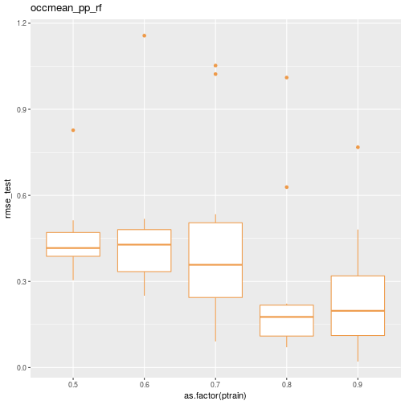

# Comparing predictive model performance using caret - Part 2: A simple caret automation function

Wrap several caret steps in a simple function.

In [Part 1](https://misken.github.io/blog/obsim_caret_part1/) of this series of posts, we used `caret` to train and test a few simulation metamodels 
using data from a series of simulation experiments on a simplified obstetrical patient flow 
network. In doing so, a number of questions popped up which suggested we needed a way to 
easily automate a number of partition, train, predict, summarize cycles with `caret`. These questions include:

* impact of different values for the number of folds and repeats in the k-crossfold process,
* training set size vs validation set size and on intervalidation set variability, 
* impact of more modeling techniques such as neural networks and splines,
* impact of a "naive analyst" who might not think to include engineered features like load and traffic intensity,
* repeating the process for the other response variables,
* repeating all of this for the LDR unit,
* ... and bunch more questions that are bound to be raised.

Part 1 ended with:

> Just this little bit of copy, paste, editing was frought with errors and tediously repititious. 
> Clearly we need to encapsulate this process in one or more functions. Ideally I also wanted to
> be able to create analysis scenarios defined by a bunch of attributes that I could store in a
> metadata file. To make this concrete, here's a little csv file illustrating what I wanted to do.


```r
scenarios_test_df <- read.csv(file="data/scenarios_test.csv")
knitr::kable(scenarios_test_df)
```


| scen|model_formula                                       |data     |method    |scenario           |pct_train_val    | partition.times|control    | seed.partition| seed.resample|extra_args                      |
|----:|:---------------------------------------------------|:--------|:---------|:------------------|:----------------|---------------:|:----------|--------------:|-------------:|:-------------------------------|
|    1|occmean_pp ~ load_pp                                |obsim_df |lm        |occmean_pp_load1   |seq(0.5,0.9,0.1) |              10|fitControl |            231|            37|                                |
|    2|occmean_pp ~ lam_pp + alos_pp + cap_pp + tot_c_rate |obsim_df |lmStepAIC |occmean_pp_lmstep1 |seq(0.5,0.9,0.1) |              10|fitControl |            231|            37|                                |
|    3|occmean_pp ~ lam_pp + alos_pp + cap_pp + tot_c_rate |obsim_df |nnet      |occmean_pp_nnet1   |seq(0.5,0.9,0.1) |              10|fitControl |            231|            37|linout=TRUE                     |
|    4|occmean_pp ~ lam_pp + alos_pp + cap_pp + tot_c_rate |obsim_df |rf        |occmean_pp_rf1     |seq(0.5,0.9,0.1) |              10|fitControl |            231|            37|                                |
|    5|occmean_pp ~ lam_pp + alos_pp + cap_pp + tot_c_rate |obsim_df |knn       |occmean_pp_knn1    |seq(0.5,0.9,0.1) |              10|fitControl |            231|            37|preProcess=c('center', 'scale') |
|    6|occmean_pp ~ lam_pp + alos_pp + cap_pp + tot_c_rate |obsim_df |gamSpline |occmean_pp_spline1 |seq(0.5,0.9,0.1) |              10|fitControl |            231|            37|                                |

> I want to iterate through the rows of this dataframe and use the values to drive a
> set of model partition, train, predict and summarize cycles. What could possibly be
> so hard about that? 

Obviously, when we read this csv file into an R dataframe, we are going to end up with
some numeric fields and some string fields. Well, the string fields will come in as
factors by default but we can use the `stringsAsFactors=FALSE` argument to prevent this.


```r
scenarios_test_df <- read.csv(file="data/scenarios_test.csv",
                              stringsAsFactors = FALSE)
str(scenarios_test_df)
```

```
## 'data.frame':	6 obs. of  11 variables:
##  $ scen           : int  1 2 3 4 5 6
##  $ model_formula  : chr  "occmean_pp ~ load_pp" "occmean_pp ~ lam_pp + alos_pp + cap_pp + tot_c_rate" "occmean_pp ~ lam_pp + alos_pp + cap_pp + tot_c_rate" "occmean_pp ~ lam_pp + alos_pp + cap_pp + tot_c_rate" ...
##  $ data           : chr  "obsim_df" "obsim_df" "obsim_df" "obsim_df" ...
##  $ method         : chr  "lm" "lmStepAIC" "nnet" "rf" ...
##  $ scenario       : chr  "occmean_pp_load1" "occmean_pp_lmstep1" "occmean_pp_nnet1" "occmean_pp_rf1" ...
##  $ pct_train_val  : chr  "seq(0.5,0.9,0.1)" "seq(0.5,0.9,0.1)" "seq(0.5,0.9,0.1)" "seq(0.5,0.9,0.1)" ...
##  $ partition.times: int  10 10 10 10 10 10
##  $ control        : chr  "fitControl" "fitControl" "fitControl" "fitControl" ...
##  $ seed.partition : int  231 231 231 231 231 231
##  $ seed.resample  : int  37 37 37 37 37 37
##  $ extra_args     : chr  "" "" "linout=TRUE" "" ...
```

One of our primary challenges will be to use string representations or names of things like formulas, dataframes, control objects and R expressions within R code to get at the actual
underlying objects. We'll deal with those details in the next post. Right now, let's design a 
simple function to encapsulate several `caret` based analysis steps and that we can use
later when we iterate over the scenario file described above.

## Basic functionality

We want a function to encapsulate the following steps:

* partition a dataframe into test and training sets
* train a model of a specified type
* make predictions on the test data
* create summaries and plots of test and training errors

One of our primary design goals is to make it easy to train models for
a range of train-test partition sizes as well as to repeat the train-test process
multiple times for each partition size. Since we are going to be comparing
a bunch of different models as well, we want to be able to control the two
key random number streams - the one used for data partitioning and the one
used in the resampling during k-crossfolds validation.

In this first version, we decided on the following input arguments.

| **Argument** | **Description** |
| ------------- | --------------------------------- |
| `model_formula`       | Formula object
| `data`       | Dataframe to split into training and test sets
| `method`       | Valid method argument value for `train` function
| `scenario`       | String describing scenario
| `pct_train_val`       | Value or vector of values in (0,1) representing proportion of cases to allocate to training set
| `partition.times`       | Number of independent train-test partitions 
| `control`       | `trainControl` object specifying how training to be done
| `seed.partition`       | Integer random number seed for partitioning process
| `seed.resample`       | Integer random number seed for resampling process
| `...`       | Additional arguments to pass to `train` function.


## The function

The "ptps" in the function name stands for "partition, train, predict, summarize". While there might be a way to avoid the two loops with `apply` family functions,
this approach is easy to follow and was easy to get working. Also, for now
we are not trying to control the random number streams via the seeds. I need
to think that part through a little more carefully.


```r
caret_ptps <- function(model_formula, data, method, scenario="", 
                       pct_train_val=0.6, partition.times=1,
                       control=trainControl(method="None"),
                       seed.partition=NULL, seed.resample=NULL,
                       ...){
  
  # Container list for results
  listsize <- length(pct_train_val) * partition.times
  results_for_df <- vector("list", listsize) 
  results_objs <- vector("list", listsize) 
  
  # Get y variable name from formula object. The ~ is [[1]], LHS is [[2]] and RHS[[3]].
  y.name <- deparse(model_formula[[2]])
  
  # Outer loop for training set size
  itemnum <- 0
  for (pct_train in pct_train_val){
    
    # Create partitions for this pct_train. 
    trainrecs <- createDataPartition(data[[y.name]], p = pct_train, 
                                     list = FALSE, times = partition.times)
    
    # Loop over data partitions
    for (s in seq(1,partition.times)){
      modeling_test_df <- data[-trainrecs[,s], ]
      modeling_train_df <- data[trainrecs[,s], ]
      
      # Train the model
      fit <- train(model_formula, 
                   data = modeling_train_df, 
                   method = method, 
                   trControl = control,
                   ...)
      
      # Make predictions for the test set
      pred <- predict(fit, newdata=modeling_test_df)

      # Gather actual and predicted values
      train_y_actual <- fit$trainingData$.outcome
      train_y_pred <- fitted.values(fit)
      
      test_y_actual <- modeling_test_df[, y.name]
      test_y_pred <- pred
      
      # Compute RMSE for train and test
      rmse_train <- rmse(train_y_actual, train_y_pred)
      rmse_test <- rmse(test_y_actual, test_y_pred)
      
      # Store key items in lists for later processing
      itemnum <- itemnum + 1
      
      result_for_df <- list(ptrain = pct_train, sample = s, scenario = scenario, 
                     rmse_train = rmse_train,
                     rmse_test = rmse_test)
      
      results_for_df[[itemnum]] <- result_for_df
      
      
      result_objs <- list(test_y_actual = test_y_actual,
                          test_y_pred = test_y_pred,
                          trained_model = fit)
      
      results_objs[[itemnum]] <- result_objs
      
    }
    
  }
  
  results_list <- list(results_for_df, results_objs)
  return(results_list) 

}
```

Our `caret_ptps` function returns a list containing two other lists. One contains
summary values such as RMSE as for the training and test phases along with scenario
and partition identifiers. The other list contains vectors of the actual and predicted values along with the model `train` object. Each element of these lists
corresponds to a single value of the percentage of the data used in the training set as well as the sample number of the train-test process for that percentage. For example, we might do 25 replications of training and testing a model with 70% of
the data used for train. That would result in 25 items in our main list returned
from `caret_ptps`. If we wanted to try partition proportions of `seq(0.5,0.9,1.0)`,
we would end up with 125 elements in our returned list. From these lists we'll be 
able to easily create summary tables and plots.

## Basic function usage

Let's see the function in action for a hard-coded set of input arguments.

Load some libraries.


```r
library(ggplot2)
library(dplyr)
library(Metrics)
library(caret)
```

Read in the data.


```r
obsim_df <- read.csv(file="data/obsim_example.csv")
names(obsim_df)[1] <- "scenario"
# Shorten a few column names
names(obsim_df)[13] <- "occmean_ldr"
names(obsim_df)[14] <- "occp95_ldr"
names(obsim_df)[15] <- "occmean_pp"
names(obsim_df)[16] <- "occp95_pp"
```

Specify input parameters.


```r
model_formula <- occmean_pp ~ lam_pp + alos_pp + cap_pp + load_pp + rho_pp
method = "rf"
scenario = "occmean_pp_rf"

# Random number seeds
num_samples <- 5
train_test_seed <- 233
resample_seed <- 67

# Specify how the model validation will work.
fitControl <- trainControl(## 5-fold CV
  method = "repeatedcv",
  number = 5,
  ## repeated ten times
  repeats = 10)

# Training set size secenarios
pct_train_val <- seq(.5,.9,.1)
num_samples <- 10
```

Call the function.


```r
results_rf <- caret_ptps(model_formula, obsim_df, 
                         method = method, scenario = scenario,
                         pct_train_val = pct_train_val, 
                         partition.times = num_samples,
                         control=fitControl,
                         seed.partition=train_test_seed,
                         seed.resample=resample_seed)
```

Pull out the first element and convert to a dataframe. Display the head and tail 
of the results summary.


```r
results_for_df <- results_rf[[1]]
results_df <- do.call(rbind,lapply(results_for_df, data.frame))
```


```r
print(head(results_df))
```

```
##   ptrain sample      scenario rmse_train rmse_test
## 1    0.5      1 occmean_pp_rf  0.3000472 0.4207122
## 2    0.5      2 occmean_pp_rf  0.2520821 0.3045032
## 3    0.5      3 occmean_pp_rf  0.3033718 0.3975591
## 4    0.5      4 occmean_pp_rf  0.2305832 0.8271542
## 5    0.5      5 occmean_pp_rf  0.2772470 0.3843739
## 6    0.5      6 occmean_pp_rf  0.2519013 0.3374716
```


```r
print(tail(results_df))
```

```
##    ptrain sample      scenario rmse_train  rmse_test
## 45    0.9      5 occmean_pp_rf 0.09730706 0.21407246
## 46    0.9      6 occmean_pp_rf 0.11933278 0.18125755
## 47    0.9      7 occmean_pp_rf 0.04593159 0.02111134
## 48    0.9      8 occmean_pp_rf 0.17881015 0.76798335
## 49    0.9      9 occmean_pp_rf 0.21381557 0.48094544
## 50    0.9     10 occmean_pp_rf 0.10476187 0.18098624
```

Here's a quick box plot of the test RMSE distribution by the percentage of
cases allocated to the training data.


```r
ggplot(data=results_df) + geom_boxplot(aes(x=as.factor(ptrain), y=rmse_test), colour="tan2") + ggtitle(scenario)
```



Now we are in good position to put all this together and compare several models and
several training dataset sizes using the `caret_ptps` function. We'll see that
the saved `train` objects can be used to get nice graphical comparisons of
model performance. We'll also have to overcome a few challenges in 
automating the whole process. On to Part 3.
