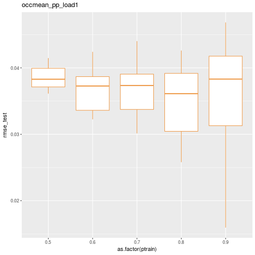
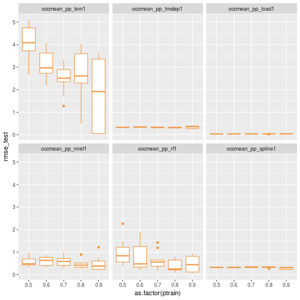
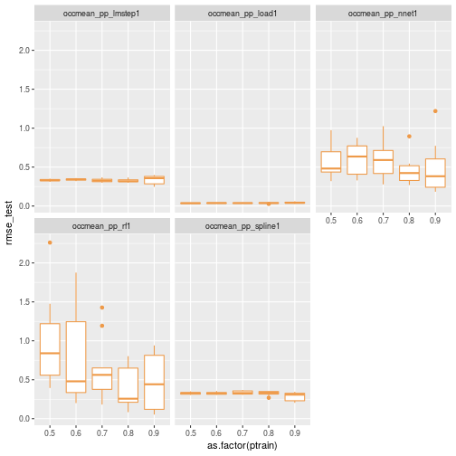

# Comparing predictive model performance using caret - Part 3: Put it all together

In [Part 1](https://misken.github.io/blog/obsim_caret_part1/) of this series of posts, we used `caret` to train and test a few simulation metamodels 
using data from a series of simulation experiments on a simplified obstetrical patient flow 
network. In doing so, a number of questions popped up which suggested we needed a way to 
easily automate a number of partition, train, predict, summarize cycles with `caret`. 

In [Part 2](https://misken.github.io/blog/obsim_caret_part2/) we created a simple function named `caret_ptps` to facilitate automating the process of partitioning a dataset, training a model, making predictions and summarizing the results. This function
takes a number of arguments related to the dataframe to use, a model formula, a modeling method, and values to control the model training and testing phases.


```r
caret_ptps <- function(model_formula, data, method, scenario="", 
                       pct_train_val=0.6, partition.times=1,
                       control=trainControl(method="None"),
                       seed.partition=NULL, seed.resample=NULL,
                       ...){
  
  # Container list for results
  listsize <- length(pct_train_val) * partition.times
  results_for_df <- vector("list", listsize) 
  results_objs <- vector("list", listsize) 
  
  # Get y variable name from formula object. The ~ is [[1]], LHS is [[2]] and RHS[[3]].
  y.name <- deparse(model_formula[[2]])
  
  # Outer loop for training set size
  itemnum <- 0
  for (pct_train in pct_train_val){
    
    # Create partitions for this pct_train. 
    trainrecs <- createDataPartition(data[[y.name]], p = pct_train, 
                                     list = FALSE, times = partition.times)
    
    # Loop over data partitions
    for (s in seq(1,partition.times)){
      modeling_test_df <- data[-trainrecs[,s], ]
      modeling_train_df <- data[trainrecs[,s], ]
      
      # Train the model
      fit <- train(model_formula, 
                   data = modeling_train_df, 
                   method = method, 
                   trControl = control,
                   ...)
      
      # Make predictions for the test set
      pred <- predict(fit, newdata=modeling_test_df)

      # Gather actual and predicted values
      train_y_actual <- fit$trainingData$.outcome
      train_y_pred <- fitted.values(fit)
      
      test_y_actual <- modeling_test_df[, y.name]
      test_y_pred <- pred
      
      # Compute RMSE for train and test
      rmse_train <- rmse(train_y_actual, train_y_pred)
      rmse_test <- rmse(test_y_actual, test_y_pred)
      
      # Store key items in lists for later processing
      itemnum <- itemnum + 1
      
      result_for_df <- list(ptrain = pct_train, sample = s, scenario = scenario, 
                     rmse_train = rmse_train,
                     rmse_test = rmse_test)
      
      results_for_df[[itemnum]] <- result_for_df
      
      
      result_objs <- list(test_y_actual = test_y_actual,
                          test_y_pred = test_y_pred,
                          trained_model = fit)
      
      results_objs[[itemnum]] <- result_objs
      
    }
    
  }
  
  results_list <- list(rmse=results_for_df, fitpred=results_objs)
  return(results_list) 

}
```


Now we are ready to use this function as we iterate over a dataframe of scenarios to analyze with `caret`. Part 1 ended with:

> Just this little bit of copy, paste, editing was frought with errors and tediously repititious. > > Clearly we need to encapsulate this process in one or more functions. Ideally I also wanted to
> be able to create analysis scenarios defined by a bunch of attributes that I could store in a
> metadata file. To make this concrete, here's a little csv file illustrating what I wanted to do.
> 


```r
scenarios_test_df <- read.csv(file="data/scenarios_test.csv")
knitr::kable(scenarios_test_df)
```


| scen|model_formula                                       |data     |method    |scenario           |pct_train_val    | partition.times|control    | seed.partition| seed.resample|extra_args                      |
|----:|:---------------------------------------------------|:--------|:---------|:------------------|:----------------|---------------:|:----------|--------------:|-------------:|:-------------------------------|
|    1|occmean_pp ~ load_pp                                |obsim_df |lm        |occmean_pp_load1   |seq(0.5,0.9,0.1) |              10|fitControl |            231|            37|                                |
|    2|occmean_pp ~ lam_pp + alos_pp + cap_pp + tot_c_rate |obsim_df |lmStepAIC |occmean_pp_lmstep1 |seq(0.5,0.9,0.1) |              10|fitControl |            231|            37|                                |
|    3|occmean_pp ~ lam_pp + alos_pp + cap_pp + tot_c_rate |obsim_df |nnet      |occmean_pp_nnet1   |seq(0.5,0.9,0.1) |              10|fitControl |            231|            37|linout=TRUE                     |
|    4|occmean_pp ~ lam_pp + alos_pp + cap_pp + tot_c_rate |obsim_df |rf        |occmean_pp_rf1     |seq(0.5,0.9,0.1) |              10|fitControl |            231|            37|                                |
|    5|occmean_pp ~ lam_pp + alos_pp + cap_pp + tot_c_rate |obsim_df |knn       |occmean_pp_knn1    |seq(0.5,0.9,0.1) |              10|fitControl |            231|            37|preProcess=c('center', 'scale') |
|    6|occmean_pp ~ lam_pp + alos_pp + cap_pp + tot_c_rate |obsim_df |gamSpline |occmean_pp_spline1 |seq(0.5,0.9,0.1) |              10|fitControl |            231|            37|                                |

Obviously, when we read this csv file into an R dataframe, we are going to end up with
some numeric fields and some string fields. Well, the string fields will come in as
factors by default but we can use the `stringsAsFactors=FALSE` argument to prevent this.


```r
scenarios_test_df <- read.csv(file="data/scenarios_test.csv",
                              stringsAsFactors = FALSE)
str(scenarios_test_df)
```

```
## 'data.frame':	6 obs. of  11 variables:
##  $ scen           : int  1 2 3 4 5 6
##  $ model_formula  : chr  "occmean_pp ~ load_pp" "occmean_pp ~ lam_pp + alos_pp + cap_pp + tot_c_rate" "occmean_pp ~ lam_pp + alos_pp + cap_pp + tot_c_rate" "occmean_pp ~ lam_pp + alos_pp + cap_pp + tot_c_rate" ...
##  $ data           : chr  "obsim_df" "obsim_df" "obsim_df" "obsim_df" ...
##  $ method         : chr  "lm" "lmStepAIC" "nnet" "rf" ...
##  $ scenario       : chr  "occmean_pp_load1" "occmean_pp_lmstep1" "occmean_pp_nnet1" "occmean_pp_rf1" ...
##  $ pct_train_val  : chr  "seq(0.5,0.9,0.1)" "seq(0.5,0.9,0.1)" "seq(0.5,0.9,0.1)" "seq(0.5,0.9,0.1)" ...
##  $ partition.times: int  10 10 10 10 10 10
##  $ control        : chr  "fitControl" "fitControl" "fitControl" "fitControl" ...
##  $ seed.partition : int  231 231 231 231 231 231
##  $ seed.resample  : int  37 37 37 37 37 37
##  $ extra_args     : chr  "" "" "linout=TRUE" "" ...
```

One of our primary challenges will be to use string representations or names of things like formulas, dataframes, control objects and R expressions within R code to get at the actual
underlying objects. Let's start by considering a few specific cases. 

First, let's read in the dataset needed for the rest of this post.


```r
obsim_df <- read.csv(file="data/obsim_example.csv")
names(obsim_df)[1] <- "scenario"
# Shorten a few column names
names(obsim_df)[13] <- "occmean_ldr"
names(obsim_df)[14] <- "occp95_ldr"
names(obsim_df)[15] <- "occmean_pp"
names(obsim_df)[16] <- "occp95_pp"
```

Load some libraries.


```r
library(ggplot2)
library(dplyr)
library(Metrics)
library(caret)
```

## R formulas to text and back

The `scenarios_test_df` dataframe has text values that look like R formula objects.


```r
simple_formula_str <- scenarios_test_df$model_formula[1]
simple_formula_str
```

```
## [1] "occmean_pp ~ load_pp"
```


```r
class(simple_formula_str)
```

```
## [1] "character"
```

An R formula object is not a string. It's an R formula object.


```r
simple_formula <- occmean_pp ~ load_pp
simple_formula
```

```
## occmean_pp ~ load_pp
## <environment: 0x1640188>
```


```r
class(simple_formula)
```

```
## [1] "formula"
```

Many R functions take formula objects as arguments. For example, `lm`:


```r
lm(simple_formula, data = obsim_df)
```

```
## 
## Call:
## lm(formula = simple_formula, data = obsim_df)
## 
## Coefficients:
## (Intercept)      load_pp  
##     0.01363      1.00295
```

As you might have guessed, `lm` probably will do the right thing if we pass in a 
string that can be coerced to a valid R formula.


```r
lm(simple_formula_str, data = obsim_df)
```

```
## 
## Call:
## lm(formula = simple_formula_str, data = obsim_df)
## 
## Coefficients:
## (Intercept)      load_pp  
##     0.01363      1.00295
```

Great. However, we are using `caret` which supports over 200 different modeling techniques. Will `caret` work if its `train` function is given a formula string instead of the formula it expects? 

First we need to partition the dataset and setup our training control object.


```r
train_test_seed <- 233
resample_seed <- 67

pct_train <- 125/150
set.seed(train_test_seed)
trainrecs <- createDataPartition(obsim_df$occmean_pp, p = pct_train, 
                                         list = FALSE, times = 1)

obsim_train_df <- obsim_df[trainrecs, ]
obsim_test_df <- obsim_df[-trainrecs, ]

fitControl <- trainControl(## 5-fold CV
  method = "repeatedcv",
  number = 5,
  ## repeated ten times
  repeats = 10)
```

First we'll explicitly pass in a formula object to make sure everything is working fine.


```r
set.seed(resample_seed)
train_load1 <- train(occmean_pp ~ load_pp, data = obsim_train_df, 
                 method = "lm", 
                 trControl = fitControl)

coef(summary(train_load1))
```

```
##               Estimate   Std. Error     t value   Pr(>|t|)
## (Intercept) 0.01324359 0.0067156390    1.972052 0.05082951
## load_pp     1.00299005 0.0001896324 5289.128771 0.00000000
```

Now confirm that we can pass in a formula object variable. Of course we can.


```r
set.seed(resample_seed)
train_load1 <- train(simple_formula, data = obsim_train_df, 
                 method = "lm", 
                 trControl = fitControl)

coef(summary(train_load1))
```

```
##               Estimate   Std. Error     t value   Pr(>|t|)
## (Intercept) 0.01324359 0.0067156390    1.972052 0.05082951
## load_pp     1.00299005 0.0001896324 5289.128771 0.00000000
```

What if we pass in the string version of the formula?


```r
set.seed(resample_seed)
train_load1_str <- train(simple_formula_str, data = obsim_train_df, 
                 method = "lm", 
                 trControl = fitControl)
```

```
## Error in train.default(simple_formula_str, data = obsim_train_df, method = "lm", : argument "y" is missing, with no default
```

Does not work.

Turns out to be simple to be simple to create a formula object from a string using
R's `as.formula` function.


```r
simple_formula_from_str <- as.formula(simple_formula_str)
class(simple_formula_from_str)
```

```
## [1] "formula"
```


```r
set.seed(resample_seed)
train_load1 <- train(simple_formula_from_str, data = obsim_train_df, 
                 method = "lm", 
                 trControl = fitControl)

coef(summary(train_load1))
```

```
##               Estimate   Std. Error     t value   Pr(>|t|)
## (Intercept) 0.01324359 0.0067156390    1.972052 0.05082951
## load_pp     1.00299005 0.0001896324 5289.128771 0.00000000
```

Success. What about the other direction: formula --> string. While that feels like it should be simple, there are complications. Let's try the obvious thing, the `as.character` function.


```r
as.character(simple_formula)
```

```
## [1] "~"          "occmean_pp" "load_pp"
```

Looks like we get a vector of strings. Interesting. The left hand side of the equation is the second
element and the right hand side, the third. That will come in handy later when we need to pluck the
response variable name from a formula. Doesn't solve the immediate problem, but useful.

A little searching led to the R `deparse` function. For example, see [https://stackoverflow.com/questions/14671172/how-to-convert-r-formula-to-text](https://stackoverflow.com/questions/14671172/how-to-convert-r-formula-to-text).


```r
deparse(simple_formula)
```

```
## [1] "occmean_pp ~ load_pp"
```

You do need to be a little careful in that the default behavior for `deparse` will 
start inserting line breaks after 60 characters. No problem, we can specify a larger limit before
line breaking using the `width.cutoff` argument. There's also an `nlines` argument that specifies
the maximum number of lines to produce.


```r
deparse(simple_formula, width.cutoff = 500, nlines = 1)
```

```
## [1] "occmean_pp ~ load_pp"
```

## R dataframes from string version of their variable name

The `scenarios_test_df` dataframe has a column containing the name of the dataframe we want to use for
our `caret` work.


```r
dfname_str <- scenarios_test_df$data[1]
dfname_str
```

```
## [1] "obsim_df"
```

Let's play a similar game with `lm` as we did with the formula.


```r
lm(simple_formula, data=dfname_str)
```

```
## Error in eval(predvars, data, env): invalid 'envir' argument of type 'character'
```

Not that we really expected R to coerce a string that just happens to coincide with a dataframe name
in the current environment, but worth a try. Instead, we must use the `get` function.


```r
lm(simple_formula, data=get(dfname_str))
```

```
## 
## Call:
## lm(formula = simple_formula, data = get(dfname_str))
## 
## Coefficients:
## (Intercept)      load_pp  
##     0.01363      1.00295
```

## R expressions from strings

One of the things we want to experiment with is the percentage of cases to 
allocate to the training data set. In the example here, we see that the `pct_train_val` column contains the following string representing a sequence.


```r
scenarios_test_df$pct_train_val[1]
```

```
## [1] "seq(0.5,0.9,0.1)"
```

So, how can we generate the actual sequence from this string?


```r
seq(0.5,0.9,0.1)
```

```
## [1] 0.5 0.6 0.7 0.8 0.9
```

One approach, though seemingly frowned upon, relies on a combination of the
`parse` and `eval` functions. We use `parse` to create an R expression from
a string and `eval` to evaluate it. Note that `parse` is usually used with
files and so we need to use the `text=` argument to give it a string to parse.


```r
seq_str <- "seq(0.5,0.9,0.1)"
parse(text = seq_str)
```

```
## expression(seq(0.5, 0.9, 0.1))
```

Now, evaluate it.


```r
eval(parse(text = seq_str))
```

```
## [1] 0.5 0.6 0.7 0.8 0.9
```

See [https://stackoverflow.com/questions/7836972/use-character-string-as-function-argument](https://stackoverflow.com/questions/7836972/use-character-string-as-function-argument) for some discussion of this. One of the answers includes this gem:


```r
library(fortunes)
fortune(106)
```

```
## 
## If the answer is parse() you should usually rethink the question.
##    -- Thomas Lumley
##       R-help (February 2005)
```

## Calling functions with list of arguments

Now we want to call the `caret_ptps` function using the arguments stored in a row
of the dataframe `scenarios_test_df`. Consider the first scenario.


```r
print(scenarios_test_df[1,])
```

```
##   scen        model_formula     data method         scenario
## 1    1 occmean_pp ~ load_pp obsim_df     lm occmean_pp_load1
##      pct_train_val partition.times    control seed.partition seed.resample
## 1 seq(0.5,0.9,0.1)              10 fitControl            231            37
##   extra_args
## 1
```

Let's put these values from the first scenario row into a set of variables. For some
of the fields we'll use one of the techniques discussed above to convert it from a string
to an R object or R expression.


```r
# Grab first row
argdf <- scenarios_test_df[1,]

model_formula <- as.formula(argdf$model_formula)
data <- get(argdf$data)
method <- argdf$method
scenario <- argdf$scenario
pct_train_val <- eval(parse(text=argdf$pct_train_val))
partition.times <- argdf$partition.times
control <- get(argdf$control)
seed.partition <- argdf$seed.partition
seed.resample <- argdf$seed.resample

# For now, extra_args is left as a string. We'll deal with this complication later in
# this post.
extra_args <- ifelse(length(argdf$extra_args)>0, argdf$extra_args, NULL)
```

Now we can use the R function `do.call` to call `caret_ptps` with a list of named
elements corresponding to the function arguments. Pretty powerful. See the [documentation](https://www.rdocumentation.org/packages/base/versions/3.4.0/topics/do.call) for more info. Start by creating a list containing the arguments to pass.


```r
arglist <- list(model_formula=model_formula, data=data, method=method, scenario=scenario, 
                pct_train_val=pct_train_val, partition.times=partition.times, 
                control=control, seed.partition=seed.partition, 
                seed.resample=seed.resample)
str(arglist)
```

```
## List of 9
##  $ model_formula  :Class 'formula'  language occmean_pp ~ load_pp
##   .. ..- attr(*, ".Environment")=<environment: 0x1640188> 
##  $ data           :'data.frame':	150 obs. of  16 variables:
##   ..$ scenario   : int [1:150] 1 2 3 4 5 6 7 8 9 10 ...
##   ..$ lam_ldr    : num [1:150] 2.74 2.74 2.74 2.74 2.74 ...
##   ..$ alos_ldr   : num [1:150] 0.5 0.5 0.5 0.5 0.5 0.5 0.5 0.5 0.5 0.5 ...
##   ..$ cap_ldr    : int [1:150] 4 4 4 3 3 3 2 2 2 8 ...
##   ..$ load_ldr   : num [1:150] 1.37 1.37 1.37 1.37 1.37 ...
##   ..$ rho_ldr    : num [1:150] 0.342 0.342 0.342 0.457 0.457 ...
##   ..$ lam_pp     : num [1:150] 2.74 2.74 2.74 2.74 2.74 ...
##   ..$ alos_pp    : num [1:150] 2.2 2.2 2.2 2.2 2.2 2.2 2.2 2.2 2.2 2.2 ...
##   ..$ cap_pp     : int [1:150] 12 10 9 12 10 9 12 10 9 29 ...
##   ..$ load_pp    : num [1:150] 6.03 6.03 6.03 6.03 6.03 ...
##   ..$ rho_pp     : num [1:150] 0.502 0.603 0.67 0.502 0.603 ...
##   ..$ tot_c_rate : num [1:150] 0.2 0.2 0.2 0.2 0.2 0.2 0.2 0.2 0.2 0.2 ...
##   ..$ occmean_ldr: num [1:150] 1.37 1.43 1.52 1.32 1.36 ...
##   ..$ occp95_ldr : num [1:150] 3.68 3.99 4 3 3 ...
##   ..$ occmean_pp : num [1:150] 6.05 6.02 6.02 6.02 6.03 ...
##   ..$ occp95_pp  : num [1:150] 10.2 10 9 10.2 10 ...
##  $ method         : chr "lm"
##  $ scenario       : chr "occmean_pp_load1"
##  $ pct_train_val  : num [1:5] 0.5 0.6 0.7 0.8 0.9
##  $ partition.times: int 10
##  $ control        :List of 26
##   ..$ method           : chr "repeatedcv"
##   ..$ number           : num 5
##   ..$ repeats          : num 10
##   ..$ search           : chr "grid"
##   ..$ p                : num 0.75
##   ..$ initialWindow    : NULL
##   ..$ horizon          : num 1
##   ..$ fixedWindow      : logi TRUE
##   ..$ verboseIter      : logi FALSE
##   ..$ returnData       : logi TRUE
##   ..$ returnResamp     : chr "final"
##   ..$ savePredictions  : logi FALSE
##   ..$ classProbs       : logi FALSE
##   ..$ summaryFunction  :function (data, lev = NULL, model = NULL)  
##   ..$ selectionFunction: chr "best"
##   ..$ preProcOptions   :List of 3
##   .. ..$ thresh : num 0.95
##   .. ..$ ICAcomp: num 3
##   .. ..$ k      : num 5
##   ..$ sampling         : NULL
##   ..$ index            : NULL
##   ..$ indexOut         : NULL
##   ..$ indexFinal       : NULL
##   ..$ timingSamps      : num 0
##   ..$ predictionBounds : logi [1:2] FALSE FALSE
##   ..$ seeds            : logi NA
##   ..$ adaptive         :List of 4
##   .. ..$ min     : num 5
##   .. ..$ alpha   : num 0.05
##   .. ..$ method  : chr "gls"
##   .. ..$ complete: logi TRUE
##   ..$ trim             : logi FALSE
##   ..$ allowParallel    : logi TRUE
##  $ seed.partition : int 231
##  $ seed.resample  : int 37
```

Now we can call `caret_ptps`.


```r
results_scenario1 <- do.call(caret_ptps, arglist)
```
Pull out the first element and convert to a dataframe. Display the head and tail 
of the results summary.


```r
results_for_df <- results_scenario1[[1]]
results_df <- do.call(rbind,lapply(results_for_df, data.frame))
```


```r
print(head(results_df))
```

```
##   ptrain sample         scenario rmse_train  rmse_test
## 1    0.5      1 occmean_pp_load1 0.03235569 0.04107803
## 2    0.5      2 occmean_pp_load1 0.03145381 0.04147086
## 3    0.5      3 occmean_pp_load1 0.03713965 0.03612767
## 4    0.5      4 occmean_pp_load1 0.03503569 0.03825939
## 5    0.5      5 occmean_pp_load1 0.03663228 0.03691576
## 6    0.5      6 occmean_pp_load1 0.03609778 0.03719239
```


```r
print(tail(results_df))
```

```
##    ptrain sample         scenario rmse_train  rmse_test
## 45    0.9      5 occmean_pp_load1 0.03607652 0.04242421
## 46    0.9      6 occmean_pp_load1 0.03713654 0.02999180
## 47    0.9      7 occmean_pp_load1 0.03656720 0.03718645
## 48    0.9      8 occmean_pp_load1 0.03673756 0.03520638
## 49    0.9      9 occmean_pp_load1 0.03587340 0.04446830
## 50    0.9     10 occmean_pp_load1 0.03788447 0.01594970
```

Here's a quick box plot of the test RMSE distribution by the percentage of
cases allocated to the training data.


```r
ggplot(data=results_df) + geom_boxplot(aes(x=as.factor(ptrain), y=rmse_test), colour="tan2") + ggtitle(scenario)
```



For convenience, I created a helper function to create a list of named arguments from
a single row of a dataframe. At the bottom of the function you'll see that it includes
code to deal with one extra argument to be passed on to the `caret` train function. For
example, for the `nnet` method we need to give the extra argument `linout=TRUE` to
tell `nnet` to create regression output instead of classification output. Similarly,
for `knn` we need `preProcess=c('center', 'scale')`. It would be easy to extend our
function to handle any number of additional arguments.


```r
caret_ptps_arglister <- function(df){
  
  # Just using the first row, no matter how many rows in data passed in.
  # Hacky but fine for now.
  argdf <- df[1,]
  
  model_formula <- as.formula(argdf$model_formula)
  data <- get(argdf$data)
  method <- argdf$method
  scenario <- argdf$scenario
  pct_train_val <- eval(parse(text=argdf$pct_train_val))
  partition.times <- argdf$partition.times
  control <- get(argdf$control)
  seed.partition <- argdf$seed.partition
  seed.resample <- argdf$seed.resample
  extra_args <- ifelse(length(argdf$extra_args)>0, argdf$extra_args, NULL)
  
  arglist <- list(model_formula=model_formula, data=data, 
                  method=method, scenario=scenario, 
                  pct_train_val=pct_train_val, partition.times=partition.times, 
                  control=control, seed.partition=seed.partition, 
                  seed.resample=seed.resample)
  
  # For now assuming only one additional argument specified.
  
  if (!is.null(extra_args))  {
    arg <- strsplit(extra_args, "=")
    argname <- arg[[1]][1]
    argval <- eval(parse(text=arg[[1]][2]))
    
    arglist[[argname]] <- argval
  } 
  
  return(arglist)
}
```

## Put it all together

Let's use a simple loop to drive the process.


```r
# Create an empty list to hold the results. Avoiding doing appends to a list.

maxlistsize <- nrow(scenarios_test_df)
results_list <- vector("list", maxlistsize)


# Iterate over rows in scenario dataframe
for (i in 1:nrow(scenarios_test_df)) {
  # Grab current row
  row <- scenarios_test_df[i,]
  # Create argument list corresponding to current scenario row
  arglist <- caret_ptps_arglister(row)
  # Partition, train, predict, summarize for current scenario row
  results <- do.call(caret_ptps, arglist)
  # We'll just save the RMSE and scenario values for this example
  results_df <- do.call(rbind,lapply(results[[1]], data.frame, stringsAsFactors=FALSE))
  # Save results dataframe to list
  results_list[[i]] <- results_df
  }
```


Now lets turn this list of dataframes into a single dataframe and make
some summary plots. See [https://stackoverflow.com/questions/2851327/convert-a-list-of-data-frames-into-one-data-frame](https://stackoverflow.com/questions/2851327/convert-a-list-of-data-frames-into-one-data-frame) for good discussion of various approaches to this common task. I'm
going to use `bind_rows` from the `dplyr` package.


```r
results_df <- as.data.frame(bind_rows(results_list))
```

Now we can visualize the distribution of RMSE for the different models and different training
set sizes.


```r
ggplot(data=results_df) + geom_boxplot(aes(x=as.factor(ptrain), y=rmse_test), colour="tan2") + facet_wrap(~scenario)
```



Let's replot without knn.


```r
ggplot(data=results_df[results_df$scenario != 'occmean_pp_knn1',]) + geom_boxplot(aes(x=as.factor(ptrain), y=rmse_test), colour="tan2") + facet_wrap(~scenario)
```



## Next steps

Now that I've got the basic idea working, I'll build on this as I work on the research
project and address the questions that originally prompted this series of posts. While
working on this approach, I was talking to a former student of mine who is now working
in the healthcare analytics field. As I was describing this, he said "that's the kind of
thing I did in my capstone project in the [Master of Information and Data Science program at UC-Berkeley](https://www.ischool.berkeley.edu/programs/mids)". His team's project resulted in
a tool called [autoCaret](http://autocaret.info/) that strives to make it easier to get
started with machine learning projects by wrapping and automating some of the steps. They
focused on binary classification problems and also included a nice GUI in addition to the
R package itself. And, it's freely available on GitHub at [https://github.com/gregce/autoCaret](https://github.com/gregce/autoCaret).
