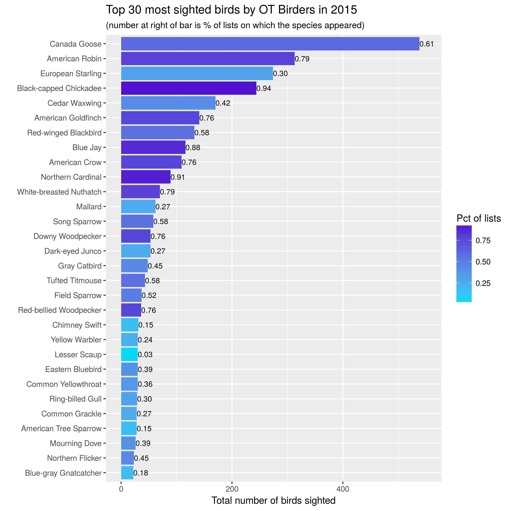
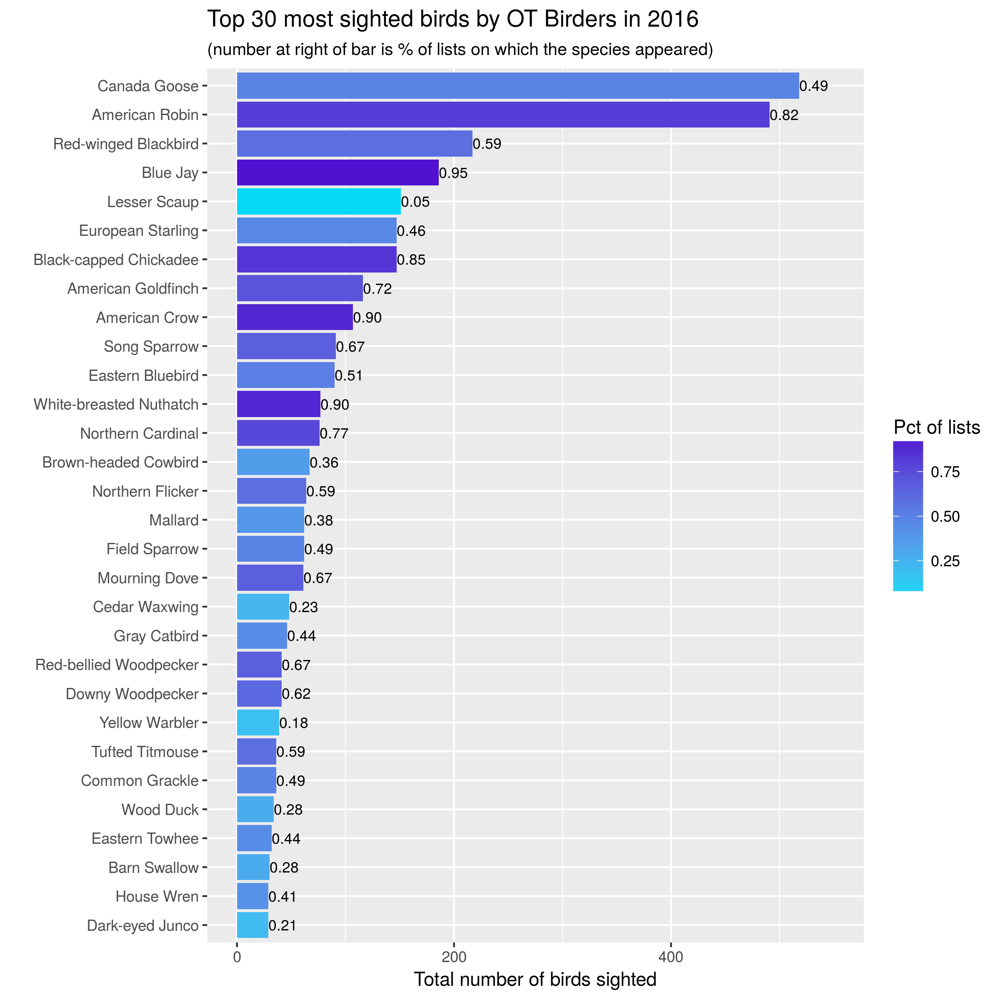
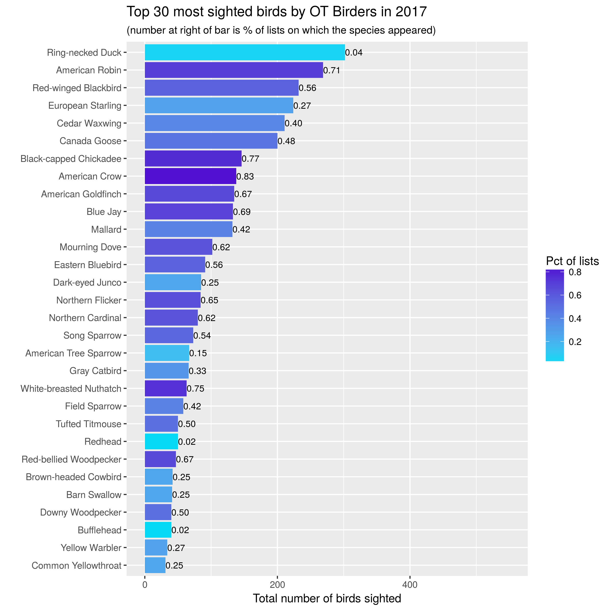
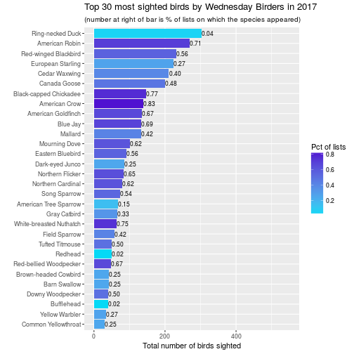

# Wednesday OT Birders - Using the ebird API, Python, and R to analyze data for our birding group

Using the eBird API from Python, we downloaded birding lists submitted by our Wednesday morning birding group. R was then used to create some basic plots showing the top species sighted each year. 

## The Wednesday OT Birders

Since 2015, a small but growing group of birders has met each Wednesday 
morning to [bird one of the parks in Oakland Township](https://oaklandnaturalareas.com/volunteer-calendar/birding-walks/).
We have a mix of birding experience, a shared love of nature and 
dedication to stewardship of natural areas. The founder of the group is
a scientist/naturalist (PhD in biology/botany) and the [Natural Areas Manager for Oakland Township](http://www.oaklandtownship.org/boards_and_commissions/parks_and_recreation/stewardship.php). So, not only do we get to bird, we get to learn a ton
about the flora of the area. Our group is also fortunate to have a gifted
writer and photographer who blogs about our parks at the [Natural Areas Notebook](https://oaklandnaturalareas.com/).

Since the group's inception,
our bird lists have been entered into [eBird](https://ebird.org/home), 
making it easy to answer those "Hey, have we ever seen a [insert random
bird species] in this park?" queries. Now that we've got a few years
of weekly data, it's time for some birding analysis. In this first post,
I'll describe how I:

* used the eBird API (2.0) with Python from a Jupyter notebook to download data from our bird lists into a pandas dataframe and then exported to csv file,
* used R to clean up the data to make sure we were just using our Wednesday Birders
lists for the analysis,
* used the R packages dplyr and ggplot2 to summarize and make plots of 
species counts by year.

## Downloading our data from eBird

[eBird.org](http://ebird.org/content/ebird/) is an extremely popular online site for entering bird sightings. It was started by the [Cornell Lab of Ornithology](http://www.birds.cornell.edu) and the [National Audobon Society](https://www.audubon.org/) and has revolutionized birding
by making it easy for anyone to enter observational data into a shared
database and to then access that database through simple to use interfaces
within web browsers or mobile apps. 

Not only does eBird make it easy for you to enter sightings and manage your own lists of birds seen, it has a nice set of tools for exploring the massive amount of data it collects.

* Summary graphs and tables
* Search for recent sightings in "hotspots" or by any location
* Interactive species maps
* ... and even more goodies

You can [download your own data](https://ebird.org/downloadMyData) or the [whole dataset](https://ebird.org/data/download) through
the eBird website. There is also an API that makes it
easy to programmatically download a variety of detailed and summary data.
The [eBird API 1.1](https://confluence.cornell.edu/display/CLOISAPI/eBird+API+1.1) is still available but people are urged to migrate to the
new [eBird API 2.0](https://documenter.getpostman.com/view/664302/ebird-api-20/2HTbHW).

I'm going to use Python to do the
data download. In order to use the eBird API 2.0 you need to [obtain a free API key](https://ebird.org/ebird/api/keygen). 

    api_key = 'put_your_api_key_here'


The Wednesday Birders cycle through four different parks each month. I just manually
grabbed the locIDs for these parks and stuffed them into a dictionary.


    hotspot_ids = {'Bear Creek Nature Park':'L2776037',
                   'Cranberry Lake Park': 'L2776024',
                   'Charles Ilsley Park': 'L2905470',
                   'Draper Twin Lake Park': 'L1581963'}


We'll need to use a few libraries.


    import pandas as pd
    import requests
    import time #used to put .5 second delay in API data call


Set the date range for the download for 2015-01-01 through 2018-02-28.


    start_date = pd.Timestamp('20150101')
    end_date = pd.Timestamp('20180228')
    num_days = (end_date - start_date).days + 1
    rng = pd.date_range(start_date, periods=num_days, freq='D')


Just a little bit of Python code needed to grab the data through a series
of web API calls.


    # Base URL for eBird API 2.0
    url_base_obs = 'https://ebird.org/ws2.0/data/obs/'

    # Create a list to hold the individual dictionaries of observations
    observations = []

    # Loop over the locations of interest and dates of interest
    for loc_id in loc_ids:
        for d in rng:
            time.sleep(0.5) # time delay
            ymd = '{}/{}/{}'.format(d.year, d.month, d.day)
            # Build the URL
            url_obs = url_base_obs + loc_id + '/historic/' + ymd + \
            '?rank=mrec&detail=full&cat=species&key=' + api_key
            print(url_obs)
            # Get the observations for one location and date
            obs = requests.get(url_obs)
            # Append the new observations to the master list
            observations.extend(obs.json())

    # Convert the list of dictionaries to a pandas dataframe        
    obs_df = pd.DataFrame(observations)
    # Check out the structure of the dataframe
    print(obs_df.info())
    # Check out the first few rows
    obs_df.head()
    # Export the dataframe to a csv file
    obs_df.to_csv("observations.csv", index=False)

## Data prep

All of the data prep and analysis is done in R. We'll need a few libraries:


```r
library(dplyr)
library(ggplot2)
library(lubridate)
```

Before diving into analysis and plots, a little data prep is needed:

* read CSV file into an R dataframe
* convert datetime fields to POSIXct
* include only the lists from our Wednesday morning walks


```r
# Read in the csv file
obs_raw <- read.csv("./data/observations.csv")
# Convert date field to POSIXct
obs_raw$obsDt <- as.POSIXct(obs_raw$obsDt)
# Create list of our birders who have entered >= 1 list
list_authors <- c("VanderWeide", "Isken", "Kriebel")
# Filter out lists not done on Wed by one of the list authors
obs_df <- obs_raw %>%
  filter(lastName %in% list_authors & wday(obsDt) == 4)
# Check out the first few rows
head(obs_df)
```

```
##   checklistId                comName countryCode   countryName firstName
## 1     CL24105           Canada Goose          US United States  Benjamin
## 2     CL24105         Turkey Vulture          US United States  Benjamin
## 3     CL24105        Red-tailed Hawk          US United States  Benjamin
## 4     CL24105         Sandhill Crane          US United States  Benjamin
## 5     CL24105 Red-bellied Woodpecker          US United States  Benjamin
## 6     CL24105       Downy Woodpecker          US United States  Benjamin
##   hasComments hasRichMedia howMany    lastName      lat       lng    locID
## 1       False        False       2 VanderWeide 42.78965 -83.10907 L2905470
## 2       False        False       1 VanderWeide 42.78965 -83.10907 L2905470
## 3       False        False       2 VanderWeide 42.78965 -83.10907 L2905470
## 4       False        False       2 VanderWeide 42.78965 -83.10907 L2905470
## 5       False        False       1 VanderWeide 42.78965 -83.10907 L2905470
## 6       False        False       1 VanderWeide 42.78965 -83.10907 L2905470
##      locId             locName locationPrivate      obsDt        obsId
## 1 L2905470 Charles Ilsley Park           False 2015-03-18 OBS303938306
## 2 L2905470 Charles Ilsley Park           False 2015-03-18 OBS303938307
## 3 L2905470 Charles Ilsley Park           False 2015-03-18 OBS303938305
## 4 L2905470 Charles Ilsley Park           False 2015-03-18 OBS303938302
## 5 L2905470 Charles Ilsley Park           False 2015-03-18 OBS303938303
## 6 L2905470 Charles Ilsley Park           False 2015-03-18 OBS303938301
##   obsReviewed obsValid presenceNoted              sciName speciesCode
## 1       False     True         False    Branta canadensis      cangoo
## 2       False     True         False       Cathartes aura      turvul
## 3       False     True         False    Buteo jamaicensis      rethaw
## 4       False     True         False  Antigone canadensis      sancra
## 5       False     True         False Melanerpes carolinus      rebwoo
## 6       False     True         False   Picoides pubescens      dowwoo
##       subId subnational1Code subnational1Name subnational2Code
## 1 S22414352            US-MI         Michigan        US-MI-125
## 2 S22414352            US-MI         Michigan        US-MI-125
## 3 S22414352            US-MI         Michigan        US-MI-125
## 4 S22414352            US-MI         Michigan        US-MI-125
## 5 S22414352            US-MI         Michigan        US-MI-125
## 6 S22414352            US-MI         Michigan        US-MI-125
##   subnational2Name      userDisplayName
## 1          Oakland Benjamin VanderWeide
## 2          Oakland Benjamin VanderWeide
## 3          Oakland Benjamin VanderWeide
## 4          Oakland Benjamin VanderWeide
## 5          Oakland Benjamin VanderWeide
## 6          Oakland Benjamin VanderWeide
```

## Plots of Species Counts

How many birds of each species have we seen? How frequently are each species
seen? 

Let's start with simple bar charts:

* one bar per species, one year per graph,
* bar length is number of birds seen,
* color of bar is related to percentage of lists on which that species seen,
* number at end of bar is percentage of lists on which that species seen.





A few observations:

* Familiar year round friends such as Canada Goose, American Robin, Black-capped Chicadee, Blue Jay and American Goldfinch are sighted in large numbers and on most outings.

* Large flocks of European Starlings lead to them having a high number of sightings but appearing relatively infrequently in our lists.  In 2017, one big flock of Ring-necked Ducks gave them the title of most birds seen that year!

* The overall composition of the lists are pretty similar across the three 
years. However, overall numbers appear to be down in 2017. Turns out this is
in spite of fact that we had more outings (lists) in 2017 (48) than in 2016 (39).
This requires more investigation.

## Creating the plots


The plots above are easy to create from a dataframe that looks like this:


```
##                    comName birding_year num_lists tot_birds totlists
## 1         Ring-necked Duck         2017         2       302       48
## 2           American Robin         2017        34       269       48
## 3     Red-winged Blackbird         2017        27       232       48
## 4        European Starling         2017        13       224       48
## 5            Cedar Waxwing         2017        19       211       48
## 6             Canada Goose         2017        23       200       48
## 7   Black-capped Chickadee         2017        37       146       48
## 8            American Crow         2017        40       138       48
## 9       American Goldfinch         2017        32       135       48
## 10                Blue Jay         2017        33       133       48
## 11                 Mallard         2017        20       132       48
## 12           Mourning Dove         2017        30       102       48
## 13        Eastern Bluebird         2017        27        91       48
## 14         Dark-eyed Junco         2017        12        85       48
## 15        Northern Flicker         2017        31        84       48
## 16       Northern Cardinal         2017        30        80       48
## 17            Song Sparrow         2017        26        73       48
## 18   American Tree Sparrow         2017         7        67       48
## 19            Gray Catbird         2017        16        66       48
## 20 White-breasted Nuthatch         2017        36        63       48
## 21           Field Sparrow         2017        20        58       48
## 22                 Redhead         2017         1        50       48
## 23         Tufted Titmouse         2017        24        50       48
## 24  Red-bellied Woodpecker         2017        32        47       48
## 25    Brown-headed Cowbird         2017        12        42       48
## 26            Barn Swallow         2017        12        41       48
## 27              Bufflehead         2017         1        40       48
## 28        Downy Woodpecker         2017        24        40       48
## 29          Yellow Warbler         2017        13        34       48
## 30     Common Yellowthroat         2017        12        31       48
##      pctlists
## 1  0.04166667
## 2  0.70833333
## 3  0.56250000
## 4  0.27083333
## 5  0.39583333
## 6  0.47916667
## 7  0.77083333
## 8  0.83333333
## 9  0.66666667
## 10 0.68750000
## 11 0.41666667
## 12 0.62500000
## 13 0.56250000
## 14 0.25000000
## 15 0.64583333
## 16 0.62500000
## 17 0.54166667
## 18 0.14583333
## 19 0.33333333
## 20 0.75000000
## 21 0.41666667
## 22 0.02083333
## 23 0.50000000
## 24 0.66666667
## 25 0.25000000
## 26 0.25000000
## 27 0.02083333
## 28 0.50000000
## 29 0.27083333
## 30 0.25000000
```

The only real trickiness is getting the percentage of lists column computed.
We can do it in a few steps using dplyr. For the example below I've just
hard coded in 2017 as the year of interest. In reality, I embedded the code
below in a function and passed the year of interest in. 


```r
# Create num species by list dataframe
numsp_bylist <- obs_df %>%
  group_by(year=year(obsDt), obsDt, subId, lastName) %>%
  count() %>%
  arrange(year, subId)

# Using numsp_bylist, create num lists by date
numlists_bydt <- numsp_bylist %>%
  group_by(obsDt) %>%
  summarise(
    numlists = n()
  ) %>%
  filter(numlists >= 1) %>%
  arrange(obsDt)

# Usings numlists_bydt, create num lists by year
numlists_byyear <- numlists_bydt %>%
  group_by(birding_year=year(obsDt)) %>%
  summarise(
    totlists = sum(numlists)
  )

# Now ready to compute species by year
species_byyear <- obs_df %>%
  group_by(comName, birding_year=year(obsDt)) %>%
  summarize(
    num_lists = n(),
    tot_birds = sum(howMany)
  ) %>%
  arrange(birding_year, desc(tot_birds))

# Join to numlists_byyear so we can compute pct of lists each species
# appeared in.
species_byyear <- left_join(species_byyear, numlists_byyear, by = 'birding_year') 

# These would be passed in to function version of this code
bird_year <- 2017 
ntop <- 30

# Compute the percentage of lists on which each species appeard
top_obs_byyear <- species_byyear %>%
  filter(birding_year == bird_year) %>%
  mutate(pctlists = num_lists / totlists) %>%
  arrange(desc(tot_birds)) %>%
  head(ntop)
```

Finally we are ready to make the plot. For this post I'm cheating a bit by 
hard coding in a y-axis limit. In the function version, this can be passed in.


```r
ggplot(top_obs_byyear) + 
    geom_bar(aes(x=reorder(comName, tot_birds), 
                 y=tot_birds, fill=pctlists), stat = "identity") +
                 scale_fill_gradient(low='#05D9F6', high='#5011D1') +
                 labs(x="", 
                      y="Total number of birds sighted", 
                      fill="Pct of lists",
                      title = paste0("Top 30 most sighted birds by Wednesday Birders in ", bird_year),
                      subtitle = "(number at right of bar is % of lists on which the species appeared)") +
                 coord_flip() +
    geom_text(data=top_obs_byyear,
              aes(x=reorder(comName,tot_birds),
                  y=tot_birds,
                  label=format(pctlists, digits = 1),
                  hjust=0
              ), size=3) + ylim(0,550)
```




## Next steps

Now that we've got the raw data downloaded and cleaned up, we can do a bunch
of exploratory analysis and our Wednesday morning birding group will know a
little more about what we've been seeing.
