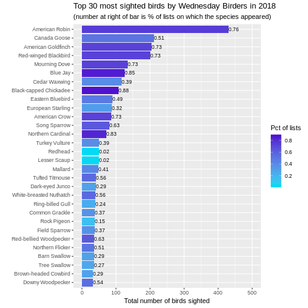
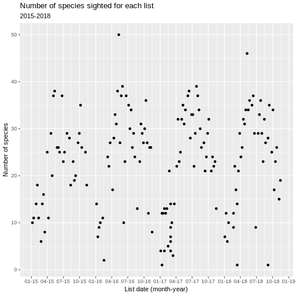
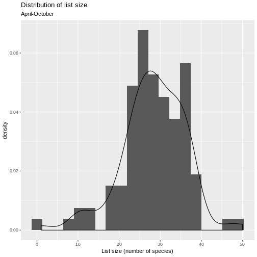
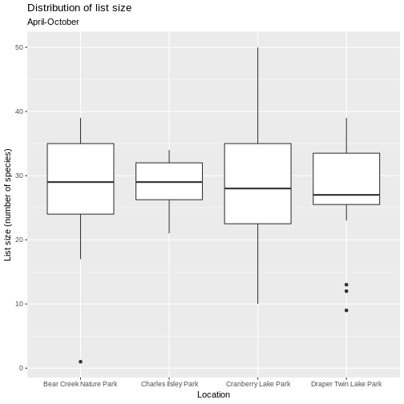
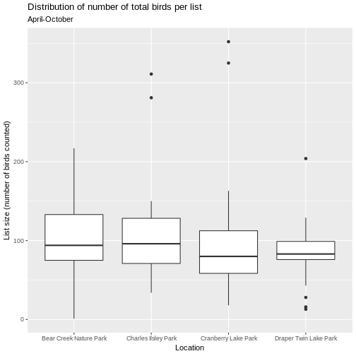
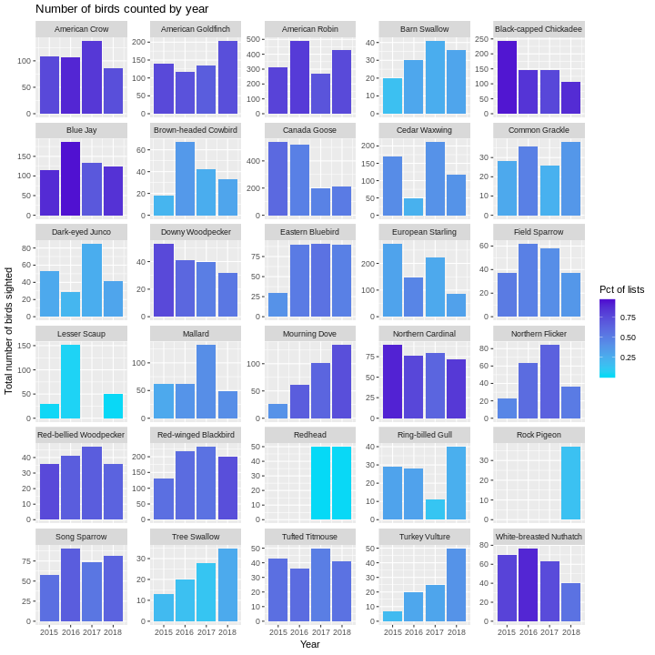
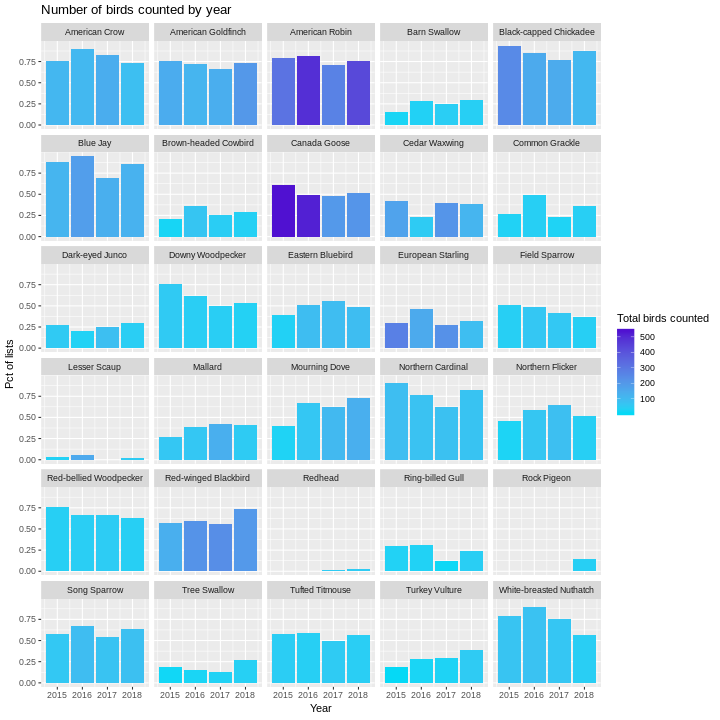

# Wednesday Birders - 2018 stats and historical analysis using R

Using the eBird API from Python, we downloaded birding lists submitted by our Wednesday morning birding group. R was then used to produce various plots relating to counts of birds sighted and frequency of list appearance, by species.


## The Wednesday Birders

In a [previous post](https://misken.github.io/blog/otbirders_1_ebirdapi_python_1/) I described how I used a mix of Python and R to acquire, clean, and analyze [eBird](https://ebird.org/home) data from our birding group's weekly walks. In this post, I'll add plots for 2018 and do a little more analysis.

To summarize the basic approach (described in the first post), we:

* used the eBird API (2.0) with Python to download data from our bird lists into a pandas dataframe and then exported to csv file,
* used R to clean up the data to make sure we were just using our Wednesday Birders lists for the analysis,
* used the R packages dplyr and ggplot2 to summarize and make plots of 
species counts by year.


## Data prep

All of the data prep and analysis is done in R. We'll need a few libraries:


```r
library(dplyr)
library(ggplot2)
library(lubridate)
```

Before diving into analysis and plots, a little data prep was needed:

* downloaded data from 2018 and converted the JSON to csv (used appropriately modified Python script detailed in first post)
* read CSV file into an R dataframe
* convert datetime fields to POSIXct
* include only the lists from our Wednesday morning walks
* combined the 2018 data with the data from 2015-1017 and saved as an RDS file


```r
obs_df <- readRDS(file = "./data/observations.rds")
```
There are a bunch of fields in the observation records from eBird. Here's
just a sample focusing on the stuff we need. Each row in the
data frame corresponds to an individual species count on a certain date
in a certain location.


```r
obs_df <- obs_df %>% 
  select(checklistId, obsDt, locName, comName, sciName, howMany, subId)

head(obs_df)
```

```
##   checklistId      obsDt             locName                comName
## 1     CL24105 2015-03-18 Charles Ilsley Park           Canada Goose
## 2     CL24105 2015-03-18 Charles Ilsley Park         Turkey Vulture
## 3     CL24105 2015-03-18 Charles Ilsley Park        Red-tailed Hawk
## 4     CL24105 2015-03-18 Charles Ilsley Park         Sandhill Crane
## 5     CL24105 2015-03-18 Charles Ilsley Park Red-bellied Woodpecker
## 6     CL24105 2015-03-18 Charles Ilsley Park       Downy Woodpecker
##                sciName howMany     subId
## 1    Branta canadensis       2 S22414352
## 2       Cathartes aura       1 S22414352
## 3    Buteo jamaicensis       2 S22414352
## 4  Antigone canadensis       2 S22414352
## 5 Melanerpes carolinus       1 S22414352
## 6   Picoides pubescens       1 S22414352
```


## Plots of Species Counts

How many birds of each species have we seen? How frequently are each species
seen? 

Let's start with simple bar charts:

* one bar per species, one year per graph,
* bar length is number of birds seen,
* color of bar is related to percentage of lists on which that species seen,
* number at end of bar is percentage of lists on which that species seen.

## Creating plots for 2018


The plots are easy to create from a dataframe that looks like this:


```
##                    comName birding_year num_lists tot_birds totlists
## 1           American Robin         2018        31       431       41
## 2             Canada Goose         2018        21       211       41
## 3       American Goldfinch         2018        30       204       41
## 4     Red-winged Blackbird         2018        30       200       41
## 5            Mourning Dove         2018        30       134       41
## 6                 Blue Jay         2018        35       125       41
## 7            Cedar Waxwing         2018        16       116       41
## 8   Black-capped Chickadee         2018        36       107       41
## 9         Eastern Bluebird         2018        20        90       41
## 10       European Starling         2018        13        87       41
## 11           American Crow         2018        30        86       41
## 12            Song Sparrow         2018        26        81       41
## 13       Northern Cardinal         2018        34        72       41
## 14            Lesser Scaup         2018         1        50       41
## 15                 Redhead         2018         1        50       41
## 16          Turkey Vulture         2018        16        50       41
## 17                 Mallard         2018        17        49       41
## 18         Dark-eyed Junco         2018        12        41       41
## 19         Tufted Titmouse         2018        23        41       41
## 20        Ring-billed Gull         2018        10        40       41
## 21 White-breasted Nuthatch         2018        23        40       41
## 22          Common Grackle         2018        15        38       41
## 23           Field Sparrow         2018        15        37       41
## 24             Rock Pigeon         2018         6        37       41
## 25            Barn Swallow         2018        12        36       41
## 26        Northern Flicker         2018        21        36       41
## 27  Red-bellied Woodpecker         2018        26        36       41
## 28            Tree Swallow         2018        11        35       41
## 29    Brown-headed Cowbird         2018        12        33       41
## 30        Downy Woodpecker         2018        22        32       41
##      pctlists
## 1  0.75609756
## 2  0.51219512
## 3  0.73170732
## 4  0.73170732
## 5  0.73170732
## 6  0.85365854
## 7  0.39024390
## 8  0.87804878
## 9  0.48780488
## 10 0.31707317
## 11 0.73170732
## 12 0.63414634
## 13 0.82926829
## 14 0.02439024
## 15 0.02439024
## 16 0.39024390
## 17 0.41463415
## 18 0.29268293
## 19 0.56097561
## 20 0.24390244
## 21 0.56097561
## 22 0.36585366
## 23 0.36585366
## 24 0.14634146
## 25 0.29268293
## 26 0.51219512
## 27 0.63414634
## 28 0.26829268
## 29 0.29268293
## 30 0.53658537
```

Here's how you can make such a data frame.


```r
# Create num species by list df
numsp_bylist <- obs_df %>%
  group_by(year=year(obsDt), obsDt, locName, subId) %>%
  summarize(
    n = n(),
    totbirds = sum(howMany)
  ) %>% 
  arrange(year, subId)

# Using numsp_bylist, create num lists by date
numlists_bydt <- numsp_bylist %>%
  group_by(obsDt) %>%
  summarise(
    numlists = n()
  ) %>%
  filter(numlists >= 1) %>%
  arrange(obsDt)

# Usings numlists_bydt, create num lists by year
numlists_byyear <- numlists_bydt %>%
  group_by(birding_year=year(obsDt)) %>%
  summarise(
    totlists = sum(numlists)
  )

# Now ready to compute species by year
species_byyear <- obs_df %>%
  group_by(comName, birding_year=year(obsDt)) %>%
  summarize(
    num_lists = n(),
    tot_birds = sum(howMany)
  ) %>%
  arrange(birding_year, desc(tot_birds))

# Join to numlists_byyear so we can compute pct of lists each species
# appeared in.
species_byyear <- left_join(species_byyear, numlists_byyear, by = 'birding_year') 

bird_year <- 2018

top_obs_byyear <- species_byyear %>%
  filter(birding_year == bird_year) %>%
  mutate(pctlists = num_lists / totlists) %>%
  arrange(desc(tot_birds)) %>%
  head(30)
```
Make the plot.


```r
ggplot(top_obs_byyear) + 
    geom_bar(aes(x=reorder(comName, tot_birds), 
                 y=tot_birds, fill=pctlists), stat = "identity") +
                 scale_fill_gradient(low='#05D9F6', high='#5011D1') +
                 labs(x="", 
                      y="Total number of birds sighted", 
                      fill="Pct of lists",
                      title = paste0("Top 30 most sighted birds by Wednesday Birders in ", bird_year),
                      subtitle = "(number at right of bar is % of lists on which the species appeared)") +
                 coord_flip() +
    geom_text(data=top_obs_byyear,
              aes(x=reorder(comName,tot_birds),
                  y=tot_birds,
                  label=format(pctlists, digits = 1),
                  hjust=0
              ), size=3) + ylim(0,500)
```



## Patterns and changes over time

Now that we have four full years of eBird sightings data from the
four parks we visit each month, let's see how things look over time (and location).

Here's an overall time series plot of number of species appearing on
each list.


```r
numsp_bylist %>% 
  ggplot() + geom_point(aes(x = as.Date(obsDt), y = n)) +
  ggtitle("Number of species sighted for each list", subtitle = "2015-2018") +
  scale_x_date(date_breaks = "3 months",
               date_labels = "%m-%y") +
  xlab("List date (month-year)") +
  ylab("Number of species")
```



Same plot but faceted by park.


```r
numsp_bylist %>% 
  ggplot() + geom_point(aes(x = as.Date(obsDt), y = n)) +
  facet_grid(locName ~ .) +
  ggtitle("Number of species sighted for each list", subtitle = "2015-2018") +
  scale_x_date(date_breaks = "3 months",
               date_labels = "%m-%y") +
  xlab("List date (month-year)") +
  ylab("Number of species")
```


Let's look at distribution of list size during the peak period of 
April-October.


```r
numsp_bylist %>% 
  filter(month(obsDt) %in% 4:10) %>% 
  ggplot() + geom_histogram(aes(x = n, y = ..density..), bins = 20) +
  ggtitle("Distribution of list size", subtitle = "April-October") +
  xlab("List size (number of species)") +
  geom_density(aes(x = n))
```



Use boxplots and group by park.


```r
numsp_bylist %>% 
  filter(month(obsDt) %in% 4:10) %>% 
  ggplot() + geom_boxplot(aes(x = locName, y = n)) +
  ggtitle("Distribution of list size", subtitle = "April-October") +
  xlab("Location") + ylab("List size (number of species)")
```



Let's repeat the above but using total number of birds counted per
list instead of number of species per list.


```r
numsp_bylist %>% 
  filter(month(obsDt) %in% 4:10) %>% 
  ggplot() + geom_boxplot(aes(x = locName, y = totbirds)) +
  ggtitle("Distribution of number of total birds per list", subtitle = "April-October") +
  xlab("Location") + ylab("List size (number of birds counted)")
```



Let's look at time series plots of number of birds counted for each
of the species in the Top 30 for 2018. We'll need the following
data frame to power the plots.


```r
top_species_byyear <- top_obs_byyear %>% 
  select("comName") %>% 
  inner_join(species_byyear, by = "comName") %>% 
  mutate(pctlists = num_lists / totlists)

top_species_byyear
```

```
## # A tibble: 114 x 6
## # Groups:   comName [30]
##    comName            birding_year num_lists tot_birds totlists pctlists
##    <chr>                     <dbl>     <int>     <dbl>    <int>    <dbl>
##  1 American Robin             2015        26       313       33    0.788
##  2 American Robin             2016        32       491       39    0.821
##  3 American Robin             2017        34       269       48    0.708
##  4 American Robin             2018        31       431       41    0.756
##  5 Canada Goose               2015        20       538       33    0.606
##  6 Canada Goose               2016        19       518       39    0.487
##  7 Canada Goose               2017        23       200       48    0.479
##  8 Canada Goose               2018        21       211       41    0.512
##  9 American Goldfinch         2015        25       141       33    0.758
## 10 American Goldfinch         2016        28       116       39    0.718
## # ... with 104 more rows
```

Bar height is total number of birds counted and bar color
is related to percentage of lists on which this bird appeared.


```r
ggplot(top_species_byyear) + 
  geom_bar(aes(x = birding_year, y = tot_birds, fill=pctlists), 
           stat = "identity") +
  scale_fill_gradient(low='#05D9F6', high='#5011D1') +
  ggtitle("Number of birds counted by year") +
  facet_wrap(~comName, ncol = 5, scales = "free_y") +
  labs(x="Year", 
       y="Total number of birds sighted", 
       fill="Pct of lists")
```



A few things pop out:

- overall number of [Black-capped Chicadees](https://www.allaboutbirds.org/guide/Black-capped_Chickadee) counted has declined, though they are still sighted very frequently. Maybe we've become somewhat immune to their
constant chatter and just aren't recording as many. "Oh, just another chicadee."
- [Downy Woodpecker](https://www.allaboutbirds.org/guide/Downy_Woodpecker) sightings have declined both in terms of number and frequency as have [White-breasted Nuthatch](https://www.allaboutbirds.org/guide/White-breasted_Nuthatch) sightings.
- [Mourning Doves](https://www.allaboutbirds.org/guide/Mourning_Dove) are up in both number and frequency.
- After 2015, sightings of [Eastern Bluebirds](https://www.allaboutbirds.org/guide/Eastern_Bluebird) have been remarkably constant.

Now swap roles of total birds and frequency of appearing on a list. Bar
height is percentage of lists on which this bird appeared and bar color
is related to total number of birds counted.


```r
ggplot(top_species_byyear) + 
  geom_bar(aes(x = birding_year, y = pctlists, fill = tot_birds), 
           stat = "identity") +
  scale_fill_gradient(low='#05D9F6', high='#5011D1') +
  ggtitle("Number of birds counted by year") +
  facet_wrap(~comName, ncol = 5) +
  labs(x="Year", 
       y="Pct of lists", 
       fill="Total birds counted")
```



## Next steps

Now our group can try to make sense of these and I'm sure we'll have ideas for more analysis. In my next post I'm going to
explore those springtime favorites, the [warblers](https://www.allaboutbirds.org/guide/browse/taxonomy/Parulidae).
