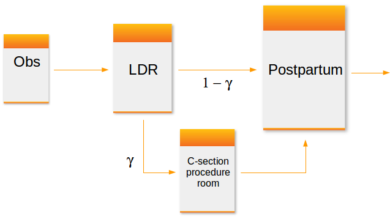
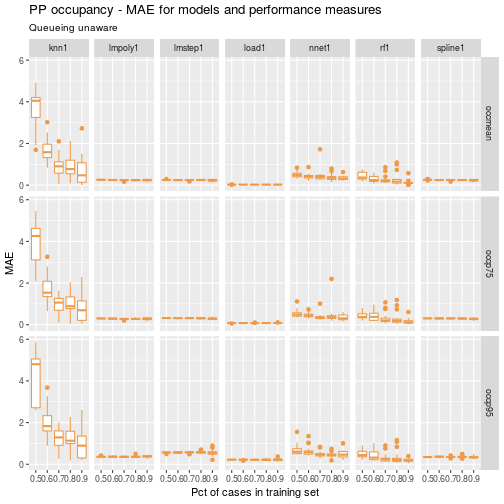
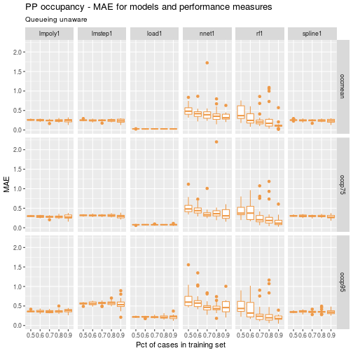
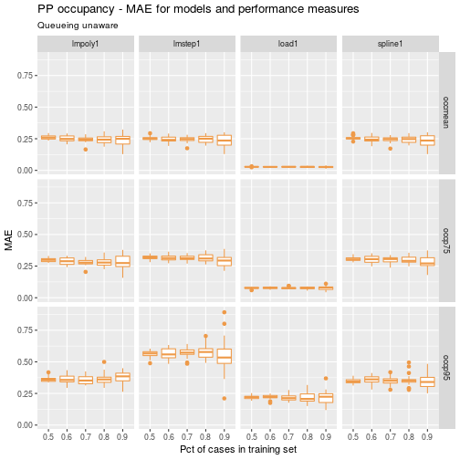
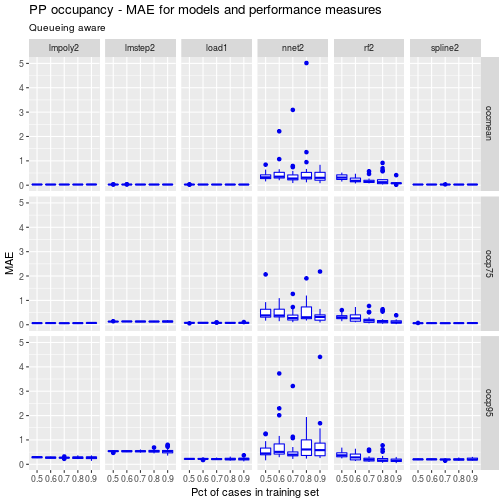
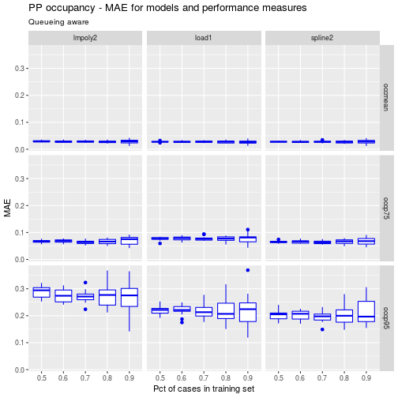

# Exploration of metamodels for simulation models of patient flow systems (Part 1)

Simulation metamodeling involves building predictive models based on outputs of designed simulation experiments. In this series of posts we'll share our experience with using the R package ``caret`` for building and comparing several predictive modeling based metamodels including linear models, neural networks, random forests, k-nearest neighbor, and cubic splines. 


## Introduction

A typical configuration of hospital units which provide care for women about to
give birth might include an observation unit, a labor, delivery and recovery
unit (LDR) and a postpartum (PP) unit. Matching the capacity of these units to
demand placed on them is important for maintaining smooth patient flow. For
example, there should be sufficient capacity in a PP unit so that there is a
relatively small probability that a post-delivery patient is *blocked* in the
LDR due to lack of a bed in PP. Of course, complicating the capacity planning
process is the fact that there are numerous sources of uncertainty in
obstetrical patient care processes. These include the number and timing of
patient arrivals, whether or not the patient requires a C-section and the length
of stay in each of the three units.



I'm working on a research project involving capacity planning models for these
systems. One phase involves building what are known as *simulation metamodels*.
The main components are:

* built a discrete event simulation model of a simplified queueing network model
of a typical obstetrical patient flow system.
* designed and ran a set of simulation experiments involving a range patient
volumes, percentages of patients requiring c-section, and unit sizes (numbers of
beds). There were 150 scenarios simulated.
* post-processed the output using both R and Python
(https://github.com/misken/hillmaker) to compute several performance measures
related to unit occupancy and patient delays.
* now working on building and comparing a number of different
statistical/machine learning techniques for predicting occupancy and delay
related peformance measures using the experimental inputs (volume, % c-section,
unit sizes).

In the simulation world, this last step is known as *simulation metamodeling*.
It has a long history. See any good discrete event simulation text such as
*Simulation modeling and analysis by Law and Kelton* [@Law2000] for an overview.
There's also a nice overview done by R. Barton and available as a [free pdf](http://www.informs-sim.org/wsc15papers/185.pdf) from
the Proceedings of the 2015 Winter Simulation
Conference [@Barton2015]. Any
predictive modeling technique capable of producing real valued output such as
neural networks, regression trees, k-nearest neighbor or any number of advanced
regression techniques are viable candidates for building simulation metamodels.

As this was my first significant project using [caret](http://topepo.github.io/caret/index.html), I thought it would be
helpful to write up some of the challenges faced and share some of the
techniques I used to make it easier to compare different models. This resulted
in three blog posts:

* [Comparing predictive models for obstetrical unit occupancy using caret - Part 1](https://misken.github.io/blog/obsim_caret_part1/)
* [Comparing predictive model performance using caret - Part 2: A simple caret automation function](https://misken.github.io/blog/obsim_caret_part2/)
* [Comparing predictive model performance using caret - Part 3: Automate](https://misken.github.io/blog/obsim_caret_part3/)

## Analysis of patient flow networks

In analyzing tandem flow systems with blocking, such as this one,
a common and pragmatic approach is to:

* decompose the system into a set of models, one for each unit,
* intelligently modify key system parameters such as arrival rates and 
service rates for each unit to heuristically account for blocking and
other interunit phenomena,
* start by analyzing the last unit in the system since no departures from that
unit will be blocked,
* work your way backwards using the results from downstream units as needed,
* perhaps use iteration to converge upon a final solution.

Decomposition based approaches for approximate analysis of queueing networks has
a long history. For special kinds of networks known as *Jackson networks*,
decomposition and analysis of each node (unit in our case) in isolation can be
used to exactly analyze the network. Our OB system is definitely not a Jackson
network:

* non-exponential service times for finite capacity units
* Patients enter the LDR for the labor and birth process after leaving the
observation (OBS) unit. After delivery and recovery, patients are transferred to
the postpartum (PP) unit. Occupancy levels in the LDR are impacted not only by
volume and length of stay for the LDR phase but also by congestion levels in the
PP unit. If a bed in PP is not available when requested, that patient will 
simply remain in the LDR until a bed becomes available.

Since we need approximate approaches (and/or simulation), let's get back to the
simulation metamodeling problem at hand. We'll start with the postpartum unit as
it is the last unit visited before the patient leaves the hospital.

## Objectives

Our primary obectives for this first experiment were to:

* Compare the ability of popular predictive modeling techniques to accurately
predict performance measures of queueing type systems arising in healthcare
capacity planning problems,
* Assess the value of queueing system domain knowledge embedded in predictive
models on model accuracy,
* Explore the impact of hyperparameters such as relative size of training and
test datasets on model accuracy and model stability.

It is well known that good *feature engineering* is often important for creating
good predictive models. Knowledge of queueing dynamics that we can capture in 
new predictor variables seems like it has the potential for creating better 
predictive models. In this first experiment, relatively basic queueing knowledge
will be used. Variables based on the concepts of *offered load* and *traffic
intensity* will be considered. In addition, when predicting percentiles of 
occupancy, the well known *square root law* for capacity planning of queueing 
systems will also be used to engineer new model terms.

## Experimental design

### Patient Flow Input Variables

Key inputs include the patient arrival rate, average length of stay, and capacity
of the postpartum unit. 

| **Name** | **Math** | **Description** |
| --------------- | ---- | ------------------------------------------ |
| `lam_pp` | $\lambda_P$                | Arrival rate of patients to postpartum (PP) unit
| `alos_pp` | $B_P$               | Average length of stay in PP |
| `cap_pp`  | $c_P$               | Number of beds in PP |
| `load_pp` | $\lambda_P B_P$     | Arrival rate times average length of stay; a measure of workload submitted to the PP |
| `rho_pp`  | $\rho_P=\lambda_P B_P/c_P$ | Traffic intensity; a measure of congestion of PP |

<br/>

If you've studied queueing systems, you know that the
interarrival and service time distributions also matter. In the simulation
model, patient arrivals were modeled with a Poisson process which means
that the interarrival times are exponentially distributed. The postpartum
service times were modeled with two simple discrete distributions - one
for patients requiring a c-section and one for those with a regular delivery.
For this first set of models, only the mean arrival rate (`lam_pp`)
and the mean service time (`alos_pp`) were used. Distributional information
is used in later models.


### Statistical Modeling Input Variables

The process of model fitting and validation is characterized by a number of *hyperparameters* or *tuning parameters*. It isn't clear (at least to me) how
to pick good values for some of these or how sensitive predictive accuracy
and/or model stability is to them. We focused on a few of these in this experiment.

| **Name** | **Description** | **Levels**|
| ------------- | --------------------------------- | -------------- |
| `pct_train_val` | Percent of cases allocated to training set | 0.5, 0.6, 0.7, 0.8, 0.9 |
| `partition.times` | Number of train/test partitions to do and use in entire partition, train, predict, summarize cycle | 10, 20 |
| `kfold_number` | Number of folds in crossfold validation | 5, 10 |

<br/>

For now we'll focus on the results for `partition.times=20` and 
`kfold_number=5`. The `pct_train_val` parameter controlled the percentage of
cases allocated between the training and test datasets. Models were built using
only training data, with k-crossfold validation used to pick the best model. 
The number of repititions of the entire process for each model was
controlled by the parameter `partition.times`. The final models were then 
used to make predictions on the test set and several error metrics computed.

### Error metrics

For each model fit instance, we computed root mean square error (RMSE),
mean absolute error (MAE), and mean absolute percent error (MAPE) using
predictions on the . Since
we are just focusing on `partition.times=20` for each
value of `pct_train_val`, the percentage of cases allocated to the training set,
we get 20 observations of each error metric and can look at the distribution
of the error metrics in addition to overall means.

Since many of the models end up fitting quite well and have errors less
than one, we'll focus on the MAE metric (so as not to square numbers < 1).

### Model families

We used a few different models that are widely used and seem applicable to the
general regression type problem at hand. In parentheses are the abbreviations
used for each of the modeling families.

- Linear models based on queueing approximations (**load**)
- Random forests (**rf**)
- Neural networks (**nnet**)
- Cubic splines (**spline**)
- k-nearest neighbor (**knn**)
- Polynomial regression (**poly**)
- Stepwise regression (**lmstep**)

Each of these is discussed in more detail below, including information about
specific R packages used and algorithm parameter settings.

### Process physics knowledge

For all of the modeling families except the linear models with queueing terms,
we considered two different sets of input variables. One set represented a
somewhat "queueing unaware"" modeler who did **not** used the two engineered
features, `load_pp` and `rho_pp`, in their models. Only `lam_pp`, `alos_pp`,
and `cap_pp` were used. In the other set, representing a modeler
with some queueing knowledge, both `load_pp` and `rho_pp` were included as
predictor variables. For example, **knn1** is a k-nearest neighbor model which
did not include `load_pp` and `rho_pp`, whereas **knn2** does include these
additional input variables.

### Response Variables

To begin we just focused on mean and percentiles of postpartum occupancy.

| **Name** | **Description** |
| ------------- | --------------------------------- |
| `occmean_pp`       | Mean occupancy (number of patients) in PP unit |
| `occp75_pp`        | 75th percentile of occupancy in PP unit |
| `occp95_pp`        | 95th percentile of occupancy in PP unit |

<br/>

There are other important response variables such as the probability that a
patient gets blocked in the LDR due to the PP unit being full and the amount of
time (mean, percentiles) that such blocked patients wait for a PP bed to become
available. We'll explore those variables in subsequent articles.

## Model details

All models were fit using the caret package. Details of the mechanics can
be found in the three blog posts mentioned above.

### Linear models based on queueing approximations

The `lm()` function was used to fit a multiple linear regression model for
each of the response variables.

For mean occupancy, the `load_pp` variable should be sufficient since
this is an exact relationship for $G/G/m$ queues.

`occmean_pp ~ load_pp`

For the percentiles, we'll use an infinite capacity approximation based on
the $M/G/\infty$ queue. For such systems, occupancy is Poisson distributed
with mean equal to the load placed on the system (arrival rate * average 
service time). For large values of load we can use a normal approximation
to the Poisson to approximate occupancy percentiles. Even for loads as small
as 10, the approximation is reasonably accurate assuming a continuity 
correction is done. For example, to approximate the $95$th percentile of
occupancy in a system with load $L$, the normal approximation to the Poisson is:

$$
O_{0.95} \approx L + 0.5 + 1.645\sqrt{L}
$$

So, we will fit a simple linear model using `lm()`.

`occp95_pp ~  load_pp + I(load_pp ^ 0.5)`

The arrivals to the post-partum aren't technically Poisson but analysis of the
simulation output revealed that they are quite close to Poisson. So, it wouldn't
be surprising if the estimates of the y-intercept is close to 0.5 and the 
slopes are near 1.0 and 1.645 for systems which are not too heavily congested.

### Other modeling techniques

For random forests and all the other techniques,  we fit six models - one
"queueing physics unaware" and one "queueing physics aware" for each of the
three occupancy related response variables. For example, 

#### occmean_pp_rf1: Mean occupancy using random forest, no queueing terms

`occmean_pp ~  lam_pp + lam_pp + cap_pp`

#### occmean_pp_rf2: Mean occupancy using random forest, queueing terms

`occmean_pp ~  lam_pp + lam_pp + cap_pp + load_pp + rho_pp`

The same predictors were used to fit models for `occp75_pp` and `occp95_pp`.

The [randomForest](https://cran.r-project.org/web/packages/randomForest/randomForest.pdf) package was used to fit the models. Default
values for parameters were used in the `randomForest()` function calls.

The [nnet](https://cran.r-project.org/web/packages/nnet/index.html) package was used to fit the neural network models. Default
values for all parameters except `linout` were used in the `nnet()` function calls. 
To get regression predictions (instead of classes) we set `linout=TRUE`.

The [gam](https://cran.r-project.org/web/packages/gam/gam.pdf) package was used to fit the cubic spline models. Default
values for parameters were used in the function calls.

The [`knn` function from the class package](https://stat.ethz.ch/R-manual/R-devel/library/class/html/knn.html) was used to fit the cubic spline models. A preprocessing step was used to center and scale the data. Default
values for parameters were used in the function calls.

The `stepAIC` function from the [MASS](https://cran.r-project.org/web/packages/MASS/MASS.pdf) package was used to fit stepwise regression models. Default
values for parameters were used in the function calls.

For the polynomial regression models, `lm` was used, and linear and quadratic
terms were included.

## Results


```
## 
## Attaching package: 'dplyr'
```

```
## The following objects are masked from 'package:stats':
## 
##     filter, lag
```

```
## The following objects are masked from 'package:base':
## 
##     intersect, setdiff, setequal, union
```


```r
## Read results data

ptps_results_pp_occ_mean_df <- read.csv("data/mmout/pp_occ_mean.csv")
ptps_results_pp_occ_p75_df <- read.csv("data/mmout/pp_occ_p75.csv")
ptps_results_pp_occ_p95_df <- read.csv("data/mmout/pp_occ_p95.csv")

ptps_results_pp_occ_df <- rbind(ptps_results_pp_occ_mean_df,
                                ptps_results_pp_occ_p75_df,
                                ptps_results_pp_occ_p95_df)
```

To make things concrete, here are the 20 rows associated with the following
model fit and test instance:

* Model = `knn1`
* Pct of cases allocated to training set = 0.7
* Performance measure = mean occupancy


```r
ptps_results_pp_occ_df %>%
  filter(model=='knn1' & ptrain==0.7 & perf_measure=='occmean') %>%
  select(1:3, rmse_test, mae_test, mape_test)
```

```
##    pm_unit_model_id ptrain sample rmse_test  mae_test   mape_test
## 1   occmean_pp_knn1    0.7      1 1.0052279 0.2145379 0.007545913
## 2   occmean_pp_knn1    0.7      2 2.0627406 0.5897758 0.016124523
## 3   occmean_pp_knn1    0.7      3 3.4692304 1.0973854 0.024377439
## 4   occmean_pp_knn1    0.7      4 2.7514137 0.8739269 0.022656215
## 5   occmean_pp_knn1    0.7      5 0.3008833 0.0722353 0.002003952
## 6   occmean_pp_knn1    0.7      6 1.8100720 0.4052148 0.009430376
## 7   occmean_pp_knn1    0.7      7 3.5187415 1.6827260 0.051162870
## 8   occmean_pp_knn1    0.7      8 3.0495487 0.9335612 0.020722189
## 9   occmean_pp_knn1    0.7      9 0.8945858 0.3518124 0.011725163
## 10  occmean_pp_knn1    0.7     10 2.4575233 0.6836743 0.017971330
## 11  occmean_pp_knn1    0.7     11 3.4595388 1.0887717 0.025021145
## 12  occmean_pp_knn1    0.7     12 2.0926021 0.5347662 0.016196254
## 13  occmean_pp_knn1    0.7     13 2.9919025 0.9974762 0.025276314
## 14  occmean_pp_knn1    0.7     14 2.3613384 0.8347072 0.020721143
## 15  occmean_pp_knn1    0.7     15 3.1262837 1.2469138 0.027042326
## 16  occmean_pp_knn1    0.7     16 2.8826036 1.0613012 0.025373251
## 17  occmean_pp_knn1    0.7     17 3.0209032 1.1946814 0.035235445
## 18  occmean_pp_knn1    0.7     18 2.4898844 0.6559066 0.014181538
## 19  occmean_pp_knn1    0.7     19 4.1696193 2.1009985 0.062670714
## 20  occmean_pp_knn1    0.7     20 2.9599517 1.4845715 0.074980965
```

### Comparison of **load1** to queuing unaware models

For mean occupancy, we would expect **load1** to outperform the queueing
unaware versions of the competing models since **load1** is based on a
queueing relationship that holds for $G/G/m$ models. It does. Let's see
how it does on the occupancy percentiles.


```r
df <- ptps_results_pp_occ_df %>% 
   filter(kfold_number==5 & partition.times==20) %>%
  filter(grepl('load1|spline1|lmstep1|nnet1|rf1|poly1|knn1', model))

ggp <- ggplot(data=df) + 
  geom_boxplot(aes(x=as.factor(ptrain), y=mae_test), colour="tan2") +
  facet_grid(perf_measure~model) + 
  labs(title = "PP occupancy - MAE for models and performance measures",
       subtitle = "Queueing unaware",
       x = "Pct of cases in training set", y = "MAE")
```


```r
ggp
```




Clearly, **knn1** is not competitive. Let's drop it and replot so that we can
compress the y-axis a bit.


```r
df <- ptps_results_pp_occ_df %>% 
   filter(kfold_number==5 & partition.times==20) %>%
  filter(grepl('load1|spline1|lmstep1|nnet1|rf1|poly1', model))

ggp <- ggplot(data=df) + 
  geom_boxplot(aes(x=as.factor(ptrain), y=mae_test), colour="tan2") +
  facet_grid(perf_measure~model) + 
  labs(title = "PP occupancy - MAE for models and performance measures",
       subtitle = "Queueing unaware",
       x = "Pct of cases in training set", y = "MAE") 
  
  
ggp
```



A few things pop out immediately:

* the queueing approximation based models, **load1**, have both low overall
MAE as well as low variability in MAE
* the neural networks and random forests don't fare well. They have both high
overall value and high variability in MAE This is somewhat surprising since
these techniques are often well suited to capturing nonlinear relationships.
* The random forest models seem most sensitive to the train-test partitioning.

Let's drop the **nnet1** and **rf1** models to make it easier to compare the
various linear models.


```r
df <- ptps_results_pp_occ_df %>% 
   filter(kfold_number==5 & partition.times==20) %>%
  filter(grepl('load1|spline1|lmstep1|poly1', model))

ggp <- ggplot(data=df) + 
  geom_boxplot(aes(x=as.factor(ptrain), y=mae_test), colour="tan2") +
  facet_grid(perf_measure~model) + 
  labs(title = "PP occupancy - MAE for models and performance measures",
       subtitle = "Queueing unaware",
       x = "Pct of cases in training set", y = "MAE") 
  
ggp
```



A few observations:

* the **load1** model again has lower and more stable MAE values across the
samples.
* a higher percentage of cases in the training set tends to lead to higher
variability in MAE across all the linear models.
* commonly used metamodeling techniques such as polynomial regression and
cubic splines performed reasonably well.

### Comparison of **load1** to queueing aware models

Now let's repeat the above comparisons but use the queueing aware models - i.e.
those that include `load_pp` and `rho_pp` as predictors.


```r
df <- ptps_results_pp_occ_df %>% 
   filter(kfold_number==5 & partition.times==20) %>%
  filter(grepl('load1|spline2|lmstep2|nnet2|rf2|poly2', model))

ggp <- ggplot(data=df) + 
  geom_boxplot(aes(x=as.factor(ptrain), y=mae_test), colour="blue2") +
  facet_grid(perf_measure~model) + 
  labs(title = "PP occupancy - MAE for models and performance measures",
       subtitle = "Queueing aware",
       x = "Pct of cases in training set", y = "MAE") 
  
ggp
```



Clearly the queueing related inputs, `load_pp` and `rho_pp`, lead to improved
performance for the competing models. Remember, **load1** is already a 
queueing approximation based model but one which uses `load_pp` in a queueing
theory driven way. The other models are simply using queueing model
related inputs in addition to the original volume and capacity related inputs.

While the neural net and random forest models have improved, they still
appear to be outperformed by the linear models. Let's look closer at the
polynomial, spline and queueing approximation models.


```r
df <- ptps_results_pp_occ_df %>% 
   filter(kfold_number==5 & partition.times==20) %>%
  filter(grepl('load1|spline2|poly2', model))

ggp <- ggplot(data=df) + 
  geom_boxplot(aes(x=as.factor(ptrain), y=mae_test), colour="blue2") +
  facet_grid(perf_measure~model) + 
  labs(title = "PP occupancy - MAE for models and performance measures",
       subtitle = "Queueing aware",
       x = "Pct of cases in training set", y = "MAE") 
  
ggp
```



For the mean and 75th percentile of occupancy, the three models perform 
similarly. For the 95th percentile, **load1** and **spline1** slightly
outperforms the polynomical regression model. 

### Model interpretability and stability

Let's explore the coefficients of the fitted models for **load1** and **poly1**.
The trained models created by caret were stored in a rather complex list. So, I
wrote an R script to gather all the fitted model coefficients into a data frame.
This data frame has 100 rows since there were 5 values of `ptrain` and
`partition.times` was equal to 20.


```r
# queuing based model - load1 coefficients
load1_mean_coeffs <- read.csv("data/mmcoeffs/pp_occ_mean_load1_coeffs.csv")
load1_p75_coeffs <- read.csv("data/mmcoeffs/pp_occ_p75_load1_coeffs.csv")
load1_p95_coeffs <- read.csv("data/mmcoeffs/pp_occ_p95_load1_coeffs.csv")

load1_mean_coeffs$ptrain <- as.factor(load1_mean_coeffs$ptrain)
load1_p75_coeffs$ptrain <- as.factor(load1_p75_coeffs$ptrain)
load1_p95_coeffs$ptrain <- as.factor(load1_p95_coeffs$ptrain)

# polynomial regression model - poly1 coefficients
poly1_mean_coeffs <- read.csv("data/mmcoeffs/pp_occ_mean_poly1_coeffs.csv")
poly1_p75_coeffs <- read.csv("data/mmcoeffs/pp_occ_p75_poly1_coeffs.csv")
poly1_p95_coeffs <- read.csv("data/mmcoeffs/pp_occ_p95_poly1_coeffs.csv")

poly1_mean_coeffs$ptrain <- as.factor(poly1_mean_coeffs$ptrain)
poly1_p75_coeffs$ptrain <- as.factor(poly1_p75_coeffs$ptrain)
poly1_p95_coeffs$ptrain <- as.factor(poly1_p95_coeffs$ptrain)
```

Let's look at the models for the 75th percentile of occupancy for `ptrain=0.7`.


```r
load1_p75_coeffs %>%
  filter(ptrain == 0.7)
```

```
##    pm_unit_model_id ptrain sample intercept slope_load slope_sqrt_load
## 1   occp75_pp_load1    0.7      1 0.2889593   1.008352       0.5903721
## 2   occp75_pp_load1    0.7      2 0.3258063   1.008224       0.5840773
## 3   occp75_pp_load1    0.7      3 0.3116994   1.008871       0.5836862
## 4   occp75_pp_load1    0.7      4 0.3360193   1.010452       0.5690141
## 5   occp75_pp_load1    0.7      5 0.3498063   1.011646       0.5590474
## 6   occp75_pp_load1    0.7      6 0.3155310   1.009692       0.5765139
## 7   occp75_pp_load1    0.7      7 0.2959349   1.009102       0.5832487
## 8   occp75_pp_load1    0.7      8 0.2860954   1.009727       0.5818735
## 9   occp75_pp_load1    0.7      9 0.2693956   1.008493       0.5914415
## 10  occp75_pp_load1    0.7     10 0.2628473   1.007700       0.5968104
## 11  occp75_pp_load1    0.7     11 0.3387758   1.010829       0.5662158
## 12  occp75_pp_load1    0.7     12 0.2447432   1.007460       0.6011716
## 13  occp75_pp_load1    0.7     13 0.3362630   1.009187       0.5783160
## 14  occp75_pp_load1    0.7     14 0.3094409   1.009444       0.5788988
## 15  occp75_pp_load1    0.7     15 0.2132483   1.004000       0.6312151
## 16  occp75_pp_load1    0.7     16 0.3302913   1.009689       0.5753801
## 17  occp75_pp_load1    0.7     17 0.2325615   1.007789       0.6029448
## 18  occp75_pp_load1    0.7     18 0.2929132   1.010284       0.5773439
## 19  occp75_pp_load1    0.7     19 0.3360432   1.010810       0.5667083
## 20  occp75_pp_load1    0.7     20 0.2571813   1.006646       0.6051993
```


```r
poly1_p75_coeffs %>%
  filter(ptrain == 0.7)
```

```
##     pm_unit_model_id ptrain sample X.Intercept.   lam_pp     alos_pp
## 1  occp75_pp_lmpoly1    0.7      1   -87.688291 2.579820   65.099967
## 2  occp75_pp_lmpoly1    0.7      2   -12.162427 2.555547   -2.455481
## 3  occp75_pp_lmpoly1    0.7      3   -73.491714 2.603787   52.874226
## 4  occp75_pp_lmpoly1    0.7      4     3.628048 2.528600  -16.498736
## 5  occp75_pp_lmpoly1    0.7      5    41.462226 2.583363  -49.236971
## 6  occp75_pp_lmpoly1    0.7      6    81.222038 2.522743  -84.228856
## 7  occp75_pp_lmpoly1    0.7      7  -137.371576 2.577796  109.616369
## 8  occp75_pp_lmpoly1    0.7      8   -28.576602 2.568045   12.404693
## 9  occp75_pp_lmpoly1    0.7      9   -21.623492 2.577156    6.089589
## 10 occp75_pp_lmpoly1    0.7     10    67.083738 2.477220  -72.630074
## 11 occp75_pp_lmpoly1    0.7     11    -9.864239 2.531038   -3.316826
## 12 occp75_pp_lmpoly1    0.7     12  -163.789360 2.543246  132.946595
## 13 occp75_pp_lmpoly1    0.7     13    42.064209 2.529504  -49.988497
## 14 occp75_pp_lmpoly1    0.7     14    24.170231 2.590286  -33.514514
## 15 occp75_pp_lmpoly1    0.7     15     6.779503 2.504883  -18.593471
## 16 occp75_pp_lmpoly1    0.7     16   122.976439 2.565841 -121.259978
## 17 occp75_pp_lmpoly1    0.7     17  -118.970123 2.633574   93.266116
## 18 occp75_pp_lmpoly1    0.7     18   -73.219030 2.579481   52.423174
## 19 occp75_pp_lmpoly1    0.7     19    26.355554 2.543214  -36.138816
## 20 occp75_pp_lmpoly1    0.7     20    73.223459 2.528021  -77.390740
##          cap_pp X.I.lam_pp.2.. X.I.alos_pp.2.. X.I.cap_pp.2..
## 1  -0.030845067   -0.005741691     -11.3619065   2.601597e-04
## 2  -0.025632428   -0.005083089       3.7516415   2.162221e-04
## 3  -0.040246820   -0.006668308      -8.7096608   3.411388e-04
## 4  -0.018205549   -0.004385510       6.8711698   1.697167e-04
## 5  -0.035890961   -0.005740894      13.9490820   3.077558e-04
## 6  -0.017799964   -0.004654535      21.6469987   2.124188e-04
## 7  -0.026538028   -0.006007476     -21.3407036   2.315027e-04
## 8  -0.024935909   -0.005265262       0.3673775   1.987442e-04
## 9  -0.025219731   -0.005449551       1.7967066   1.800406e-04
## 10  0.001003787   -0.003249230      19.2592239   3.971013e-05
## 11 -0.018766936   -0.004841127       3.6881823   1.926407e-04
## 12 -0.014468823   -0.005145656     -26.5043317   1.491973e-04
## 13 -0.021212189   -0.004545079      14.1846651   1.954244e-04
## 14 -0.043465930   -0.006606853      10.4005853   4.455661e-04
## 15 -0.008669886   -0.003341825       7.1719121   5.156785e-05
## 16 -0.033838814   -0.005887669      29.8724299   3.518421e-04
## 17 -0.045338648   -0.007583201     -17.7135740   4.237847e-04
## 18 -0.025372856   -0.005866851      -8.6069308   2.151193e-04
## 19 -0.024621035   -0.004343342      11.1175351   1.843272e-04
## 20 -0.015682715   -0.004378092      20.1781025   1.405878e-04
```

A quick perusal of the two data frames suggests that the coefficients in
the polynomial regression model, especially those related to average length
of stay, vary widely from sample to sample. The **load1** model coefficients
are very stable across the samples. This stability is desirable from the
perspective of interpreting and explaining the model to others as well giving
the modeler some confidence that the model is in some sense capturing the
essence of the underlyng process physics. 

Exploring this question of
model stability and interpretability will be the subject of the next post. I'm
not exactly sure how to quantify these measures for modeling techniques such
as random forests or neural networks. One idea for random forest models would
be to look at how consistent the *variable importance* values are across the
20 different train-test partitions.

# References
